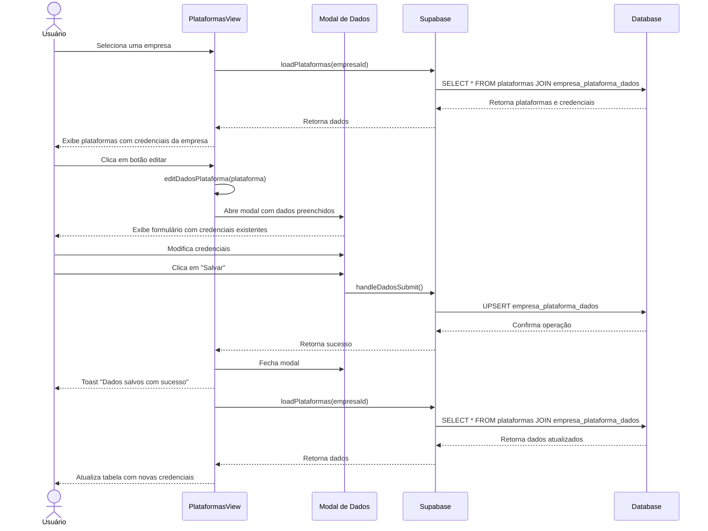

# Funcionalidade: Gerenciar Credenciais de Acesso

## Descrição

Esta funcionalidade permite gerenciar as credenciais de acesso de uma empresa a uma plataforma específica, incluindo login, senha, informações de certificado digital e observações.

## Fluxo da Funcionalidade



## Interface de Usuário

O modal de edição de credenciais contém:

- Título indicando a plataforma e empresa
- Campos de entrada para:
  - Login
  - Senha
  - Data de validade do certificado
  - Observações
- Botões de "Cancelar" e "Salvar"

## Preparação do Modal de Edição

```javascript
const editDadosPlataforma = (plataforma) => {
  editingPlataforma.value = plataforma
  dadosForm.value = {
    login: plataforma.dados_especificos?.login || '',
    senha: plataforma.dados_especificos?.senha || '',
    data_validade: plataforma.dados_especificos?.data_validade || '',
    observacoes: plataforma.dados_especificos?.observacoes || ''
  }
  showDadosModal.value = true
}
```

## Submissão das Credenciais

```javascript
const handleDadosSubmit = async () => {
  try {
    const dadosToSave = {
      ...dadosForm.value,
      plataforma_id: editingPlataforma.value.id
    }
    await saveDadosPlataforma(dadosToSave)
    closeDadosModal()
  } catch (error) {
    console.error('Erro ao salvar dados específicos:', error)
    showToast('Erro ao salvar dados específicos', 'error')
  }
}

const saveDadosPlataforma = async (dados) => {
  try {
    const { data: { user } } = await supabase.auth.getUser()

    const dadosToSave = {
      empresa_id: selectedEmpresa.value.id,
      plataforma_id: editingPlataforma.value.id,
      login: dados.login,
      senha: dados.senha,
      data_validade: dados.data_validade,
      observacoes: dados.observacoes,
      responsavel_id: user.id,
      updated_at: new Date().toISOString()
    }

    const { error } = await supabase
      .from('empresa_plataforma_dados')
      .upsert(dadosToSave, {
        onConflict: 'empresa_id,plataforma_id'
      })

    if (error) throw error

    await loadPlataformas(selectedEmpresa.value?.id)
    showToast('Dados salvos com sucesso!')
  } catch (error) {
    console.error('Erro ao salvar:', error)
    showToast('Erro ao salvar dados', 'error')
  }
}
```

## Fechar o Modal

```javascript
const closeDadosModal = () => {
  showDadosModal.value = false
  editingPlataforma.value = null
  dadosForm.value = {
    login: '',
    senha: '',
    certificado_digital: '',
    data_validade_certificado: '',
    observacoes: ''
  }
}
```

## Visualização na Tabela

Os dados das credenciais são exibidos na tabela principal quando uma empresa está selecionada:

```html
<!-- Células extras apenas quando uma empresa estiver selecionada -->
<template v-if="selectedEmpresa">
  <td>{{ plataforma.dados_especificos?.login || '-' }}</td>
  <td>{{ plataforma.dados_especificos?.senha || '-' }}</td>
  <td>
    <span :class="getValidadeClass(plataforma.dados_especificos?.data_validade_certificado)">
      {{ formatDate(plataforma.dados_especificos?.data_validade_certificado) }}
    </span>
  </td>
  <td>{{ plataforma.dados_especificos?.observacoes || '-' }}</td>
</template>
```

## Indicadores Visuais de Validade

O sistema usa indicadores visuais para alertar sobre datas de validade:

```javascript
const getValidadeClass = (data) => {
  if (!data) return 'validade-indefinida'

  const hoje = new Date()
  const validade = new Date(data)
  const diasRestantes = Math.ceil((validade - hoje) / (1000 * 60 * 60 * 24))

  if (diasRestantes < 0) return 'validade-expirada'
  if (diasRestantes <= 30) return 'validade-proxima'
  return 'validade-ok'
}
```

## Tabela e Colunas Atualizadas

### Tabela: empresa_plataforma_dados

| Coluna | Tipo | Descrição |
|--------|------|-----------|
| login | text | Nome de usuário para acesso à plataforma |
| senha | text | Senha para acesso à plataforma |
| data_validade | date | Data de validade do certificado ou credenciais |
| observacoes | text | Observações adicionais sobre o acesso |
| responsavel_id | uuid | ID do usuário responsável pela atualização |
| updated_at | timestamp | Data da atualização (automática) |

## Considerações de Segurança

**Observação importante**: Os dados de credenciais são armazenados em texto simples no banco de dados atual. Uma implementação robusta de segurança deve encriptar esses dados antes de armazená-los e desencriptá-los apenas quando necessário.
