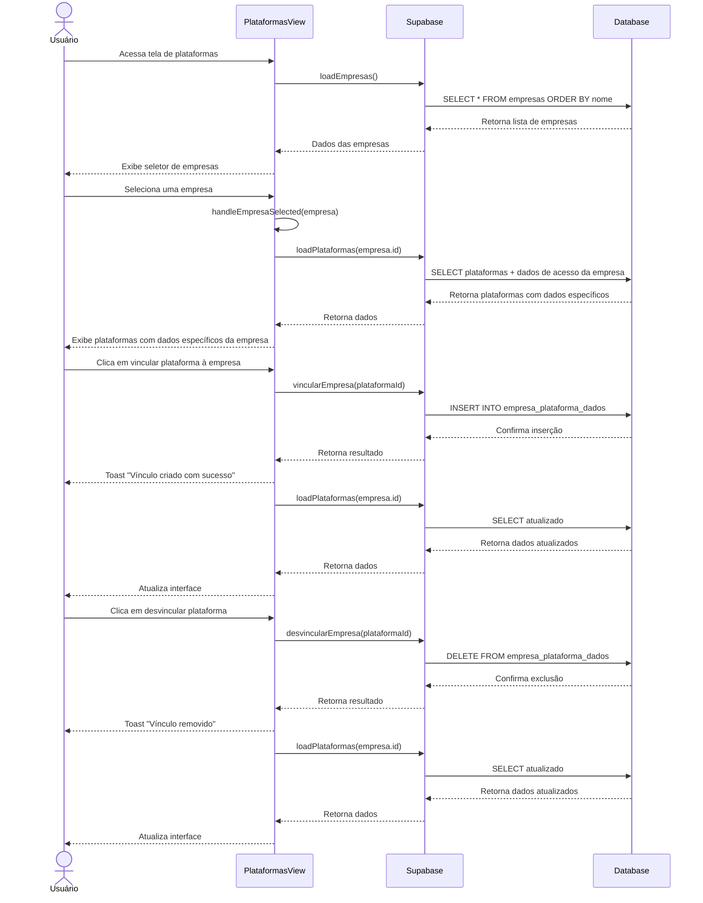

# Funcionalidade: Integração com Empresas

## Descrição

Esta funcionalidade permite associar empresas cadastradas às plataformas de licitação e gerenciar essas associações. Cada empresa pode ter diferentes credenciais de acesso para cada plataforma.

## Fluxo da Funcionalidade



## Interface de Usuário

A funcionalidade inclui:

1. **Seletor de Empresas**: Para escolher qual empresa visualizar/editar
2. **Lista de Plataformas**: Com colunas específicas para dados de acesso quando uma empresa está selecionada
3. **Botões de Vínculo/Desvínculo**: Para associar ou remover associações entre empresa e plataforma
4. **Modal de Edição de Credenciais**: Para editar dados específicos de acesso

## Seleção de Empresa

```javascript
const selectEmpresa = async (empresa) => {
  selectedEmpresa.value = empresa
  await loadPlataformas(empresa.id)
  console.log('Empresa selecionada:', empresa)
}

const clearEmpresaSelection = () => {
  selectedEmpresa.value = null
  loadPlataformas()
}
```

## Carregamento de Plataformas Específicas

```javascript
const loadPlataformas = async (empresaId = null) => {
  try {
    let query = supabase
      .from('plataformas')
      .select(`
        *,
        empresa_plataforma_dados!left(
          empresa_id,
          login,
          senha,
          data_validade,
          observacoes
        )
      `)
      .order('nome')

    if (empresaId) {
      query = query.eq('empresa_plataforma_dados.empresa_id', empresaId)
    }

    const { data, error } = await query

    if (error) throw error

    plataformas.value = data.map(p => ({
      ...p,
      dados_especificos: p.empresa_plataforma_dados?.find(
        d => d.empresa_id === empresaId
      ) || null
    }))

  } catch (error) {
    console.error('Erro ao carregar plataformas:', error)
    showToast('Erro ao carregar plataformas', 'error')
  }
}
```

## Vinculação de Empresa e Plataforma

```javascript
const vincularEmpresa = async (plataformaId) => {
  try {
    if (!selectedEmpresa.value) return

    const { error } = await supabase
      .from('empresa_plataforma_dados')
      .insert({
        empresa_id: selectedEmpresa.value.id,
        plataforma_id: plataformaId
      })

    if (error) throw error
    await loadPlataformas(selectedEmpresa.value.id)
    showToast('Empresa vinculada com sucesso!', 'success')
  } catch (error) {
    console.error('Erro ao vincular empresa:', error)
    showToast('Erro ao vincular empresa à plataforma', 'error')
  }
}
```

## Desvinculação de Empresa e Plataforma

```javascript
const desvincularEmpresa = async (plataformaId) => {
  if (!confirm('Deseja desvincular esta plataforma da empresa?')) return

  try {
    const { error } = await supabase
      .from('empresa_plataforma_dados')
      .delete()
      .match({
        empresa_id: selectedEmpresa.value.id,
        plataforma_id: plataformaId
      })

    if (error) throw error
    await loadPlataformas(selectedEmpresa.value.id)
    showToast('Vínculo removido com sucesso!', 'success')
  } catch (error) {
    console.error('Erro ao desvincular:', error)
    showToast('Erro ao desvincular plataforma da empresa', 'error')
  }
}
```

## Múltiplas Vinculações no Modal de Edição

Quando não há empresa selecionada, o modal permite vincular várias empresas de uma vez:

```javascript
const toggleEmpresa = (empresa) => {
  const index = empresasSelecionadas.value.indexOf(empresa.id)
  if (index === -1) {
    empresasSelecionadas.value.push(empresa.id)
    showToast(`Empresa ${empresa.nome} vinculada com sucesso!`, 'success')
  } else {
    empresasSelecionadas.value.splice(index, 1)
    showToast(`Empresa ${empresa.nome} desvinculada!`, 'error')
  }
}
```

## Visualização Filtrada

```javascript
const plataformasFiltradas = computed(() => {
  if (!selectedEmpresa.value) {
    return plataformas.value
  }

  return plataformas.value.filter(p => {
    return p.dados_especificos?.empresa_id === selectedEmpresa.value.id
  })
})
```

## Tabelas e Colunas

### Tabela: empresa_plataforma_dados

Esta tabela armazena as vinculações entre empresas e plataformas:

| Coluna | Tipo | Descrição |
|--------|------|-----------|
| empresa_id | uuid | ID da empresa vinculada |
| plataforma_id | uuid | ID da plataforma vinculada |
| login | text | Nome de usuário específico para a empresa nesta plataforma |
| senha | text | Senha específica para a empresa nesta plataforma |
| data_validade | date | Validade das credenciais ou certificado |
| observacoes | text | Observações sobre o acesso |

### Restrição de Unicidade

```sql
UNIQUE (empresa_id, plataforma_id)
```

Esta restrição garante que uma empresa só possa ser vinculada uma vez a cada plataforma.

## Considerações de Implementação

1. **Filtragem Eficiente**: O sistema usa joins e filtros no banco de dados para buscar apenas os dados relevantes
2. **Visualização Adaptativa**: A interface muda dependendo se há uma empresa selecionada ou não
3. **Feedback Visual**: O sistema mostra indicadores de validade e notificações toast para ações
4. **Limpeza de Memória**: Assinaturas em tempo real são limpas quando o componente é desmontado
