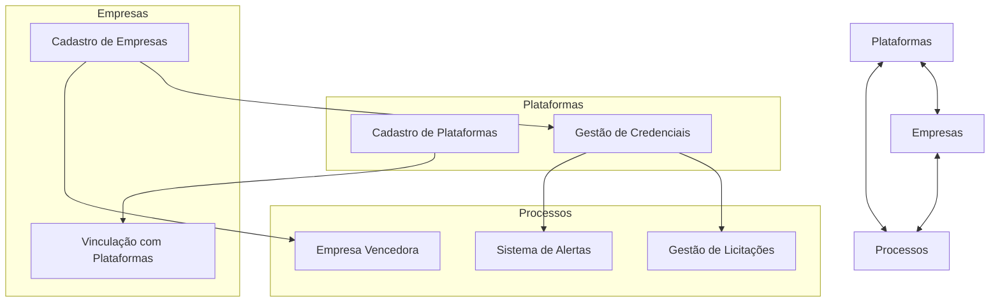
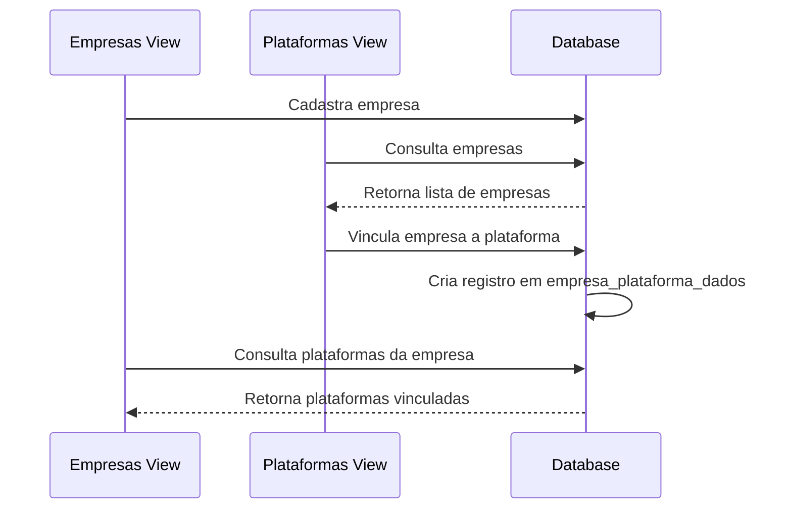
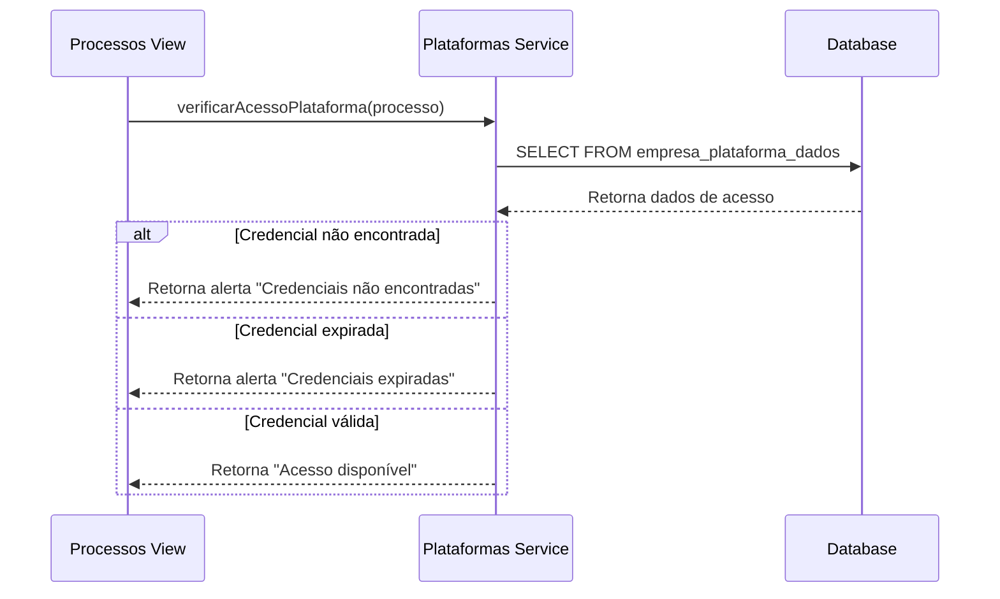
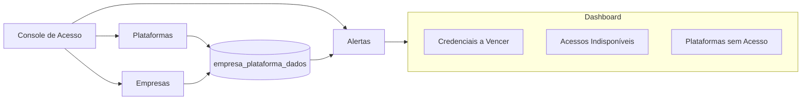

# Integração com Outros Módulos

## Descrição

O módulo de Gerenciamento de Plataformas se integra com outros componentes do sistema, principalmente com o módulo de Empresas e o módulo de Processos, formando uma estrutura coesa para gerenciar o ciclo completo de licitações.

## Diagrama de Integrações



## Integrações Principais

### 1. Integração com Módulo de Empresas

#### Compartilhamento de Dados

O módulo de Plataformas se integra com o módulo de Empresas através da tabela de relacionamento `empresa_plataforma_dados`, permitindo:

- Vincular empresas a plataformas de licitação
- Armazenar credenciais de acesso específicas por empresa/plataforma
- Visualizar plataformas associadas a uma empresa específica

#### Fluxo de Integração



#### Código de Integração

No módulo de Plataformas, a integração com Empresas é feita por:

```javascript
// Carregamento de empresas
const loadEmpresas = async () => {
  try {
    const { data, error } = await supabase
      .from('empresas')
      .select('*')
      .order('nome');
      
    if (error) throw error;
    empresas.value = data || [];
  } catch (error) {
    console.error('Erro ao carregar empresas:', error);
    showToast('Erro ao carregar empresas', 'error');
  }
};
```

### 2. Integração com Módulo de Processos

O módulo de Plataformas fornece informações importantes para o módulo de Processos:

#### Dados Compartilhados

- Informações sobre plataformas onde as licitações estão publicadas
- Credenciais de acesso necessárias para participar das licitações
- Status de vinculos entre empresas e plataformas

#### Alertas de Plataformas



### 3. Console de Gerenciamento de Acesso

O sistema inclui um console integrado que permite visualizar todas as credenciais e seus status:



## APIs de Integração

### API para Verificação de Acesso

```javascript
export const acessoApi = {
  // Verifica se existe credencial válida para uma plataforma/empresa
  async verificarCredencialValida(empresaId, plataformaId) {
    const { data, error } = await supabase
      .from('empresa_plataforma_dados')
      .select('*')
      .eq('empresa_id', empresaId)
      .eq('plataforma_id', plataformaId)
      .eq('status', 'ACTIVE')
      .single();
      
    if (error) return { success: false, error };
    
    if (!data) {
      return { 
        success: false, 
        error: { message: 'Sem credenciais de acesso' } 
      };
    }
    
    // Verifica se a credencial está vencida
    if (data.data_validade) {
      const hoje = new Date();
      const validade = new Date(data.data_validade);
      
      if (validade < hoje) {
        return { 
          success: false, 
          error: { message: 'Credenciais expiradas' },
          expiracao: data.data_validade
        };
      }
    }
    
    return { success: true, data };
  },
  
  // Obtém todas as credenciais que expiram nos próximos N dias
  async obterCredenciaisAVencer(dias = 30) {
    const dataLimite = new Date();
    dataLimite.setDate(dataLimite.getDate() + dias);
    
    const dataLimiteISO = dataLimite.toISOString().split('T')[0];
    const hoje = new Date().toISOString().split('T')[0];
    
    const { data, error } = await supabase
      .from('empresa_plataforma_dados')
      .select(`
        *,
        empresas (id, nome),
        plataformas (id, nome, url)
      `)
      .gte('data_validade', hoje)
      .lte('data_validade', dataLimiteISO);
      
    if (error) return { success: false, error };
    
    return { success: true, data };
  }
};
```

### Hook de Verificação de Acesso em Processos

```javascript
export function useAcessoVerification() {
  const verificarAcessoProcesso = async (processo) => {
    // Se o processo não tem plataforma definida
    if (!processo.plataforma_id) {
      return { valido: false, mensagem: 'Processo sem plataforma definida' };
    }
    
    // Se o processo não tem empresa vencedora ou interessada
    if (!processo.empresa_interessada_id && !processo.empresa_vencedora) {
      return { valido: false, mensagem: 'Processo sem empresa definida' };
    }
    
    const empresaId = processo.empresa_interessada_id || processo.empresa_vencedora;
    
    // Verifica credenciais
    const { success, data, error } = await acessoApi.verificarCredencialValida(
      empresaId, 
      processo.plataforma_id
    );
    
    if (!success) {
      return { 
        valido: false, 
        mensagem: error.message || 'Erro ao verificar credenciais',
        detalhes: error
      };
    }
    
    return { 
      valido: true, 
      mensagem: 'Credenciais válidas',
      login: data.login,
      expiracao: data.data_validade
    };
  };
  
  return {
    verificarAcessoProcesso
  };
}
```

## Eventos do Sistema

Os módulos se comunicam através de eventos do sistema:

| Evento | Gerado por | Consumido por | Descrição |
|--------|------------|--------------|-----------|
| `platform-credentials-updated` | Plataformas | Processos | Quando as credenciais são atualizadas |
| `platform-added` | Plataformas | Dashboard | Quando uma nova plataforma é adicionada |
| `platform-status-changed` | Plataformas | Dashboard, Processos | Quando o status de uma plataforma muda |
| `empresa-platform-linked` | Plataformas/Empresas | Dashboard | Quando uma empresa é vinculada a uma plataforma |

## Casos de Uso da Integração

1. **Verificação de Acesso**: Antes de processar uma licitação, o sistema verifica se existem credenciais válidas para a plataforma
2. **Alertas de Vencimento**: Dashboard exibe alertas quando certificados estão próximos do vencimento
3. **Filtros Cruzados**: Capacidade de filtrar processos por plataforma e empresa simultaneamente
4. **Análise de Cobertura**: Identificação de plataformas que não possuem credenciais para determinadas empresas
