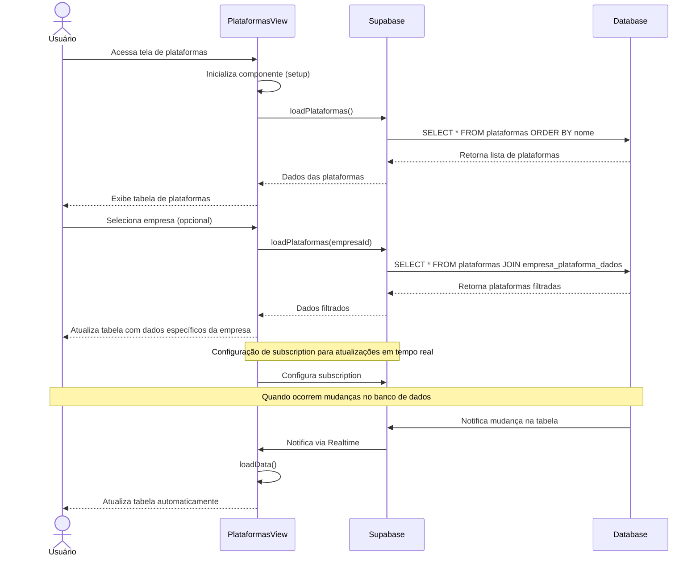

# Funcionalidade: Listar Plataformas

## Descrição

Esta funcionalidade exibe uma tabela com todas as plataformas de licitação cadastradas no sistema, permitindo visualização, pesquisa e acesso às operações de adição, edição e exclusão.

## Fluxo da Funcionalidade



## Interface de Usuário

A tabela de plataformas apresenta:

- Cabeçalho com título "Plataformas"
- Seletor de empresa para filtrar visualização (opcional)
- Botão para adicionar nova plataforma
- Tabela com colunas:
  - Nome da plataforma
  - URL (com link clicável)
  - Campos adicionais quando uma empresa está selecionada:
    - Login
    - Senha
    - Validade do certificado
    - Observações
  - Ações (editar, excluir)

## Dados Recuperados

Os dados são carregados da tabela `plataformas` usando a função `loadPlataformas`:

```javascript
const loadPlataformas = async (empresaId = null) => {
  try {
    let query = supabase
      .from('plataformas')
      .select(`
        *,
        empresa_plataforma_dados!left(
          empresa_id,
          login,
          senha,
          data_validade,
          observacoes
        )
      `)
      .order('nome')

    if (empresaId) {
      query = query.eq('empresa_plataforma_dados.empresa_id', empresaId)
    }

    const { data, error } = await query

    if (error) throw error

    plataformas.value = data.map(p => ({
      ...p,
      dados_especificos: p.empresa_plataforma_dados?.find(
        d => d.empresa_id === empresaId
      ) || null
    }))

  } catch (error) {
    console.error('Erro ao carregar plataformas:', error)
    showToast('Erro ao carregar plataformas', 'error')
  }
}
```

## Atualização em Tempo Real

O componente utiliza o serviço de tempo real do Supabase para manter a lista de plataformas sempre atualizada:

```javascript
onMounted(() => {
  loadPlataformas()
  loadEmpresas()
  
  const channel = supabase.channel('plataformas-updates')
    .on('postgres_changes', 
      { event: '*', schema: 'public', table: 'plataformas' }, 
      () => loadData()
    )
    .subscribe()
  
  SupabaseManager.addSubscription('plataformas-updates', channel)
})

onUnmounted(() => {
  const channel = SupabaseManager.getSubscription('plataformas-updates')
  if (channel) {
    supabase.removeChannel(channel)
    SupabaseManager.removeSubscription('plataformas-updates')
  }
})
```

## Filtragem por Empresa

A funcionalidade permite filtrar plataformas por empresa selecionada:

```javascript
const selectEmpresa = async (empresa) => {
  selectedEmpresa.value = empresa
  await loadPlataformas(empresa.id)
}

const clearEmpresaSelection = () => {
  selectedEmpresa.value = null
  loadPlataformas()
}

const plataformasFiltradas = computed(() => {
  if (!selectedEmpresa.value) {
    return plataformas.value
  }

  return plataformas.value.filter(p => {
    return p.dados_especificos?.empresa_id === selectedEmpresa.value.id
  })
})
```

## Formatação de Dados

O componente inclui funções para formatação de dados:

```javascript
const truncateUrl = (url) => {
  return url.length > 60 ? url.substring(0, 60) + '...' : url
}

const formatDate = (date) => {
  if (!date) return '-'
  try {
    return new Date(date).toLocaleDateString('pt-BR')
  } catch (error) {
    console.error('Erro ao formatar data:', error)
    return '-'
  }
}

const getValidadeClass = (data) => {
  if (!data) return 'validade-indefinida'

  const hoje = new Date()
  const validade = new Date(data)
  const diasRestantes = Math.ceil((validade - hoje) / (1000 * 60 * 60 * 24))

  if (diasRestantes < 0) return 'validade-expirada'
  if (diasRestantes <= 30) return 'validade-proxima'
  return 'validade-ok'
}
```

## Tabelas do Banco de Dados

### Tabela: plataformas

| Coluna | Tipo | Descrição |
|--------|------|-----------|
| id | uuid | Identificador único da plataforma |
| nome | text | Nome da plataforma |
| url | text | URL de acesso à plataforma |
| status | text | Status da plataforma (ativo, inativo) |
| created_at | timestamp | Data de criação do registro |
| updated_at | timestamp | Data de atualização do registro |

### Tabela: empresa_plataforma_dados

| Coluna | Tipo | Descrição |
|--------|------|-----------|
| id | uuid | Identificador único do relacionamento |
| empresa_id | uuid | ID da empresa (FK) |
| plataforma_id | uuid | ID da plataforma (FK) |
| login | text | Nome de usuário para acesso |
| senha | text | Senha para acesso |
| data_validade | date | Data de validade do certificado ou credenciais |
| observacoes | text | Observações adicionais |
| responsavel_id | uuid | ID do usuário responsável |
| created_at | timestamp | Data de criação do registro |
| updated_at | timestamp | Data de atualização do registro |
