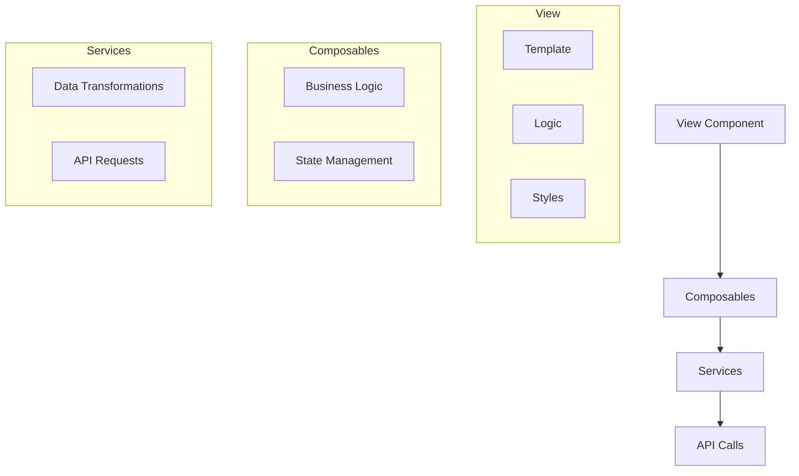

# Melhores Práticas - Gerenciamento de Plataformas

## Visão Geral

Este documento apresenta as melhores práticas para trabalhar com o módulo de Gerenciamento de Plataformas, incluindo padrões de código, segurança, desempenho e experiência do usuário.

## Organização de Código

### Separação de Responsabilidades



1. **Componentes Vue**: Focados em renderização e interações diretas com o usuário
2. **Composables**: Lógica reutilizável e gerenciamento de estado
3. **Serviços**: Comunicação com APIs e transformações de dados

### Padrões de Nomenclatura

| Tipo | Padrão | Exemplo |
|------|--------|---------|
| Componentes | PascalCase | `PlataformasView.vue`, `PlataformaForm.vue` |
| Composables | camelCase com prefixo 'use' | `useSupabase.js`, `useValidation.js` |
| Métodos | camelCase, verbos | `loadPlataformas()`, `validateForm()` |
| Variáveis de estado | camelCase | `isLoading`, `selectedEmpresa` |

## Gestão de Estado

### Estado Local vs. Global

Prefira estado local sempre que possível:

```javascript
// Estado local com composables
export function usePlataformas() {
  const plataformas = ref([]);
  const isLoading = ref(false);
  
  async function loadPlataformas() {
    // implementação...
  }
  
  return {
    plataformas,
    isLoading,
    loadPlataformas
  };
}
```

Use estado global apenas quando necessário:

```javascript
// Estado global com provide/inject
// Em App.vue ou layout principal
provide('toastManager', useToast());

// Nos componentes
const { showToast } = inject('toastManager');
```

### Reatividade

Mantenha a responsividade do sistema usando propriedades reativas corretamente:

```javascript
// Propriedade computada para filtragem
const plataformasFiltradas = computed(() => {
  if (!filtro.value) return plataformas.value;
  
  return plataformas.value.filter(plataforma => 
    plataforma.nome.toLowerCase().includes(filtro.value.toLowerCase()) ||
    plataforma.url.toLowerCase().includes(filtro.value.toLowerCase())
  );
});
```

## Segurança

### Sanitização de Dados

Sempre sanitize dados de entrada para evitar injeção de código:

```javascript
const sanitizeInput = (input) => {
  if (typeof input !== 'string') return '';
  
  // Remove scripts potencialmente perigosos
  return input
    .replace(/<script\b[^<]*(?:(?!<\/script>)<[^<]*)*<\/script>/gi, '')
    .trim();
};

// Uso
formData.value.nome = sanitizeInput(formData.value.nome);
```

### Proteção de Credenciais

Não armazene senhas em texto claro no banco de dados:

```javascript
// Encriptação de senha antes de armazenar
const encryptPassword = (password) => {
  // Use uma biblioteca de criptografia forte
  return CryptoJS.AES.encrypt(
    password, 
    import.meta.env.VITE_ENCRYPTION_SECRET
  ).toString();
};

// Decriptação para uso
const decryptPassword = (encryptedPassword) => {
  return CryptoJS.AES.decrypt(
    encryptedPassword,
    import.meta.env.VITE_ENCRYPTION_SECRET
  ).toString(CryptoJS.enc.Utf8);
};
```

### Políticas de Acesso

Implemente políticas de controle de acesso no Supabase:

```sql
-- Permissão baseada em função para modificar plataformas
CREATE POLICY "Permitir modificação apenas para administradores"
ON plataformas
FOR ALL
TO authenticated
USING (
  EXISTS (
    SELECT 1 FROM profiles
    WHERE profiles.user_id = auth.uid()
    AND profiles.role = 'admin'
  )
);
```

## Desempenho

### Otimização de Consultas

```javascript
// Selecione apenas campos necessários
const loadPlataformasBasic = async () => {
  const { data } = await supabase
    .from('plataformas')
    .select('id, nome, url') // apenas campos essenciais
    .order('nome');
    
  return data;
};

// Use joins apenas quando necessário
const loadPlataformasDetalhadas = async (empresaId) => {
  const { data } = await supabase
    .from('plataformas')
    .select(`
      id, nome, url,
      empresa_plataforma_dados!inner(*)
    `)
    .eq('empresa_plataforma_dados.empresa_id', empresaId);
    
  return data;
};
```

### Carregamento Sob Demanda

Implemente carregamento sob demanda para listas grandes:

```javascript
const loadMorePlataformas = async () => {
  if (isLoading.value || !hasMorePages.value) return;
  
  try {
    isLoading.value = true;
    
    const { data, error } = await supabase
      .from('plataformas')
      .select('*')
      .range(page.value * PAGE_SIZE, (page.value + 1) * PAGE_SIZE - 1)
      .order('nome');
      
    if (error) throw error;
    
    if (data.length < PAGE_SIZE) {
      hasMorePages.value = false;
    }
    
    plataformas.value.push(...data);
    page.value++;
  } catch (error) {
    console.error('Erro ao carregar mais plataformas:', error);
  } finally {
    isLoading.value = false;
  }
};
```

### Memoização

Use memoização para operações caras:

```javascript
import { computed } from 'vue';

// Memoização com computed
const getPlataformaById = (id) => {
  return computed(() => {
    return plataformas.value.find(p => p.id === id);
  });
};

// Ou implementação manual
const memoize = (fn) => {
  const cache = {};
  
  return (...args) => {
    const key = JSON.stringify(args);
    
    if (cache[key] === undefined) {
      cache[key] = fn(...args);
    }
    
    return cache[key];
  };
};

const getPlataformasForEmpresa = memoize((empresaId) => {
  return plataformas.value.filter(p => {
    return p.dados_especificos?.empresa_id === empresaId;
  });
});
```

## Experiência do Usuário

### Feedback Imediato

Forneça feedback visual para todas as ações:

```javascript
const deletePlataforma = async (id) => {
  try {
    showToast('Excluindo plataforma...', 'info');
    isDeleting.value = id; // Ativa indicador visual
    
    const { error } = await supabase
      .from('plataformas')
      .delete()
      .eq('id', id);
      
    if (error) throw error;
    
    showToast('Plataforma excluída com sucesso', 'success');
  } catch (error) {
    showToast('Erro ao excluir plataforma: ' + error.message, 'error');
  } finally {
    isDeleting.value = null; // Remove indicador
  }
};
```

### Estados de Carregamento

Implemente estados de carregamento para todas as operações assíncronas:

```html
<template>
  <div>
    <!-- Estado de carregamento inicial -->
    <div v-if="isInitialLoading" class="loading-state">
      <spinner-component size="large" />
      <p>Carregando dados...</p>
    </div>
    
    <!-- Estado de lista vazia -->
    <div v-else-if="!isLoading && plataformas.length === 0" class="empty-state">
      <empty-icon />
      <h3>Nenhuma plataforma encontrada</h3>
      <p>Clique no botão "Nova Plataforma" para adicionar</p>
    </div>
    
    <!-- Lista com dados -->
    <div v-else>
      <!-- Conteúdo normal -->
      
      <!-- Indicador de carregamento em ações específicas -->
      <button 
        @click="loadMore" 
        :disabled="isLoadingMore"
        class="btn-load-more"
      >
        <spinner-component v-if="isLoadingMore" size="small" />
        {{ isLoadingMore ? 'Carregando...' : 'Carregar mais' }}
      </button>
    </div>
  </div>
</template>
```

### Atalhos e Interações Rápidas

Adicione atalhos de teclado e interações intuitivas:

```javascript
onMounted(() => {
  // Atalhos de teclado
  document.addEventListener('keydown', handleKeyDown);
  
  onUnmounted(() => {
    document.removeEventListener('keydown', handleKeyDown);
  });
});

const handleKeyDown = (e) => {
  // Esc para fechar modais
  if (e.key === 'Escape') {
    if (showModal.value) closeModal();
    if (showDeleteDialog.value) cancelDelete();
  }
  
  // Ctrl+F para focar na busca
  if (e.ctrlKey && e.key === 'f') {
    e.preventDefault();
    document.getElementById('search-input')?.focus();
  }
  
  // Ctrl+N para nova plataforma
  if (e.ctrlKey && e.key === 'n') {
    e.preventDefault();
    openAddModal();
  }
};
```

## Testabilidade

### Componentes Testáveis

Estruture código para facilitar testes:

```javascript
// Código testável com dependências explícitas
export function usePlataformasService(supabaseClient) {
  const loadPlataformas = async () => {
    return supabaseClient
      .from('plataformas')
      .select('*')
      .order('nome');
  };
  
  return {
    loadPlataformas
  };
}

// Em produção
const { loadPlataformas } = usePlataformasService(supabase);

// Em testes
const mockSupabase = {
  from: () => ({
    select: () => ({
      order: () => Promise.resolve({ data: mockData, error: null })
    })
  })
};
const { loadPlataformas } = usePlataformasService(mockSupabase);
```

### Testes Unitários

Exemplo de teste unitário para validação:

```javascript
import { describe, it, expect } from 'vitest';
import { useValidation } from '@/composables/useValidation';

describe('useValidation', () => {
  const { validateUrl } = useValidation();
  
  it('deve aceitar URLs válidas', () => {
    const urls = [
      'https://example.com',
      'http://sub.domain.org/path',
      'https://site.gov.br'
    ];
    
    urls.forEach(url => {
      const result = validateUrl(url);
      expect(result.valid).toBe(true);
      expect(result.error).toBeNull();
    });
  });
  
  it('deve rejeitar URLs inválidas', () => {
    const urls = [
      'invalid-url',
      'just text',
      'file://'
    ];
    
    urls.forEach(url => {
      const result = validateUrl(url);
      expect(result.valid).toBe(false);
      expect(result.error).toBeTruthy();
    });
  });
});
```

## Documentação de Código

Documente funções importantes:

```javascript
/**
 * Carrega plataformas do banco de dados, opcionalmente filtradas por empresa
 * 
 * @param {string|null} empresaId - ID da empresa para filtrar, ou null para todas
 * @returns {Promise<{data: Array, error: Object|null}>} Resultado da consulta
 * @throws {Error} Se houver falha na comunicação com a API
 */
async function loadPlataformas(empresaId = null) {
  try {
    // Implementação...
  } catch (error) {
    console.error('Falha ao carregar plataformas:', error);
    throw error;
  }
}
```

## Versionamento e Evolução

Mantenha registro de alterações no código:

```javascript
/**
 * @version 1.2.0
 * @changelog
 * - 1.0.0: Versão inicial com funcionalidades básicas de CRUD
 * - 1.1.0: Adicionado suporte para credenciais específicas por empresa
 * - 1.2.0: Implementado sistema de tempo real para atualizações automáticas
 */
export function usePlataformas() {
  // Implementação...
}
```

## Uso de Recursos

Sempre libere recursos após uso:

```javascript
// Subscriptions de Supabase
onMounted(() => {
  const channel = supabase.channel('canal')
    .on('postgres_changes', {/*...*/}, () => {})
    .subscribe();
    
  SupabaseManager.addSubscription('canal', channel);
  
  // Limpeza de recursos
  onUnmounted(() => {
    const channel = SupabaseManager.getSubscription('canal');
    if (channel) {
      supabase.removeChannel(channel);
      SupabaseManager.removeSubscription('canal');
    }
    
    // Outros recursos
    if (intervalId.value) clearInterval(intervalId.value);
    if (timeoutId.value) clearTimeout(timeoutId.value);
  });
});
```

## Convenções de Estilo

Mantenha um estilo de código consistente:

```javascript
// ✅ Bom estilo
const getNomePlataforma = (plataforma) => {
  return plataforma?.nome || 'Desconhecida';
};

// ❌ Estilo inconsistente
function getNomePlataforma (plataforma) 
{
  return plataforma?.nome || 'Desconhecida'
};
```

Use formatadores de código e linters (ESLint, Prettier) para manter consistência no projeto.
