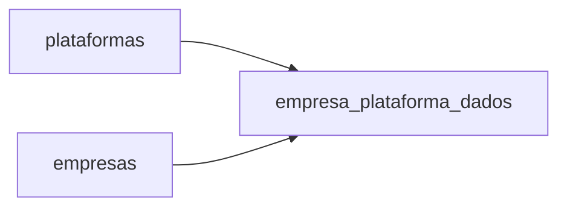

# Guia de Migração de Dados - Plataformas

## Visão Geral

Este documento descreve os procedimentos para migrar dados de plataformas entre ambientes ou versões do sistema, incluindo instruções para exportação, importação e verificação de consistência dos dados.

## Estrutura de Dados para Migração

A migração completa do módulo de plataformas envolve as seguintes tabelas:



## Exportação de Dados

### Usando API Supabase

```javascript
/**
 * Exporta dados de plataformas para um arquivo JSON
 */
const exportarPlataformas = async () => {
  try {
    // 1. Exportar plataformas
    const { data: plataformas, error: plataformasError } = await supabase
      .from('plataformas')
      .select('*');
      
    if (plataformasError) throw plataformasError;
    
    // 2. Exportar vínculos com empresas
    const { data: vinculos, error: vinculosError } = await supabase
      .from('empresa_plataforma_dados')
      .select('*');
      
    if (vinculosError) throw vinculosError;
    
    // 3. Criar objeto de exportação
    const exportData = {
      version: "1.0",
      timestamp: new Date().toISOString(),
      data: {
        plataformas,
        empresa_plataforma_dados: vinculos
      }
    };
    
    // 4. Converter para JSON e criar arquivo para download
    const blob = new Blob(
      [JSON.stringify(exportData, null, 2)], 
      { type: 'application/json' }
    );
    
    const url = URL.createObjectURL(blob);
    const a = document.createElement('a');
    a.href = url;
    a.download = `plataformas-export-${new Date().toISOString().split('T')[0]}.json`;
    document.body.appendChild(a);
    a.click();
    document.body.removeChild(a);
    URL.revokeObjectURL(url);
    
    return {
      success: true,
      message: 'Dados exportados com sucesso',
      count: {
        plataformas: plataformas.length,
        vinculos: vinculos.length
      }
    };
  } catch (error) {
    console.error('Erro ao exportar dados:', error);
    return {
      success: false,
      error: error.message
    };
  }
};
```

### Usando SQL Direto (DDL e DML)

```sql
-- Exportar estrutura de tabelas
CREATE OR REPLACE FUNCTION export_plataformas_ddl()
RETURNS text AS $$
DECLARE
  ddl_script text;
BEGIN
  -- Plataformas
  SELECT pg_get_ddl('CREATE TABLE plataformas', 'public.plataformas') INTO ddl_script;
  
  -- Empresa Plataforma Dados
  ddl_script := ddl_script || E'\n\n' || pg_get_ddl('CREATE TABLE empresa_plataforma_dados', 'public.empresa_plataforma_dados');
  
  RETURN ddl_script;
END;
$$ LANGUAGE plpgsql;

-- Exportar dados como comandos INSERT
CREATE OR REPLACE FUNCTION export_plataformas_dml()
RETURNS text AS $$
DECLARE
  dml_script text := '';
  p RECORD;
  v RECORD;
BEGIN
  -- Plataformas
  dml_script := dml_script || E'-- Plataformas\n';
  FOR p IN SELECT * FROM plataformas
  LOOP
    dml_script := dml_script || format(
      E'INSERT INTO plataformas (id, nome, url, responsavel_id, created_at, updated_at) VALUES (''%s'', ''%s'', ''%s'', ''%s'', ''%s'', ''%s'');\n',
      p.id, p.nome, p.url, p.responsavel_id, p.created_at, p.updated_at
    );
  END LOOP;
  
  -- Empresa Plataforma Dados
  dml_script := dml_script || E'\n-- Empresa Plataforma Dados\n';
  FOR v IN SELECT * FROM empresa_plataforma_dados
  LOOP
    dml_script := dml_script || format(
      E'INSERT INTO empresa_plataforma_dados (id, empresa_id, plataforma_id, login, senha, data_validade, observacoes, responsavel_id, created_at, updated_at) VALUES (''%s'', ''%s'', ''%s'', ''%s'', ''%s'', %s, ''%s'', ''%s'', ''%s'', ''%s'');\n',
      v.id, v.empresa_id, v.plataforma_id, 
      COALESCE(v.login, ''), COALESCE(v.senha, ''),
      CASE WHEN v.data_validade IS NULL THEN 'NULL' ELSE '''' || v.data_validade || '''' END,
      COALESCE(v.observacoes, ''), COALESCE(v.responsavel_id::text, 'NULL'),
      v.created_at, v.updated_at
    );
  END LOOP;
  
  RETURN dml_script;
END;
$$ LANGUAGE plpgsql;
```

## Importação de Dados

### Interface de Usuário para Importação

```javascript
/**
 * Importa dados de plataformas a partir de um arquivo JSON
 * @param {File} file - Arquivo JSON com dados de exportação
 */
const importarPlataformas = async (file) => {
  try {
    // 1. Ler arquivo
    const fileContent = await file.text();
    const importData = JSON.parse(fileContent);
    
    // 2. Validar estrutura do arquivo
    if (!importData.data || !importData.data.plataformas) {
      throw new Error('Formato de arquivo inválido');
    }
    
    // 3. Verificar compatibilidade de versão
    if (importData.version !== "1.0") {
      console.warn('Versão do arquivo diferente da esperada. Podem ocorrer problemas.');
    }
    
    // 4. Importar plataformas
    const { count: plataformasCount, error: plataformasError } = await supabase
      .from('plataformas')
      .upsert(importData.data.plataformas, {
        onConflict: 'id',
        ignoreDuplicates: false
      });
      
    if (plataformasError) throw plataformasError;
    
    // 5. Importar vínculos
    const { count: vinculosCount, error: vinculosError } = await supabase
      .from('empresa_plataforma_dados')
      .upsert(importData.data.empresa_plataforma_dados || [], {
        onConflict: 'id',
        ignoreDuplicates: false
      });
      
    if (vinculosError) throw vinculosError;
    
    return {
      success: true,
      message: 'Dados importados com sucesso',
      count: {
        plataformas: plataformasCount,
        vinculos: vinculosCount
      }
    };
  } catch (error) {
    console.error('Erro ao importar dados:', error);
    return {
      success: false,
      error: error.message
    };
  }
};
```

### Interface Visual

```html
<template>
  <div class="import-container">
    <h2>Importar Plataformas</h2>
    
    <div class="upload-area" @dragover.prevent @drop.prevent="handleDrop">
      <input 
        type="file" 
        ref="fileInput" 
        accept=".json" 
        style="display: none" 
        @change="handleFileSelected"
      />
      
      <div v-if="!selectedFile" class="upload-placeholder">
        <i class="fas fa-upload"></i>
        <p>Arraste um arquivo ou clique para selecionar</p>
        <button class="btn-select" @click="$refs.fileInput.click()">
          Selecionar Arquivo
        </button>
      </div>
      
      <div v-else class="selected-file">
        <i class="fas fa-file-code"></i>
        <p>{{ selectedFile.name }}</p>
        <div class="file-actions">
          <button class="btn-change" @click="$refs.fileInput.click()">
            Trocar
          </button>
          <button class="btn-import" @click="handleImport" :disabled="isImporting">
            <span v-if="isImporting">Importando...</span>
            <span v-else>Importar Dados</span>
          </button>
        </div>
      </div>
    </div>
    
    <div v-if="result" class="import-result" :class="result.success ? 'success' : 'error'">
      <div v-if="result.success">
        <h3>Importação concluída com sucesso!</h3>
        <ul>
          <li>Plataformas: {{ result.count?.plataformas || 0 }}</li>
          <li>Vínculos: {{ result.count?.vinculos || 0 }}</li>
        </ul>
      </div>
      <div v-else>
        <h3>Erro na importação</h3>
        <p>{{ result.error }}</p>
      </div>
    </div>
  </div>
</template>

<script>
export default {
  setup() {
    const fileInput = ref(null);
    const selectedFile = ref(null);
    const isImporting = ref(false);
    const result = ref(null);
    
    const handleFileSelected = (event) => {
      selectedFile.value = event.target.files[0];
      result.value = null;
    };
    
    const handleDrop = (event) => {
      selectedFile.value = event.dataTransfer.files[0];
      result.value = null;
    };
    
    const handleImport = async () => {
      if (!selectedFile.value) return;
      
      try {
        isImporting.value = true;
        result.value = null;
        
        result.value = await importarPlataformas(selectedFile.value);
      } catch (error) {
        result.value = {
          success: false,
          error: error.message
        };
      } finally {
        isImporting.value = false;
      }
    };
    
    return {
      fileInput,
      selectedFile,
      isImporting,
      result,
      handleFileSelected,
      handleDrop,
      handleImport
    };
  }
}
</script>
```

## Verificação de Consistência

### Script de Validação

```javascript
/**
 * Realiza verificação de consistência nos dados de plataformas
 */
const verificarConsistencia = async () => {
  try {
    const inconsistencias = [];
    
    // 1. Verificar vínculos com empresas inexistentes
    const { data: vinculosSemEmpresa, error: vinculosError } = await supabase
      .rpc('verificar_vinculos_sem_empresa');
      
    if (vinculosError) throw vinculosError;
    
    if (vinculosSemEmpresa.length > 0) {
      inconsistencias.push({
        tipo: 'vinculos_sem_empresa',
        mensagem: `Encontrados ${vinculosSemEmpresa.length} vínculos referenciando empresas inexistentes`,
        itens: vinculosSemEmpresa
      });
    }
    
    // 2. Verificar vínculos com plataformas inexistentes
    const { data: vinculosSemPlataforma, error: vincPlatError } = await supabase
      .rpc('verificar_vinculos_sem_plataforma');
      
    if (vincPlatError) throw vincPlatError;
    
    if (vinculosSemPlataforma.length > 0) {
      inconsistencias.push({
        tipo: 'vinculos_sem_plataforma',
        mensagem: `Encontrados ${vinculosSemPlataforma.length} vínculos referenciando plataformas inexistentes`,
        itens: vinculosSemPlataforma
      });
    }
    
    // 3. Verificar plataformas duplicadas por nome
    const { data: plataformasDuplicadas, error: dupError } = await supabase
      .rpc('verificar_plataformas_duplicadas');
      
    if (dupError) throw dupError;
    
    if (plataformasDuplicadas.length > 0) {
      inconsistencias.push({
        tipo: 'plataformas_duplicadas',
        mensagem: `Encontradas ${plataformasDuplicadas.length} plataformas com nomes duplicados`,
        itens: plataformasDuplicadas
      });
    }
    
    return {
      success: true,
      inconsistencias,
      consistente: inconsistencias.length === 0
    };
  } catch (error) {
    console.error('Erro na verificação de consistência:', error);
    return {
      success: false,
      error: error.message
    };
  }
};
```

### Funções SQL para Verificação

```sql
-- Função para verificar vínculos com empresas inexistentes
CREATE OR REPLACE FUNCTION verificar_vinculos_sem_empresa()
RETURNS TABLE (id uuid, plataforma_id uuid, plataforma_nome text) AS $$
BEGIN
  RETURN QUERY
    SELECT 
      epd.id, 
      epd.plataforma_id,
      p.nome AS plataforma_nome
    FROM empresa_plataforma_dados epd
    LEFT JOIN empresas e ON epd.empresa_id = e.id
    LEFT JOIN plataformas p ON epd.plataforma_id = p.id
    WHERE e.id IS NULL;
END;
$$ LANGUAGE plpgsql;

-- Função para verificar vínculos com plataformas inexistentes
CREATE OR REPLACE FUNCTION verificar_vinculos_sem_plataforma()
RETURNS TABLE (id uuid, empresa_id uuid, empresa_nome text) AS $$
BEGIN
  RETURN QUERY
    SELECT 
      epd.id, 
      epd.empresa_id,
      e.nome AS empresa_nome
    FROM empresa_plataforma_dados epd
    LEFT JOIN plataformas p ON epd.plataforma_id = p.id
    LEFT JOIN empresas e ON epd.empresa_id = e.id
    WHERE p.id IS NULL;
END;
$$ LANGUAGE plpgsql;

-- Função para verificar plataformas com nomes duplicados
CREATE OR REPLACE FUNCTION verificar_plataformas_duplicadas()
RETURNS TABLE (nome text, count bigint, ids text) AS $$
BEGIN
  RETURN QUERY
    SELECT 
      p.nome, 
      COUNT(*) AS count,
      string_agg(p.id::text, ', ') AS ids
    FROM plataformas p
    GROUP BY p.nome
    HAVING COUNT(*) > 1;
END;
$$ LANGUAGE plpgsql;
```

## Correção de Problemas

### Script para Correção Automática

```javascript
/**
 * Corrige problemas comuns nos dados de plataformas
 */
const corrigirProblemas = async () => {
  try {
    const resultados = {
      correcoes: []
    };
    
    // 1. Remover vínculos inválidos (sem empresa ou plataforma)
    const { data: vinculosRemovidos, error: remError } = await supabase
      .rpc('remover_vinculos_invalidos');
      
    if (remError) throw remError;
    
    resultados.correcoes.push({
      tipo: 'vinculos_invalidos',
      mensagem: `Removidos ${vinculosRemovidos} vínculos inválidos`
    });
    
    // 2. Mesclar plataformas duplicadas
    const { data: plataformasMescladas, error: mergError } = await supabase
      .rpc('mesclar_plataformas_duplicadas');
      
    if (mergError) throw mergError;
    
    resultados.correcoes.push({
      tipo: 'plataformas_duplicadas',
      mensagem: `Mescladas ${plataformasMescladas} plataformas duplicadas`
    });
    
    return {
      success: true,
      resultados
    };
  } catch (error) {
    console.error('Erro na correção de problemas:', error);
    return {
      success: false,
      error: error.message
    };
  }
};
```

### Funções SQL para Correção

```sql
-- Função para remover vínculos inválidos
CREATE OR REPLACE FUNCTION remover_vinculos_invalidos()
RETURNS integer AS $$
DECLARE
  vinculos_removidos integer;
BEGIN
  -- Remover vínculos sem empresas ou sem plataformas
  WITH deleted AS (
    DELETE FROM empresa_plataforma_dados epd
    WHERE NOT EXISTS (
      SELECT 1 FROM empresas e WHERE e.id = epd.empresa_id
    )
    OR NOT EXISTS (
      SELECT 1 FROM plataformas p WHERE p.id = epd.plataforma_id
    )
    RETURNING *
  )
  SELECT COUNT(*) INTO vinculos_removidos FROM deleted;
  
  RETURN vinculos_removidos;
END;
$$ LANGUAGE plpgsql;

-- Função para mesclar plataformas duplicadas
CREATE OR REPLACE FUNCTION mesclar_plataformas_duplicadas()
RETURNS integer AS $$
DECLARE
  plataformas_mescladas integer := 0;
  rec record;
  ids uuid[];
  id_principal uuid;
BEGIN
  -- Encontrar plataformas com mesmo nome
  FOR rec IN 
    SELECT nome, array_agg(id) AS ids
    FROM plataformas
    GROUP BY nome
    HAVING COUNT(*) > 1
  LOOP
    ids := rec.ids;
    id_principal := ids[1]; -- Primeiro ID como principal
    
    -- Atualizar vínculos das plataformas duplicadas para a principal
    WITH updated AS (
      UPDATE empresa_plataforma_dados
      SET plataforma_id = id_principal
      WHERE plataforma_id = ANY(ids[2:array_length(ids, 1)])
      AND NOT EXISTS (
        -- Evitar conflito de unicidade
        SELECT 1 FROM empresa_plataforma_dados
        WHERE plataforma_id = id_principal
        AND empresa_id = empresa_plataforma_dados.empresa_id
      )
      RETURNING *
    )
    SELECT COUNT(*) INTO plataformas_mescladas FROM updated;
    
    -- Remover plataformas duplicadas
    DELETE FROM plataformas
    WHERE id = ANY(ids[2:array_length(ids, 1)]);
    
    plataformas_mescladas := plataformas_mescladas + (array_length(ids, 1) - 1);
  END LOOP;
  
  RETURN plataformas_mescladas;
END;
$$ LANGUAGE plpgsql;
```

## Migração Entre Ambientes

### Script para Migração Completa

```javascript
/**
 * Realiza migração de dados entre ambientes
 * @param {Object} config - Configuração com credenciais dos ambientes
 */
const migrarEntreAmbientes = async (config) => {
  try {
    // 1. Configurar cliente Supabase para origem e destino
    const supabaseOrigem = createClient(
      config.origem.url,
      config.origem.apiKey
    );
    
    const supabaseDestino = createClient(
      config.destino.url,
      config.destino.apiKey
    );
    
    // 2. Extrair dados da origem
    const { data: plataformas, error: platError } = await supabaseOrigem
      .from('plataformas')
      .select('*');
      
    if (platError) throw platError;
    
    const { data: vinculos, error: vincError } = await supabaseOrigem
      .from('empresa_plataforma_dados')
      .select('*');
      
    if (vincError) throw vincError;
    
    // 3. Inserir dados no destino
    // 3.1. Plataformas
    const { error: destPlatError } = await supabaseDestino
      .from('plataformas')
      .upsert(plataformas, {
        onConflict: 'id',
        ignoreDuplicates: false
      });
      
    if (destPlatError) throw destPlatError;
    
    // 3.2. Vínculos
    const { error: destVincError } = await supabaseDestino
      .from('empresa_plataforma_dados')
      .upsert(vinculos, {
        onConflict: 'id',
        ignoreDuplicates: false
      });
      
    if (destVincError) throw destVincError;
    
    // 4. Verificar migração
    const contagemOrigem = {
      plataformas: plataformas.length,
      vinculos: vinculos.length
    };
    
    const { data: platDest, error: countPlatError } = await supabaseDestino
      .from('plataformas')
      .select('id', { count: 'exact' });
      
    if (countPlatError) throw countPlatError;
    
    const { data: vincDest, error: countVincError } = await supabaseDestino
      .from('empresa_plataforma_dados')
      .select('id', { count: 'exact' });
      
    if (countVincError) throw countVincError;
    
    const contagemDestino = {
      plataformas: platDest.length,
      vinculos: vincDest.length
    };
    
    return {
      success: true,
      contagemOrigem,
      contagemDestino,
      completa: (
        contagemOrigem.plataformas === contagemDestino.plataformas &&
        contagemOrigem.vinculos === contagemDestino.vinculos
      )
    };
  } catch (error) {
    console.error('Erro na migração entre ambientes:', error);
    return {
      success: false,
      error: error.message
    };
  }
};
```

## Considerações de Segurança

- **Sanitização de dados**: Todos os dados importados devem passar por validação rigorosa
- **Controle de acesso**: Apenas administradores devem poder realizar operações de migração
- **Backup prévio**: Sempre realize backup antes de operações de importação ou correção
- **Criptografia**: Dados sensíveis (senhas) devem ser criptografados adequadamente
- **Logs**: Mantenha registros detalhados de todas as operações de migração

## Procedimentos Recomendados

1. **Antes da migração**:
   - Faça backup completo do banco de dados
   - Verifique consistência dos dados na origem
   - Prepare ambiente de destino com esquema compatível
   - Estabeleça janela de manutenção se necessário

2. **Durante a migração**:
   - Execute em etapas (plataformas primeiro, depois vínculos)
   - Monitore logs para identificar problemas rapidamente
   - Tenha script de rollback preparado

3. **Após a migração**:
   - Verifique consistência dos dados no destino
   - Execute testes funcionais básicos
   - Monitore o sistema por um período para identificar problemas
