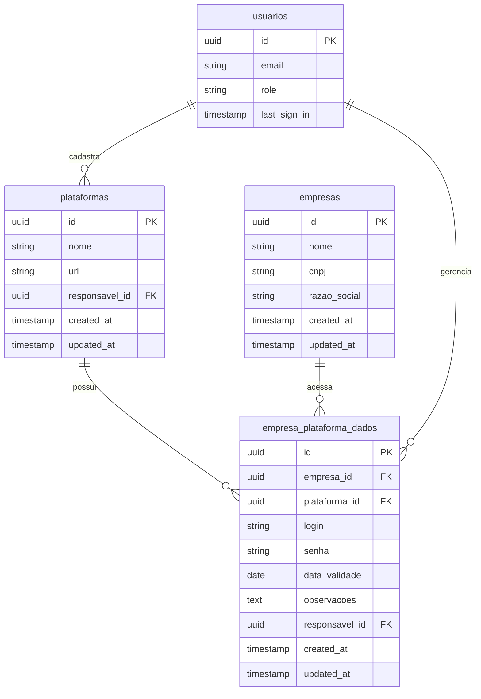

# Modelo de Dados - Gerenciamento de Plataformas

## Visão Geral do Modelo

O módulo de Gerenciamento de Plataformas utiliza um modelo de dados que permite cadastrar plataformas de licitação e seus relacionamentos com empresas, armazenando credenciais de acesso de forma organizada.

## Diagrama ER



## Detalhamento das Tabelas

### Tabela: plataformas

Esta tabela armazena as informações básicas das plataformas de licitação.

| Coluna | Tipo | Nulável | Descrição | Restrições |
|--------|------|---------|-----------|------------|
| id | uuid | não | Identificador único | Chave primária, default: gen_random_uuid() |
| nome | text | não | Nome da plataforma | Único |
| url | text | não | URL de acesso à plataforma | - |
| responsavel_id | uuid | sim | ID do usuário que cadastrou | Chave estrangeira |
| created_at | timestamp with time zone | não | Data de criação | Default: now() |
| updated_at | timestamp with time zone | não | Data de última atualização | Default: now() |

#### Índices da tabela plataformas

- Índice primário: id
- Índice único: nome
- Índice para pesquisa: responsavel_id

### Tabela: empresa_plataforma_dados

Esta tabela estabelece o relacionamento entre empresas e plataformas, armazenando as credenciais de acesso.

| Coluna | Tipo | Nulável | Descrição | Restrições |
|--------|------|---------|-----------|------------|
| id | uuid | não | Identificador único | Chave primária, default: gen_random_uuid() |
| empresa_id | uuid | não | ID da empresa | Chave estrangeira |
| plataforma_id | uuid | não | ID da plataforma | Chave estrangeira |
| login | text | sim | Nome de usuário para acesso | - |
| senha | text | sim | Senha para acesso | - |
| data_validade | date | sim | Data de validade do certificado | - |
| observacoes | text | sim | Observações adicionais | - |
| responsavel_id | uuid | sim | ID do usuário responsável | Chave estrangeira |
| created_at | timestamp with time zone | não | Data de criação | Default: now() |
| updated_at | timestamp with time zone | não | Data de última atualização | Default: now() |

#### Índices da tabela empresa_plataforma_dados

- Índice primário: id
- Índice composto único: (empresa_id, plataforma_id)
- Índice para busca: empresa_id
- Índice para busca: plataforma_id
- Índice para busca: responsavel_id

### Tabela: empresas

Esta tabela armazena as informações das empresas que podem acessar as plataformas.

| Coluna | Tipo | Nulável | Descrição | Restrições |
|--------|------|---------|-----------|------------|
| id | uuid | não | Identificador único | Chave primária |
| nome | text | não | Nome comercial da empresa | - |
| cnpj | text | não | CNPJ da empresa | Único |
| razao_social | text | não | Razão social completa | - |
| created_at | timestamp with time zone | não | Data de criação | Default: now() |
| updated_at | timestamp with time zone | não | Data de última atualização | Default: now() |

### Tabela: usuarios (auth.users no Supabase)

Esta tabela representa os usuários do sistema que podem gerenciar plataformas.

| Coluna | Tipo | Nulável | Descrição |
|--------|------|---------|-----------|
| id | uuid | não | Identificador único |
| email | text | não | Email do usuário |
| role | text | sim | Função do usuário no sistema |
| last_sign_in | timestamp | sim | Data do último login |

## Chaves Estrangeiras

- `plataformas.responsavel_id` → `auth.users.id`
  - ON DELETE: SET NULL (quando um usuário é excluído, a plataforma permanece mas perde a referência)
  - ON UPDATE: CASCADE (atualiza a referência quando o ID do usuário muda)

- `empresa_plataforma_dados.empresa_id` → `empresas.id`
  - ON DELETE: CASCADE (exclui os dados de acesso quando a empresa é excluída)
  - ON UPDATE: CASCADE (atualiza a referência quando o ID da empresa muda)

- `empresa_plataforma_dados.plataforma_id` → `plataformas.id`
  - ON DELETE: CASCADE (exclui os dados de acesso quando a plataforma é excluída)
  - ON UPDATE: CASCADE (atualiza a referência quando o ID da plataforma muda)

- `empresa_plataforma_dados.responsavel_id` → `auth.users.id`
  - ON DELETE: SET NULL (quando um usuário é excluído, o registro permanece mas perde a referência)
  - ON UPDATE: CASCADE (atualiza a referência quando o ID do usuário muda)

## Relacionamentos

1. **Plataforma para Dados de Acesso**: Uma plataforma pode ter múltiplos registros em `empresa_plataforma_dados`, representando seu acesso por diferentes empresas.

2. **Empresa para Dados de Acesso**: Uma empresa pode ter múltiplos registros em `empresa_plataforma_dados`, representando seu acesso a diferentes plataformas.

3. **Usuário para Plataformas**: Um usuário pode ser responsável por cadastrar múltiplas plataformas.

4. **Usuário para Dados de Acesso**: Um usuário pode ser responsável por gerenciar múltiplos registros de dados de acesso.

## SQL para Criação das Tabelas

```sql
-- Tabela de plataformas
CREATE TABLE IF NOT EXISTS plataformas (
    id UUID PRIMARY KEY DEFAULT gen_random_uuid(),
    nome TEXT NOT NULL UNIQUE,
    url TEXT NOT NULL,
    responsavel_id UUID REFERENCES auth.users(id) ON DELETE SET NULL,
    created_at TIMESTAMP WITH TIME ZONE DEFAULT now() NOT NULL,
    updated_at TIMESTAMP WITH TIME ZONE DEFAULT now() NOT NULL
);

-- Tabela de relacionamento entre empresas e plataformas
CREATE TABLE IF NOT EXISTS empresa_plataforma_dados (
    id UUID PRIMARY KEY DEFAULT gen_random_uuid(),
    empresa_id UUID NOT NULL REFERENCES empresas(id) ON DELETE CASCADE,
    plataforma_id UUID NOT NULL REFERENCES plataformas(id) ON DELETE CASCADE,
    login TEXT,
    senha TEXT,
    data_validade DATE,
    observacoes TEXT,
    responsavel_id UUID REFERENCES auth.users(id) ON DELETE SET NULL,
    created_at TIMESTAMP WITH TIME ZONE DEFAULT now() NOT NULL,
    updated_at TIMESTAMP WITH TIME ZONE DEFAULT now() NOT NULL,
    UNIQUE (empresa_id, plataforma_id)
);

-- Índices para melhorar performance
CREATE INDEX idx_plataformas_responsavel ON plataformas(responsavel_id);
CREATE INDEX idx_empresa_plataforma_empresa ON empresa_plataforma_dados(empresa_id);
CREATE INDEX idx_empresa_plataforma_plataforma ON empresa_plataforma_dados(plataforma_id);
CREATE INDEX idx_empresa_plataforma_responsavel ON empresa_plataforma_dados(responsavel_id);
```

## Considerações de Design

1. **Separação de Dados Específicos**: Os dados de acesso são armazenados separadamente da tabela de plataformas para permitir diferentes credenciais para cada par empresa-plataforma.

2. **Rastreabilidade**: A inclusão de `responsavel_id` e timestamps em todas as tabelas permite rastrear quando e por quem cada registro foi criado ou modificado.

3. **Exclusão em Cascata**: A configuração ON DELETE CASCADE na tabela de relacionamento garante que quando uma plataforma ou empresa é excluída, seus dados de acesso também sejam removidos.

4. **Unicidade**: A restrição UNIQUE (empresa_id, plataforma_id) garante que não existam registros duplicados para a mesma combinação de empresa e plataforma.

## Considerações de Segurança

**Observação importante sobre armazenamento de senhas**: No modelo atual, senhas são armazenadas como texto simples na coluna `senha`. Para uma implementação segura em ambiente de produção, seria recomendável:

1. Encriptar senhas antes de armazená-las
2. Implementar campos separados para armazenar certificados digitais
3. Adicionar logs de auditoria para registrar acessos às credenciais
