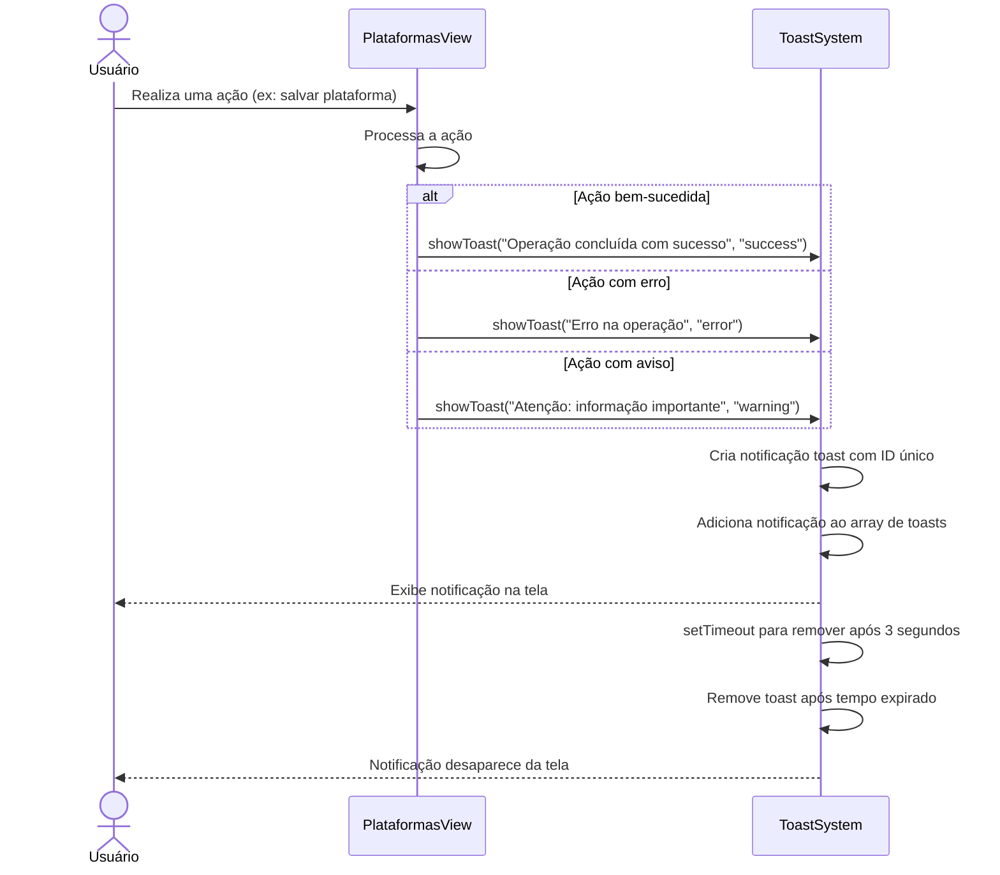

# Funcionalidade: Sistema de Notificações Toast

## Descrição

Esta funcionalidade implementa um sistema de notificações toast para fornecer feedback visual ao usuário após operações como criação, atualização ou exclusão de plataformas e vínculos com empresas.

## Fluxo da Funcionalidade



## Implementação

O sistema de toast utiliza um composable simples que pode ser reutilizado em qualquer componente:

```javascript
export function useToast() {
  // Store compartilhado para os toasts
  const toasts = ref([]);

  // Adiciona uma nova notificação toast
  function showToast(message, type = 'success', duration = 3000) {
    const id = Date.now();
    
    // Adiciona o toast ao array
    toasts.value.push({
      id,
      message,
      type,
      duration
    });
    
    // Remove o toast após o tempo definido
    setTimeout(() => {
      toasts.value = toasts.value.filter(toast => toast.id !== id);
    }, duration);
  }

  // Remove um toast específico
  function removeToast(id) {
    toasts.value = toasts.value.filter(toast => toast.id !== id);
  }

  return {
    toasts,
    showToast,
    removeToast
  };
}
```

## Componente ToastNotification

Este é o componente visual que exibe as notificações:

```html
<template>
  <div class="toast-container">
    <transition-group name="toast">
      <div 
        v-for="toast in toasts" 
        :key="toast.id"
        :class="['toast', `toast-${toast.type}`]"
        @click="removeToast(toast.id)"
      >
        <span class="toast-message">{{ toast.message }}</span>
      </div>
    </transition-group>
  </div>
</template>
```

## Tipos de Notificações

O sistema suporta três tipos principais de notificações:

| Tipo | Cor | Uso |
|------|-----|-----|
| success | Verde | Operações concluídas com sucesso |
| error | Vermelho | Erros e falhas em operações |
| warning | Amarelo | Alertas e avisos importantes |

## Casos de Uso em Plataformas

### Operações Bem-Sucedidas

```javascript
// Após adicionar uma plataforma
showToast('Plataforma cadastrada com sucesso!', 'success');

// Após atualizar uma plataforma
showToast('Plataforma atualizada com sucesso!', 'success');

// Após excluir uma plataforma
showToast('Plataforma excluída com sucesso!', 'success');

// Após vincular empresa a plataforma
showToast('Empresa vinculada com sucesso!', 'success');
```

### Erros e Falhas

```javascript
// Erro ao adicionar plataforma
showToast('Erro ao salvar plataforma: ' + error.message, 'error');

// Erro ao carregar plataformas
showToast('Erro ao carregar plataformas', 'error');

// Erro ao vincular empresa
showToast('Erro ao vincular empresa à plataforma', 'error');

// Erro ao desvincular plataforma
showToast('Erro ao desvincular plataforma da empresa', 'error');
```

### Avisos

```javascript
// Aviso sobre plataforma não compatível
showToast(`Atenção: "${nome}" não é uma plataforma comum para o estado ${estado}`, 'warning');

// Aviso sobre campo específico
showToast('O certificado está próximo da data de validade', 'warning');
```

## Estilização CSS

O componente Toast é estilizado para garantir visibilidade e responsividade:

```css
.toast-container {
  position: fixed;
  top: 20px;
  right: 20px;
  z-index: 9999;
  display: flex;
  flex-direction: column;
  align-items: flex-end;
}

.toast {
  margin-bottom: 10px;
  padding: 12px 20px;
  border-radius: 8px;
  min-width: 280px;
  max-width: 400px;
  box-shadow: 0 4px 12px rgba(0, 0, 0, 0.15);
  display: flex;
  align-items: center;
  cursor: pointer;
  transition: all 0.3s ease;
}

.toast-success {
  background-color: #10B981;
  color: white;
}

.toast-error {
  background-color: #EF4444;
  color: white;
}

.toast-warning {
  background-color: #F59E0B;
  color: white;
}

/* Animações */
.toast-enter-active,
.toast-leave-active {
  transition: all 0.3s ease;
}

.toast-enter-from {
  opacity: 0;
  transform: translateX(30px);
}

.toast-leave-to {
  opacity: 0;
  transform: translateX(30px);
}
```

## Integração com Componentes

O sistema de toast é facilmente integrado aos componentes através do composable:

```javascript
import { useToast } from '@/composables/useToast';

export default {
  setup() {
    const { toasts, showToast, removeToast } = useToast();
    
    // Resto do setup...
    
    return {
      toasts,
      showToast,
      removeToast
      // Outras propriedades e métodos...
    }
  }
}
```

## Benefícios

1. **Feedback Imediato**: Fornece retorno visual instantâneo das ações
2. **Design Não Intrusivo**: Não bloqueia a interface do usuário
3. **Auto-remoção**: Desaparece automaticamente após tempo determinado
4. **Customizável**: Permite diferentes tipos de mensagens com estilos distintos
5. **Reusabilidade**: Pode ser utilizado em qualquer parte do sistema
