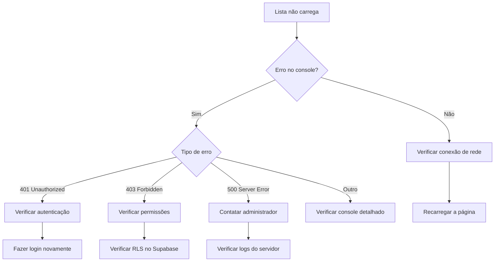
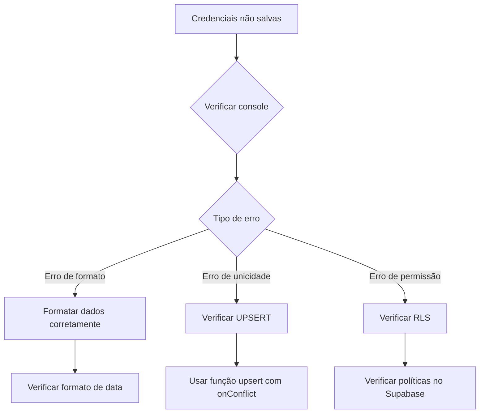

# Guia de Solução de Problemas

Este documento apresenta problemas comuns que podem ocorrer ao utilizar o módulo de Gerenciamento de Plataformas e suas soluções.

## Problemas de Carregamento de Dados

### Problema: Lista de Plataformas Não Carrega

**Sintomas:**

- Tela permanece em estado de carregamento indefinidamente
- Mensagem de erro "Erro ao carregar plataformas"
- Console exibe erro de conexão com o Supabase

**Causas Possíveis:**

1. Problemas de conexão com a internet
2. Chave da API do Supabase inválida ou expirada
3. Políticas de segurança (RLS) bloqueando o acesso

**Soluções:**



**Verificação de Autenticação:**

```javascript
// Verificar status de autenticação atual
const checkAuth = async () => {
  const { data: { user }, error } = await supabase.auth.getUser();
  
  if (error || !user) {
    console.error("Erro de autenticação:", error);
    // Redirecionar para login
    router.push('/login');
    return false;
  }
  
  return true;
};
```

## Problemas de Adição/Edição de Plataformas

### Problema: Não Consigo Salvar Nova Plataforma

**Sintomas:**

- Mensagem de erro ao salvar
- Modal permanece aberto após tentativa de salvar
- Erro no console relacionado à inserção de dados

**Causas Possíveis:**

1. Violação de unicidade (nome já existente)
2. Dados inválidos ou incompletos
3. Problemas de permissão para inserção

**Soluções:**

1. **Verificar campos obrigatórios:**

   ```javascript
   if (!formData.nome || !formData.url) {
     showToast('Nome e URL são obrigatórios', 'error');
     return;
   }
   ```

2. **Verificar unicidade previamente:**

   ```javascript
   // Verificar se nome já existe
   const { data } = await supabase
     .from('plataformas')
     .select('id')
     .eq('nome', formData.nome)
     .single();
   
   if (data) {
     showToast('Já existe uma plataforma com este nome', 'error');
     return;
   }
   ```

3. **Inspecionar logs detalhados:**

   ```javascript
   try {
     // Código de salvamento...
   } catch (error) {
     console.error('Erro detalhado:', error);
     
     // Tratamento específico por código
     if (error.code === '23505') {
       showToast('Esse registro já existe no sistema', 'error');
     } else {
       showToast('Erro ao salvar: ' + error.message, 'error');
     }
   }
   ```

## Problemas com Vinculações de Empresas

### Problema: Credenciais Não São Salvas

**Sintomas:**

- Mensagem de sucesso ao salvar, mas dados não aparecem
- Ao editar novamente, campos estão vazios
- Erro no console relacionado à tabela empresa_plataforma_dados

**Causas Possíveis:**

1. Problemas de formato de dados (especialmente datas)
2. Violação de unicidade na tabela de relacionamento
3. Permissões inadequadas

**Soluções:**



**Solução para UPSERT:**

```javascript
// Usar upsert em vez de insert para lidar com registros existentes
const { error } = await supabase
  .from('empresa_plataforma_dados')
  .upsert({
    empresa_id: empresaId,
    plataforma_id: plataformaId,
    login: login,
    senha: senha,
    // outros campos...
  }, {
    onConflict: 'empresa_id,plataforma_id',
    ignoreDuplicates: false
  });
```

## Problemas de Exclusão

### Problema: Erro ao Excluir Plataforma

**Sintomas:**

- Mensagem de erro ao tentar excluir
- Erro no console sobre chaves estrangeiras ou restrições de integridade

**Causas Possíveis:**

1. Plataforma usada como referência em processos
2. Problemas de permissão para exclusão
3. Erros de cascata na exclusão

**Soluções:**

1. **Verificar dependências antes de excluir:**

   ```javascript
   const verificarDependencias = async (plataformaId) => {
     // Verificar se a plataforma é usada em processos
     const { count, error } = await supabase
       .from('processos')
       .select('id', { count: 'exact' })
       .eq('plataforma_id', plataformaId);
       
     if (error) throw error;
     
     if (count > 0) {
       showToast(`Esta plataforma é usada em ${count} processos e não pode ser excluída`, 'error');
       return false;
     }
     
     return true;
   };
   ```

2. **Tratamento de erros específico:**

   ```javascript
   try {
     // Código de exclusão...
   } catch (error) {
     console.error('Erro ao excluir:', error);
     
     if (error.code === '23503') {
       showToast('Não é possível excluir pois existem registros relacionados', 'error');
     } else if (error.code === '42501') {
       showToast('Você não tem permissão para excluir esta plataforma', 'error');
     } else {
       showToast('Erro ao excluir: ' + error.message, 'error');
     }
   }
   ```

## Problemas de Tempo Real

### Problema: Atualizações em Tempo Real Não Funcionam

**Sintomas:**

- Alterações feitas em outra sessão não aparecem automaticamente
- Nenhum erro no console, mas dados desatualizados
- Subscriptions configuradas mas não disparam

**Causas Possíveis:**

1. Canal não configurado corretamente
2. Problemas com o serviço Realtime do Supabase
3. Filteração incorreta dos eventos

**Soluções:**

1. **Verificar configuração do canal:**

   ```javascript
   // Verificação de canal
   const verificarCanal = () => {
     const channel = SupabaseManager.getSubscription('plataformas-updates');
     console.log('Status do canal:', channel?.state);
     
     if (!channel || channel.state !== 'SUBSCRIBED') {
       console.warn('Canal não está subscrito corretamente');
       
       // Recriar canal
       if (channel) {
         supabase.removeChannel(channel);
         SupabaseManager.removeSubscription('plataformas-updates');
       }
       
       configureRealtimeChannel();
     }
   };
   ```

2. **Configurar corretamente filtros de eventos:**

   ```javascript
   const configureRealtimeChannel = () => {
     try {
       const channel = supabase.channel('plataformas-updates')
         .on('postgres_changes', {
           event: '*', // ou especificar 'INSERT', 'UPDATE', 'DELETE'
           schema: 'public',
           table: 'plataformas',
         }, (payload) => {
           console.log('Evento recebido:', payload);
           loadPlataformas();
         })
         .subscribe((status) => {
           console.log('Status de subscrição:', status);
         });
       
       SupabaseManager.addSubscription('plataformas-updates', channel);
     } catch (error) {
       console.error('Erro ao configurar canal em tempo real:', error);
     }
   };
   ```

3. **Implementar fallback com polling:**

   ```javascript
   // Implementação de polling como fallback
   const startPolling = () => {
     const pollingInterval = setInterval(() => {
       loadPlataformas().catch(console.error);
     }, 30000); // Verificar a cada 30 segundos
     
     return pollingInterval;
   };
   
   onMounted(() => {
     // Tentar configurar canal realtime
     configureRealtimeChannel();
     
     // Estabelecer polling como fallback
     const polling = startPolling();
     
     onUnmounted(() => {
       clearInterval(polling);
       // Limpar canal...
     });
   });
   ```

## Problemas de Desempenho

### Problema: Carregamento Lento com Muitas Plataformas

**Sintomas:**

- Tempo de carregamento excessivo
- Interface travando ao rolar com muitos registros
- Uso intenso de memória

**Soluções:**

1. **Implementar paginação no servidor:**

   ```javascript
   const loadPlataformas = async (page = 0, pageSize = 20) => {
     try {
       const { data, error, count } = await supabase
         .from('plataformas')
         .select('*', { count: 'exact' })
         .range(page * pageSize, (page + 1) * pageSize - 1)
         .order('nome');
         
       if (error) throw error;
       
       return {
         data,
         totalPages: Math.ceil(count / pageSize),
         currentPage: page
       };
     } catch (error) {
       console.error('Erro ao carregar plataformas:', error);
       throw error;
     }
   };
   ```

2. **Implementar paginação na interface:**

   ```html
   <!-- Controles de paginação -->
   <div class="pagination">
     <button 
       @click="changePage(currentPage - 1)" 
       :disabled="currentPage === 0"
       class="btn-page"
     >
       Anterior
     </button>
     
     <span class="page-info">
       Página {{ currentPage + 1 }} de {{ totalPages }}
     </span>
     
     <button 
       @click="changePage(currentPage + 1)" 
       :disabled="currentPage >= totalPages - 1"
       class="btn-page"
     >
       Próxima
     </button>
   </div>
   ```

3. **Implementar virtual scrolling:**

   ```javascript
   import { VirtualScroller } from 'vue-virtual-scroller';
   import 'vue-virtual-scroller/dist/vue-virtual-scroller.css';
   
   export default {
     components: {
       VirtualScroller
     },
     // resto do código...
   }
   ```

   ```html
   <virtual-scroller
     class="scroller"
     :items="plataformas"
     :item-height="50"
     v-slot="{ item: plataforma }"
   >
     <plataforma-item :plataforma="plataforma" />
   </virtual-scroller>
   ```

## Problemas de Permissão

### Problema: Erro de Permissão ao Acessar Plataformas

**Sintomas:**

- Mensagem "403 Forbidden" ou "Not allowed by policy"
- Console mostra erros de RLS (Row Level Security)

**Soluções:**

1. **Verificar políticas no Supabase:**

   ```sql
   -- Visualizar políticas existentes
   SELECT * FROM pg_policies WHERE tablename = 'plataformas';
   
   -- Criar política para permitir leitura
   CREATE POLICY "Permitir leitura para usuários autenticados"
     ON plataformas
     FOR SELECT
     TO authenticated
     USING (true);
   
   -- Criar política para permitir modificações
   CREATE POLICY "Permitir modificação para administradores"
     ON plataformas
     FOR ALL
     TO authenticated
     USING ((auth.jwt() -> 'user_metadata' ->> 'role') = 'admin');
   ```

2. **Verificar função do usuário antes de operações:**

   ```javascript
   const canModifyPlataformas = async () => {
     try {
       const { data: { user }, error } = await supabase.auth.getUser();
       
       if (error || !user) return false;
       
       // Verificar se o usuário tem perfil de administrador
       const { data: profile, error: profileError } = await supabase
         .from('profiles')
         .select('role')
         .eq('id', user.id)
         .single();
         
       if (profileError || !profile) return false;
       
       return profile.role === 'admin';
     } catch (error) {
       console.error('Erro ao verificar permissões:', error);
       return false;
     }
   };
   ```

## Diagnóstico e Logging

Para facilitar o diagnóstico de problemas, implemente um sistema de logging mais detalhado:

```javascript
const logLevels = {
  DEBUG: 0,
  INFO: 1,
  WARN: 2,
  ERROR: 3
};

const currentLevel = logLevels.INFO; // Configurável

const logger = {
  debug: (message, ...args) => {
    if (currentLevel <= logLevels.DEBUG) {
      console.log(`[DEBUG] ${message}`, ...args);
    }
  },
  
  info: (message, ...args) => {
    if (currentLevel <= logLevels.INFO) {
      console.log(`[INFO] ${message}`, ...args);
    }
  },
  
  warn: (message, ...args) => {
    if (currentLevel <= logLevels.WARN) {
      console.warn(`[WARN] ${message}`, ...args);
    }
  },
  
  error: (message, ...args) => {
    if (currentLevel <= logLevels.ERROR) {
      console.error(`[ERROR] ${message}`, ...args);
    }
  }
};

// Uso
logger.info('Carregando plataformas...');
try {
  // operação
} catch (error) {
  logger.error('Falha ao carregar plataformas:', error);
}
```
