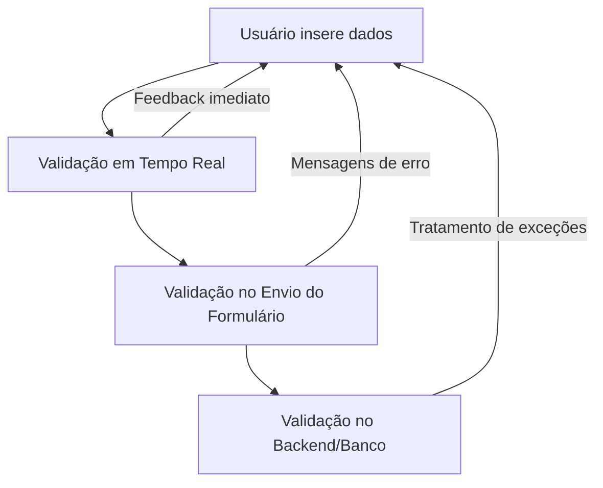

# Funcionalidade: Validação de Dados

## Descrição

O sistema de validação de dados do módulo de Plataformas implementa verificações em vários níveis para garantir a integridade e consistência dos dados, incluindo validações locais no front-end e verificações no servidor.

## Níveis de Validação



## Validações de Plataformas

### Validações de Campo

| Campo | Regras de Validação | Mensagem de Erro |
|-------|---------------------|------------------|
| Nome | Obrigatório, String, Único | "Nome da plataforma é obrigatório" |
| URL | Obrigatório, Formato URL válido | "URL da plataforma é obrigatório" ou "Formato de URL inválido" |

### Validação de Unicidade

```javascript
// Validação de nome único para plataforma
const validateNomeUnico = async (nome) => {
  try {
    // Verifica se já existe uma plataforma com este nome
    const { data, error } = await supabase
      .from('plataformas')
      .select('id')
      .eq('nome', nome)
      .maybeSingle();
      
    if (error) throw error;
    
    return { 
      valid: !data,
      error: data ? 'Já existe uma plataforma com este nome' : null
    };
    
  } catch (error) {
    console.error('Erro ao validar unicidade:', error);
    return { 
      valid: false,
      error: 'Erro ao verificar disponibilidade do nome'
    };
  }
};
```

### Validação de URL

```javascript
// Validação de formato de URL
const validateUrl = (url) => {
  // Se vazio, não valida (a obrigatoriedade é tratada em outra validação)
  if (!url) return { valid: true };
  
  try {
    // Tenta criar um objeto URL (lança exceção se inválido)
    new URL(url);
    return { valid: true };
  } catch (e) {
    return { 
      valid: false, 
      error: 'URL inválida. Formato esperado: http(s)://exemplo.com'
    };
  }
};
```

## Validações em Vínculos com Empresas

### Validação de Duplicidade

```javascript
// Verifica se já existe vínculo entre empresa e plataforma
const validateVinculo = async (empresaId, plataformaId) => {
  if (!empresaId || !plataformaId) return { valid: true };
  
  try {
    const { data, error } = await supabase
      .from('empresa_plataforma_dados')
      .select('id')
      .eq('empresa_id', empresaId)
      .eq('plataforma_id', plataformaId)
      .maybeSingle();
      
    if (error) throw error;
    
    return {
      valid: !data,
      error: data ? 'Esta empresa já está vinculada a esta plataforma' : null
    };
    
  } catch (error) {
    console.error('Erro ao validar vínculo:', error);
    return { 
      valid: false,
      error: 'Erro ao verificar vínculo existente'
    };
  }
};
```

### Validação de Data de Validade

```javascript
// Validação de data de validade
const validateDataValidade = (data) => {
  // Se vazia, não valida
  if (!data) return { valid: true };
  
  try {
    const dataValidade = new Date(data);
    const hoje = new Date();
    
    // Data não pode ser anterior a hoje
    return {
      valid: dataValidade >= hoje,
      error: dataValidade < hoje ? 'A data deve ser igual ou posterior a hoje' : null
    };
  } catch (e) {
    return {
      valid: false,
      error: 'Formato de data inválido'
    };
  }
};
```

## Implementação no Formulário

A validação é aplicada de forma abrangente no formulário:

```javascript
const validateForm = async () => {
  // Limpa erros anteriores
  formErrors.value = {};
  
  // Validação de campos obrigatórios
  if (!formData.value.nome) {
    formErrors.value.nome = 'Nome da plataforma é obrigatório';
  }
  
  if (!formData.value.url) {
    formErrors.value.url = 'URL da plataforma é obrigatória';
  } else {
    // Validação de formato de URL
    const urlValidation = validateUrl(formData.value.url);
    if (!urlValidation.valid) {
      formErrors.value.url = urlValidation.error;
    }
  }
  
  // Se estiver editando, não precisa validar unicidade se o nome não mudou
  if (!isEditing.value || originalData.value.nome !== formData.value.nome) {
    // Validação de nome único
    const uniqueValidation = await validateNomeUnico(formData.value.nome);
    if (!uniqueValidation.valid) {
      formErrors.value.nome = uniqueValidation.error;
    }
  }
  
  // Se estiver em modo empresa específica, valida data
  if (selectedEmpresa.value) {
    const dataValidation = validateDataValidade(formData.value.data_validade);
    if (!dataValidation.valid) {
      formErrors.value.data_validade = dataValidation.error;
    }
  }
  
  // Verificação final
  return Object.keys(formErrors.value).length === 0;
};
```

## Validação no Submit

```javascript
const handleSubmit = async () => {
  try {
    // Executa validações
    const isValid = await validateForm();
    
    if (!isValid) {
      showToast('Por favor, corrija os erros no formulário', 'error');
      return;
    }
    
    // Dados validados, prossegue com o envio...
  } catch (error) {
    console.error('Erro ao validar formulário:', error);
    showToast('Erro ao processar o formulário', 'error');
  }
};
```

## Validação no Servidor (Banco de Dados)

O banco de dados possui restrições que garantem uma camada adicional de validação:

```sql
-- Restrição de unicidade para nome da plataforma
ALTER TABLE plataformas ADD CONSTRAINT unique_plataforma_nome UNIQUE (nome);

-- Restrição de unicidade para vínculo entre empresa e plataforma
ALTER TABLE empresa_plataforma_dados 
  ADD CONSTRAINT unique_empresa_plataforma 
  UNIQUE (empresa_id, plataforma_id);
```

## Feedback Visual

O formulário fornece feedback visual imediato sobre o status da validação:

```html
<div class="form-group">
  <label for="nome">Nome da Plataforma*</label>
  <input 
    id="nome" 
    v-model="formData.nome" 
    :class="['form-control', formErrors.nome ? 'is-invalid' : '']"
    type="text"
  />
  <div v-if="formErrors.nome" class="invalid-feedback">
    {{ formErrors.nome }}
  </div>
</div>
```

## Otimizações de Validação

1. **Debouncing**: Validações assíncronas (como verificação de unicidade) são executadas com debounce para evitar excesso de requisições
2. **Validação Sequencial**: Para economizar recursos, as validações são executadas em sequência, interrompendo ao encontrar o primeiro erro
3. **Cache Local**: Resultados de validações são armazenados temporariamente para evitar re-validação de valores não alterados
4. **Sanitização**: Dados são sanitizados antes da validação para evitar problemas comuns (por exemplo, espaços extras)

## Erros Comuns e Tratamentos

| Erro | Causa | Tratamento |
|------|-------|------------|
| Duplicação de nome | Tentativa de cadastrar plataforma com nome existente | Mensagem clara de erro, sugestão de nomes alternativos |
| URL inválida | Formato incorreto de URL (sem protocolo, etc.) | Mensagem explicativa, autocorreção para adicionar "https://" |
| Vínculo duplicado | Tentativa de vincular empresa já vinculada | Mensagem explicativa, opção para editar vínculo existente |
| Data inválida | Data de validade no passado | Alerta visual, sugestão da data atual |
