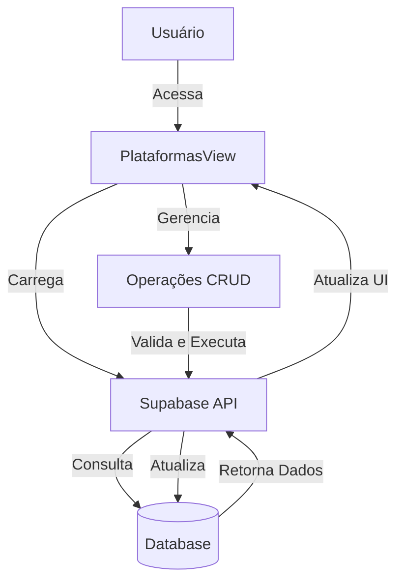
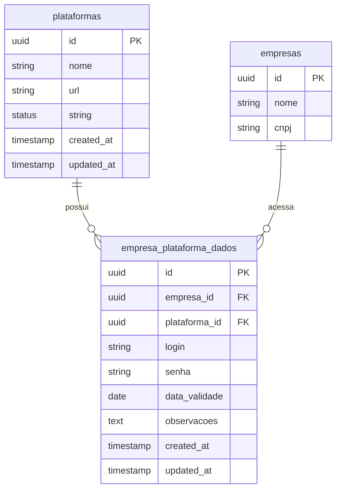
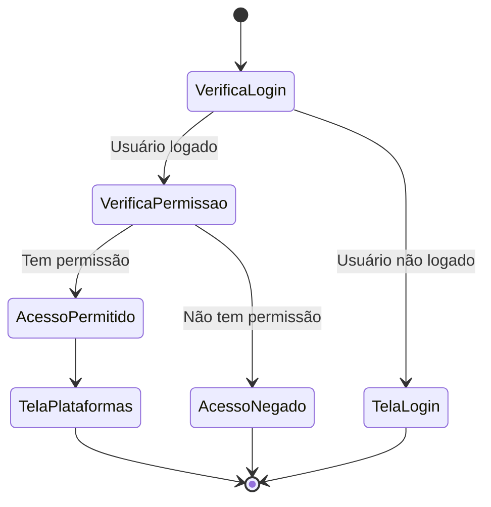

# Visão Geral - Gerenciamento de Plataformas

## Descrição da Funcionalidade

O módulo de "Gerenciamento de Plataformas" permite cadastrar, visualizar, editar e excluir plataformas de licitação utilizadas nos processos licitatórios, além de gerenciar vínculos entre empresas e plataformas, armazenando credenciais de acesso de forma segura.

## Acesso

- Disponível para usuários autenticados com permissões adequadas
- Caminho: Menu Principal > Cadastros > Plataformas

## Funcionalidades Principais

1. **Listar Plataformas**: Visualização de todas as plataformas cadastradas no sistema
2. **Adicionar Plataforma**: Inclusão de novas plataformas com nome e URL
3. **Editar Plataforma**: Modificação dos dados de uma plataforma existente
4. **Excluir Plataforma**: Remoção de uma plataforma do sistema (com verificação de vínculos)
5. **Vincular Empresas**: Associação de empresas a plataformas, com armazenamento de credenciais
6. **Gerenciar Dados de Acesso**: Armazenamento de login, senha, certificados e outros dados relevantes para acesso às plataformas

## Diagrama de Arquitetura

## Modelo de Dados Simplificado

## Fluxo de Permissões

## Componentes Principais

1. **PlataformasView.vue**: Componente principal que gerencia a tela de plataformas
2. **PlataformasView.js**: Lógica do componente separada em script
3. **Modal de Cadastro/Edição**: Interface para adicionar ou editar plataformas
4. **Interface de Vínculos**: Sistema para gerenciar vinculações com empresas
5. **Toast Notifications**: Feedback visual para o usuário após operações

## Tabelas do Banco de Dados

| Tabela | Descrição |
|--------|-----------|
| plataformas | Armazena as informações das plataformas de licitação |
| empresa_plataforma_dados | Relaciona empresas com plataformas e armazena credenciais de acesso |
| empresas | Contém dados das empresas que podem ser vinculadas às plataformas |

## Tecnologias Utilizadas

- Vue.js para a interface do usuário
- Supabase como backend e banco de dados
- Sistema de notificações por toast
- Sistema de tempo real para atualização automática de dados
