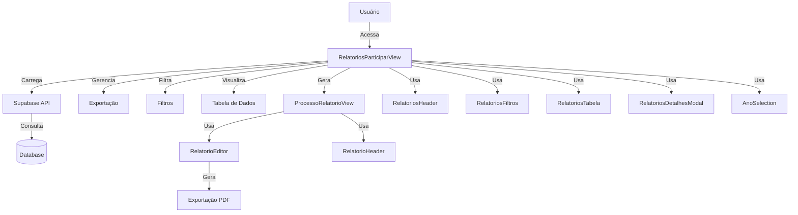
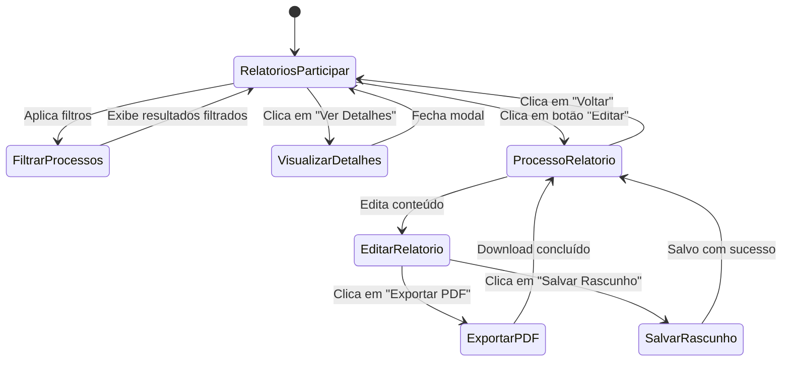
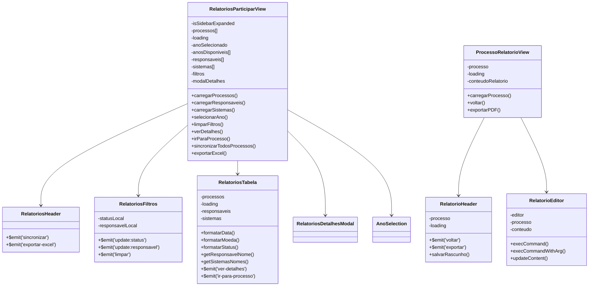
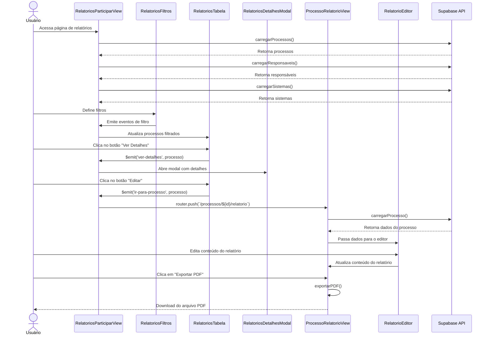
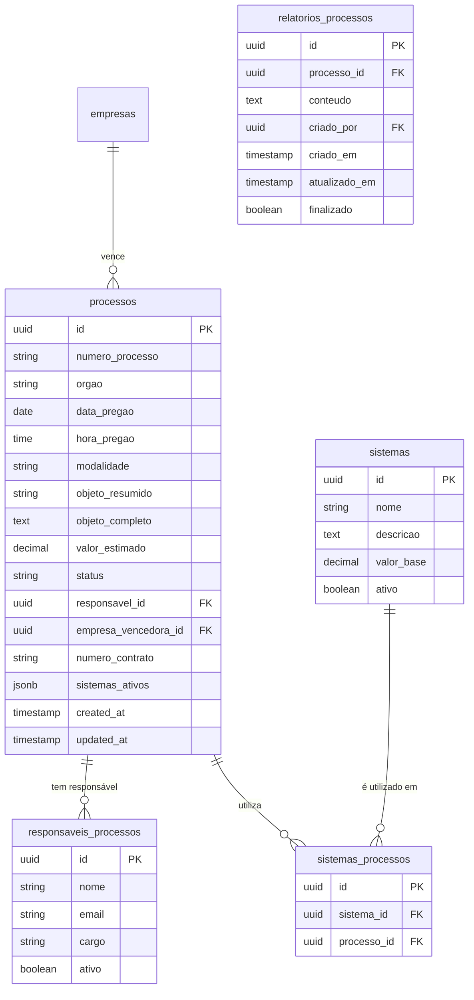
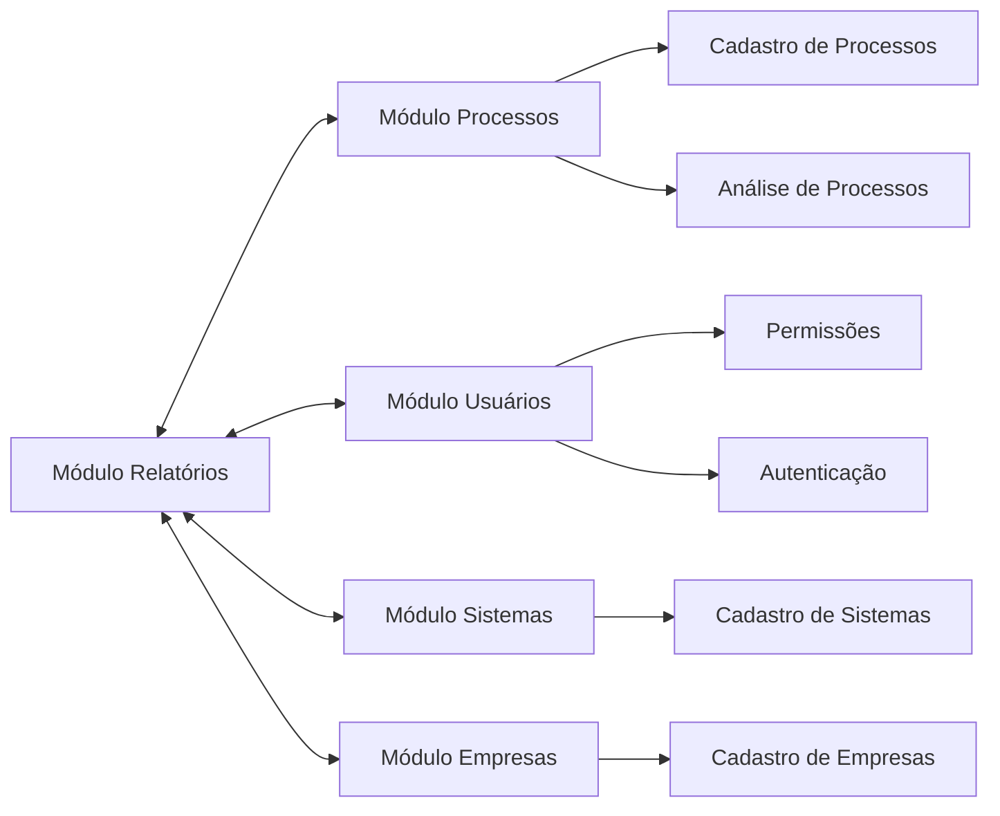

# Documentação do Módulo de Relatórios

## Visão Geral

O módulo de Relatórios permite aos usuários visualizar, gerenciar e exportar relatórios de processos licitatórios em que a empresa decidiu participar. Este módulo possibilita a criação de relatórios detalhados sobre cada processo, incluindo análises técnicas, observações importantes e conclusões, com layout semelhante ao Google Docs e exportação para PDF.

## Estrutura de Componentes



### Componentes Principais

1. **RelatoriosParticiparView**: Componente principal que gerencia a exibição da lista de processos com participação.

2. **ProcessoRelatorioView**: Componente para edição e geração de relatórios detalhados por processo.

3. **RelatoriosHeader**: Cabeçalho da página com ações de sincronização e exportação.

4. **RelatoriosFiltros**: Componente para filtragem de processos por diversos critérios.

5. **RelatoriosTabela**: Tabela que exibe os processos e suas informações principais.

6. **RelatoriosDetalhesModal**: Modal para exibir informações detalhadas de um processo.

7. **AnoSelection**: Componente de seleção de ano para filtrar os processos.

8. **RelatorioEditor**: Editor de texto rico para criação de relatórios detalhados.

## Fluxo de Navegação



## Integração entre Componentes



## Interação entre Componentes



## Estrutura do Banco de Dados

### Modelo ER



### Detalhamento das Tabelas

#### Tabela: processos

| Coluna | Tipo | Descrição |
|--------|------|-----------|
| id | UUID | Identificador único do processo |
| numero_processo | TEXT | Número do processo licitatório |
| orgao | TEXT | Nome do órgão licitante |
| data_pregao | DATE | Data do pregão |
| hora_pregao | TIME | Hora do pregão |
| modalidade | TEXT | Modalidade da licitação (pregão, concorrência, etc.) |
| objeto_resumido | TEXT | Resumo do objeto da licitação |
| objeto_completo | TEXT | Descrição completa do objeto |
| valor_estimado | NUMERIC | Valor estimado da licitação |
| status | TEXT | Status do processo (vamos_participar, ganhamos, perdemos, etc.) |
| responsavel_id | UUID | ID do responsável interno pelo processo |
| empresa_vencedora_id | UUID | ID da empresa vencedora |
| sistemas_ativos | JSONB | Sistemas utilizados no processo |
| created_at | TIMESTAMP | Data de criação do registro |
| updated_at | TIMESTAMP | Data da última atualização |

#### Tabela: responsaveis_processos

| Coluna | Tipo | Descrição |
|--------|------|-----------|
| id | UUID | Identificador único do responsável |
| nome | TEXT | Nome do responsável |
| email | TEXT | Email do responsável |
| cargo | TEXT | Cargo do responsável |
| ativo | BOOLEAN | Indica se o responsável está ativo |

#### Tabela: relatorios_processos

| Coluna | Tipo | Descrição |
|--------|------|-----------|
| id | UUID | Identificador único do relatório |
| processo_id | UUID | Referência ao processo |
| conteudo | TEXT | Conteúdo HTML do relatório |
| criado_por | UUID | Referência ao usuário que criou o relatório |
| criado_em | TIMESTAMP | Data de criação do relatório |
| atualizado_em | TIMESTAMP | Data da última atualização |
| finalizado | BOOLEAN | Indica se o relatório está finalizado |

## Funcionalidades Principais

### 1. Listagem e Filtragem de Processos

- Visualização de processos com participação confirmada
- Filtros por ano, status e responsável
- Ordenação por diferentes critérios
- Sincronização de dados

### 2. Geração de Relatórios

- Editor de texto rico com formatação avançada
- Modelo pré-preenchido com dados do processo
- Ferramentas de edição semelhantes ao Google Docs
- Salvamento automático de rascunhos

### 3. Exportação de Relatórios

- Geração de PDF com layout profissional
- Metadados incluídos automaticamente
- Cabeçalhos e rodapés personalizados
- Compatibilidade com sistemas de impressão

### 4. Detalhes de Processos

- Visualização modal de detalhes completos
- Acesso rápido às informações relacionadas
- Navegação facilitada para edição de relatório

## Utilitários e Funções Auxiliares

### Formatadores

```javascript
// Formatação de data
function formatarData(date) {
  if (!date) return '-';
  return new Date(date).toLocaleDateString('pt-BR');
}

// Formatação de valor monetário
function formatarMoeda(valor) {
  if (valor === null || valor === undefined) return '-';
  return new Intl.NumberFormat('pt-BR', {
    style: 'currency',
    currency: 'BRL'
  }).format(valor);
}

// Formatação de status
function formatarStatus(status) {
  if (!status) return '-';
  
  const statusMap = {
    'vamos_participar': 'Vamos Participar',
    'ganhamos': 'Ganhamos',
    'perdemos': 'Perdemos',
    'em_analise': 'Em Análise',
    'adiado': 'Adiado',
    'cancelado': 'Cancelado',
    'demonstracao': 'Demonstração'
  };
  
  return statusMap[status] || status.replace(/_/g, ' ');
}
```

### Exportação para PDF

A função `exportToPDF` utiliza as bibliotecas jsPDF e html2canvas para converter o conteúdo HTML do editor em um documento PDF formatado:

```javascript
async function exportToPDF({ conteudo, processo, nomeArquivo }) {
  // Importar bibliotecas
  const { jsPDF } = await import('jspdf');
  const html2canvas = (await import('html2canvas')).default;
  
  // Criar elemento temporário
  const tempDiv = document.createElement('div');
  tempDiv.innerHTML = conteudo;
  tempDiv.style.width = '210mm';
  tempDiv.style.padding = '20mm';
  // ...configurações adicionais...

  // Renderizar HTML para canvas
  const canvas = await html2canvas(tempDiv);
  
  // Criar documento PDF
  const doc = new jsPDF({
    orientation: 'portrait',
    unit: 'mm',
    format: 'a4'
  });
  
  // Adicionar metadados
  doc.setProperties({
    title: `Relatório - ${processo.numero_processo}`,
    // ...outros metadados...
  });
  
  // Adicionar conteúdo
  const imgWidth = doc.internal.pageSize.getWidth() - 20;
  const imgHeight = (canvas.height * imgWidth) / canvas.width;
  
  doc.addImage(
    canvas.toDataURL('image/jpeg', 1.0),
    'JPEG',
    10,
    20,
    imgWidth,
    imgHeight
  );
  
  // Salvar PDF
  doc.save(nomeArquivo);
  
  return true;
}
```

### Geração de Modelo de Relatório

```javascript
async function gerarModeloRelatorio(processo) {
  if (!processo) return '';
  
  // Extrair dados do processo
  const {
    numero_processo,
    orgao,
    data_pregao,
    // ...outros campos...
  } = processo;

  // Formatar dados
  const dataFormatada = formatarData(data_pregao);
  const valorFormatado = formatarMoeda(valor_estimado);
  
  // Estrutura HTML do relatório
  return `
    <h1 style="text-align:center; margin-bottom: 30px;">Relatório de Processo Licitatório</h1>
    
    <h2>1. Informações Gerais</h2>
    <table style="width:100%; border-collapse: collapse; margin-bottom: 20px;">
      <tr>
        <td style="width:30%; padding:8px; border-bottom:1px solid #ddd;"><strong>Número do Processo:</strong></td>
        <td style="padding:8px; border-bottom:1px solid #ddd;">${numero_processo || ''}</td>
      </tr>
      <!-- ...outros campos... -->
    </table>
    
    <!-- ...seções adicionais... -->
  `;
}
```

## Consultas SQL Principais

### Carregar Processos para Relatórios

```sql
SELECT p.*,
       r.id as responsavel_id,
       r.nome as responsavel_nome
FROM processos p
LEFT JOIN responsaveis_processos r ON p.responsavel_id = r.id
WHERE p.status IN ('vamos_participar', 'ganhamos', 'perdemos')
  AND EXTRACT(YEAR FROM p.data_pregao) = :ano
ORDER BY p.data_pregao DESC;
```

### Buscar Relatório de um Processo

```sql
SELECT r.*,
       p.numero_processo,
       p.orgao,
       p.data_pregao,
       p.valor_estimado,
       resp.nome as responsavel_nome
FROM relatorios_processos r
JOIN processos p ON r.processo_id = p.id
LEFT JOIN responsaveis_processos resp ON p.responsavel_id = resp.id
WHERE r.processo_id = :processo_id;
```

### Salvar Rascunho de Relatório

```sql
INSERT INTO relatorios_processos (
  id,
  processo_id,
  conteudo,
  criado_por,
  criado_em,
  atualizado_em,
  finalizado
)
VALUES (
  uuid_generate_v4(),
  :processo_id,
  :conteudo,
  :usuario_id,
  NOW(),
  NOW(),
  false
)
ON CONFLICT (processo_id) DO UPDATE
SET conteudo = EXCLUDED.conteudo,
    atualizado_em = NOW();
```

## Rotas do Módulo

| Rota | Componente | Descrição |
|------|------------|-----------|
| `/relatorios-participar` | RelatoriosParticiparView | Lista de processos com participação |
| `/processos/:id/relatorio` | ProcessoRelatorioView | Editor de relatório para um processo específico |

## Como Utilizar

### Visualização de Relatórios

1. Acesse a página "Relatórios de Participação" através do menu lateral
2. Use os filtros para encontrar processos específicos por ano, status ou responsável
3. Clique no botão "Ver Detalhes" para visualizar informações completas sobre um processo
4. Clique no botão "Editar" (ícone de lápis) para criar ou editar um relatório para o processo

### Criação e Edição de Relatórios

1. Na tela de edição de relatório, encontre um modelo pré-preenchido com os dados do processo
2. Utilize as ferramentas de formatação para personalizar o conteúdo:
   - Formatação básica (negrito, itálico, sublinhado)
   - Alinhamento de texto
   - Tamanho e tipo de fonte
   - Listas ordenadas e não-ordenadas
   - Cores de texto

3. Ao concluir, você pode:
   - Salvar o rascunho para continuar editando posteriormente
   - Exportar o relatório como PDF para compartilhamento

### Exportação para PDF

1. Clique no botão "Exportar PDF" no topo da página de edição
2. O sistema gerará um arquivo PDF formatado com o conteúdo do relatório
3. O PDF incluirá automaticamente:
   - Cabeçalho com dados do processo
   - Todas as formatações aplicadas no editor
   - Paginação automática para relatórios longos
   - Metadados do documento (título, autor, etc.)

## Considerações Técnicas

### Performance

- Paginação de resultados para lidar com grande volume de dados
- Carregamento sob demanda de componentes pesados
- Otimização de consultas SQL com índices apropriados
- Uso eficiente de cache para dados frequentemente acessados

### Segurança

- Validação de permissões de usuário para acesso a relatórios
- Sanitização de conteúdo HTML para evitar ataques XSS
- Controle de acesso baseado em papéis para edição de relatórios
- Logs de atividade para auditoria

### Manutenção

- Componentes modularizados para facilitar manutenção
- Separação clara de responsabilidades entre componentes
- Documentação de código para principais funções
- Padrões consistentes de nomenclatura e estruturação

## Integrações com Outros Módulos



## Próximos Passos

1. **Comentários em Relatórios**: Permitir que usuários adicionem comentários e notas em relatórios
2. **Templates Personalizados**: Possibilitar a criação e uso de templates personalizados para diferentes tipos de relatório
3. **Assinatura Digital**: Implementar funcionalidade de assinatura digital para validação de relatórios
4. **Relatórios Automáticos**: Geração automática de relatórios baseados em critérios pré-definidos
5. **Integração com Email**: Envio automático de relatórios por email para stakeholders relevantes
6. **Análise Estatística**: Inclusão de gráficos e estatísticas automáticas em relatórios

## Conclusão

O módulo de Relatórios oferece uma solução completa para criação, edição e gerenciamento de relatórios de processos licitatórios. Com uma interface intuitiva e ferramentas avançadas de edição, possibilita a documentação detalhada de cada processo, facilitando o acompanhamento, análise e compartilhamento de informações importantes.