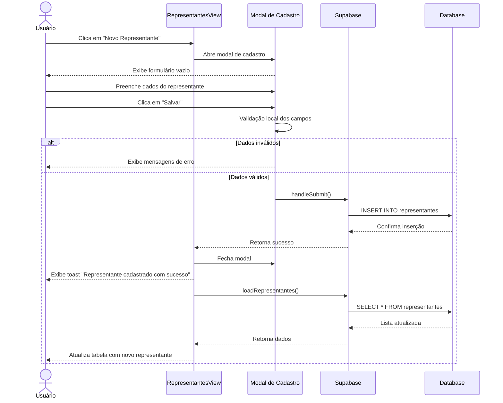

# Funcionalidade: Adicionar Representante

## Descrição

Esta funcionalidade permite adicionar novos representantes ao sistema através de um formulário modal. O usuário fornece informações básicas como nome, documento, informações de contato e localização.

## Fluxo da Funcionalidade



## Interface de Usuário

O modal de cadastro de representantes contém:

- Título "Novo Representante"
- Campos para os dados do representante:
  - Nome (obrigatório)
  - Documento (CPF)
  - Email
  - Telefone
  - Cidade
  - Estado/UF
  - Empresa
  - Observações
- Botões de "Cancelar" e "Salvar"

## Validações Realizadas

O formulário realiza validações básicas dos campos obrigatórios:

```javascript
const handleSubmit = async () => {
  try {
    // Validação básica
    if (!formData.value.nome) {
      showToast('Nome do representante é obrigatório', 'error');
      return;
    }
    
    // Prossegue com o salvamento...
  } catch (error) {
    // Tratamento de erros...
  }
}
```

## Submissão do Formulário

O processo de inserção no banco de dados é realizado através da função `handleSubmit`:

```javascript
const handleSubmit = async () => {
  try {
    // Se estiver editando
    if (editingId.value) {
      // Código de atualização...
    } 
    // Novo cadastro
    else {
      const { error } = await supabase
        .from('representantes')
        .insert({
          ...formData.value,
          status: 'ACTIVE',
          created_at: new Date().toISOString()
        });
      
      if (error) throw error;
      showToast('Representante cadastrado com sucesso!');
    }
    
    await loadRepresentantes();
    closeModal();
  } catch (error) {
    console.error('Erro ao salvar:', error);
    showToast(error.message || 'Erro ao salvar representante', 'error');
  }
};
```

## Resetar Formulário

Após salvar ou cancelar, o formulário é resetado:

```javascript
const closeModal = () => {
  showModal.value = false;
  editingId.value = null;
  formData.value = {
    nome: '',
    documento: '',
    email: '',
    telefone: '',
    cidade: '',
    estado: '',
    empresa: '',
    observacoes: ''
  };
};
```

## Estrutura do Objeto de Dados

```javascript
const formData = ref({
  nome: '',
  documento: '',
  email: '',
  telefone: '',
  cidade: '',
  estado: '',
  empresa: '',
  observacoes: ''
});
```

## Tabela e Colunas

### Inserção na tabela representantes

| Coluna | Tipo | Descrição | Valor |
|--------|------|-----------|-------|
| id | uuid | Identificador único | Gerado automaticamente |
| nome | text | Nome do representante | Fornecido pelo usuário |
| documento | text | Documento de identificação | Fornecido pelo usuário |
| email | text | Email de contato | Fornecido pelo usuário |
| telefone | text | Telefone de contato | Fornecido pelo usuário |
| cidade | text | Cidade de atuação | Fornecido pelo usuário |
| estado | text | Estado de atuação | Fornecido pelo usuário |
| empresa | text | Empresa que representa | Fornecido pelo usuário |
| observacoes | text | Observações adicionais | Fornecido pelo usuário |
| status | text | Status do registro | 'ACTIVE' (padrão) |
| created_at | timestamp | Data de criação | Data atual (gerado) |

## Template do Modal

```html
<div v-if="showModal" class="modal-cfg-usuarios">
  <div class="modal-content-cfg-usuarios">
    <h2 class="modal-title-cfg-usuarios">{{ editingId ? 'Editar' : 'Novo' }} Representante</h2>
    <form @submit.prevent="handleSubmit" class="form-cfg-usuarios">
      <div class="form-group-cfg-usuarios">
        <!-- Campo: Nome -->
        <div class="input-group-cfg-usuarios">
          <label for="nome">Nome*</label>
          <input id="nome" v-model="formData.nome" type="text" required />
        </div>
        
        <!-- Campo: Documento -->
        <div class="input-group-cfg-usuarios">
          <label for="documento">Documento (CPF)</label>
          <input id="documento" v-model="formData.documento" type="text" />
        </div>
        
        <!-- Campo: Email -->
        <div class="input-group-cfg-usuarios">
          <label for="email">Email</label>
          <input id="email" v-model="formData.email" type="email" />
        </div>
        
        <!-- Campo: Telefone -->
        <div class="input-group-cfg-usuarios">
          <label for="telefone">Telefone</label>
          <input id="telefone" v-model="formData.telefone" type="text" />
        </div>
        
        <!-- Campo: Cidade -->
        <div class="input-group-cfg-usuarios">
          <label for="cidade">Cidade</label>
          <input id="cidade" v-model="formData.cidade" type="text" />
        </div>
        
        <!-- Campo: Estado -->
        <div class="input-group-cfg-usuarios">
          <label for="estado">Estado</label>
          <input id="estado" v-model="formData.estado" type="text" />
        </div>
        
        <!-- Campo: Empresa -->
        <div class="input-group-cfg-usuarios">
          <label for="empresa">Empresa</label>
          <input id="empresa" v-model="formData.empresa" type="text" />
        </div>
        
        <!-- Campo: Observações -->
        <div class="input-group-cfg-usuarios">
          <label for="observacoes">Observações</label>
          <textarea id="observacoes" v-model="formData.observacoes"></textarea>
        </div>
      </div>
      
      <!-- Botões de ação -->
      <div class="modal-actions-cfg-usuarios">
        <button type="button" @click="closeModal" class="btn-cancel-cfg-usuarios">Cancelar</button>
        <button type="submit" class="btn-save-cfg-usuarios">Salvar</button>
      </div>
    </form>
  </div>
</div>
```

## Consulta SQL de Inserção

```sql
-- Inserção de um novo representante
INSERT INTO representantes (
  nome,
  documento,
  email,
  telefone,
  cidade,
  estado,
  empresa,
  observacoes,
  status,
  created_at
) VALUES (
  'Nome do Representante',
  '123.456.789-00',
  'email@exemplo.com',
  '(99) 98765-4321',
  'Cidade',
  'UF',
  'Empresa',
  'Observações',
  'ACTIVE',
  NOW()
);
```
