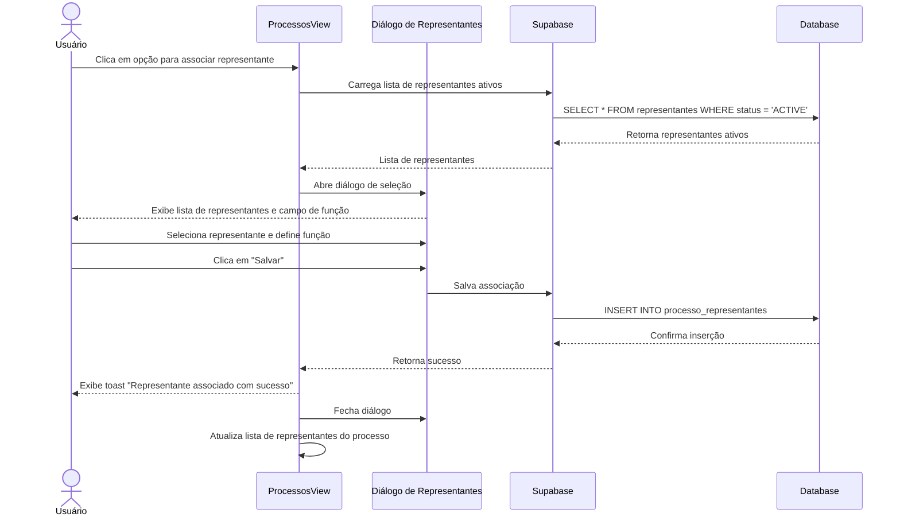

# Funcionalidade: Associar Representantes a Processos

## Descrição

Esta funcionalidade permite associar representantes a processos licitatórios, definindo sua função ou responsabilidade específica no processo. Esta associação é realizada na tela de gerenciamento de processos, não na tela de representantes.

## Fluxo da Funcionalidade



## Interface de Usuário

Esta funcionalidade é disponibilizada na tela de processos, não na tela de representantes:

- **Diálogo de Associação**: Aberto a partir da tela de processos
- **Lista de Seleção**: Dropdown com representantes ativos
- **Campo de Função**: Entrada de texto para definir função/responsabilidade
- **Botões de Ação**: Cancelar e Salvar

## Carregamento de Representantes

Na tela de processos, os representantes ativos são carregados:

```javascript
const loadRepresentantesAtivos = async () => {
  try {
    const { data, error } = await supabase
      .from('representantes')
      .select('id, nome')
      .eq('status', 'ACTIVE')
      .order('nome');
      
    if (error) throw error;
    representantesDisponiveis.value = data || [];
  } catch (error) {
    console.error('Erro ao carregar representantes:', error);
  }
};
```

## Associação a Processo

```javascript
const associarRepresentante = async () => {
  try {
    if (!selectedRepresentante.value) {
      showToast('Selecione um representante', 'error');
      return;
    }
    
    const { data: { user } } = await supabase.auth.getUser();
    
    const { error } = await supabase
      .from('processo_representantes')
      .insert({
        processo_id: processoAtual.value.id,
        representante_id: selectedRepresentante.value,
        funcao: representanteFuncao.value,
        responsavel_id: user?.id || null,
        created_at: new Date().toISOString()
      });
      
    if (error) throw error;
    
    showToast('Representante associado com sucesso!');
    await loadRepresentantesDoProcesso();
    closeRepresentanteDialog();
  } catch (error) {
    console.error('Erro ao associar representante:', error);
    showToast('Erro ao associar representante ao processo', 'error');
  }
};
```

## Visualização de Representantes Associados

Na tela de processo, os representantes associados são exibidos:

```javascript
const loadRepresentantesDoProcesso = async () => {
  try {
    const { data, error } = await supabase
      .from('processo_representantes')
      .select(`
        id,
        funcao,
        representante:representante_id (
          id, nome, documento, telefone, email
        )
      `)
      .eq('processo_id', processoAtual.value.id);
      
    if (error) throw error;
    representantesProcesso.value = data || [];
  } catch (error) {
    console.error('Erro ao carregar representantes do processo:', error);
  }
};
```

## Remoção de Associação

```javascript
const removerRepresentante = async (associacaoId) => {
  try {
    const { error } = await supabase
      .from('processo_representantes')
      .delete()
      .eq('id', associacaoId);
      
    if (error) throw error;
    
    showToast('Representante removido do processo com sucesso!');
    await loadRepresentantesDoProcesso();
  } catch (error) {
    console.error('Erro ao remover representante:', error);
    showToast('Erro ao remover representante do processo', 'error');
  }
};
```

## Tabela e Colunas

### Tabela: processo_representantes

Esta é a tabela que armazena as associações entre processos e representantes:

| Coluna | Tipo | Descrição |
|--------|------|-----------|
| id | uuid | Identificador único da associação |
| processo_id | uuid | ID do processo (FK) |
| representante_id | uuid | ID do representante (FK) |
| funcao | text | Função do representante no processo |
| responsavel_id | uuid | ID do usuário responsável pela associação (FK) |
| created_at | timestamp | Data de criação |
| updated_at | timestamp | Data de atualização |

## Consulta SQL para Associação

```sql
-- Inserção de uma nova associação entre processo e representante
INSERT INTO processo_representantes (
  processo_id,
  representante_id,
  funcao,
  responsavel_id,
  created_at
) VALUES (
  'uuid-do-processo',
  'uuid-do-representante',
  'Preposto',
  'uuid-do-usuario',
  NOW()
);
```

## Funcionalidades Relacionadas

Esta funcionalidade está diretamente relacionada ao gerenciamento de processos licitatórios, proporcionando:

1. **Designação de Responsabilidades**: Permite definir quem é responsável por cada processo
2. **Rastreabilidade**: Mantém registro histórico de quem representou a empresa em cada licitação
3. **Planejamento de Recursos**: Facilita a gestão de disponibilidade de representantes para processos futuros
