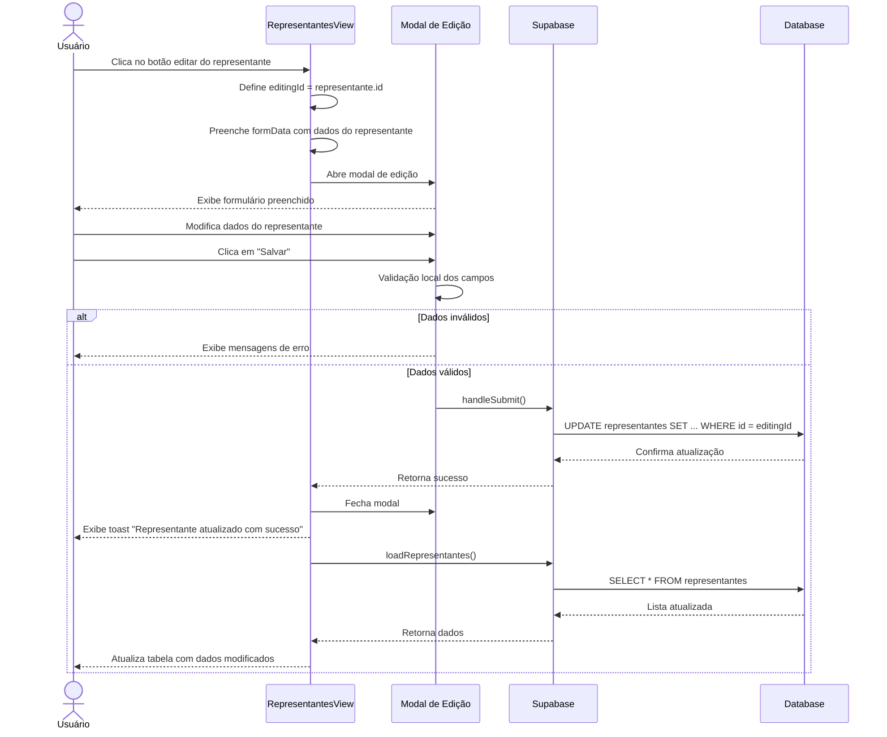

# Funcionalidade: Editar Representante

## Descrição

Esta funcionalidade permite modificar os dados de representantes já cadastrados no sistema. O mesmo modal utilizado para adição é reaproveitado, mas pré-preenchido com os dados existentes.

## Fluxo da Funcionalidade



## Interface de Usuário

A interface para edição é a mesma do cadastro, com algumas diferenças:

- O título do modal muda para "Editar Representante"
- Os campos são pré-preenchidos com os dados existentes
- Os mesmos campos são disponibilizados para edição

## Preparação para Edição

```javascript
const editRepresentante = (representante) => {
  editingId.value = representante.id;
  formData.value = { ...representante };
  showModal.value = true;
};
```

## Submissão da Edição

```javascript
const handleSubmit = async () => {
  try {
    // Validação básica
    if (!formData.value.nome) {
      showToast('Nome do representante é obrigatório', 'error');
      return;
    }
    
    // Se estiver editando
    if (editingId.value) {
      const { error } = await supabase
        .from('representantes')
        .update({
          ...formData.value,
          updated_at: new Date().toISOString()
        })
        .eq('id', editingId.value);
      
      if (error) throw error;
      showToast('Representante atualizado com sucesso!');
    } 
    // Novo cadastro (código omitido, já documentado em adicionar_representante.md)
    else {
      // ...código para novo cadastro
    }
    
    await loadRepresentantes();
    closeModal();
  } catch (error) {
    console.error('Erro ao salvar:', error);
    showToast(error.message || 'Erro ao salvar representante', 'error');
  }
};
```

## Comparação entre os Dados Originais e Modificados

O sistema não guarda um histórico de alterações ou faz comparação entre os dados originais e modificados. Apenas atualiza os dados com os novos valores fornecidos.

## Campos Atualizados

| Campo | Obrigatoriedade | Validação |
|-------|----------------|-----------|
| nome | Obrigatório | Não pode ser vazio |
| documento | Opcional | - |
| email | Opcional | Formato de email válido (verificado pelo navegador através do tipo de campo) |
| telefone | Opcional | - |
| cidade | Opcional | - |
| estado | Opcional | - |
| empresa | Opcional | - |
| observacoes | Opcional | - |

## Tabela e Colunas Atualizadas

### Atualização na tabela representantes

| Coluna | Tipo | Descrição |
|--------|------|-----------|
| nome | text | Nome do representante |
| documento | text | Documento de identificação |
| email | text | Email de contato |
| telefone | text | Telefone de contato |
| cidade | text | Cidade de atuação |
| estado | text | Estado de atuação |
| empresa | text | Empresa que representa |
| observacoes | text | Observações adicionais |
| updated_at | timestamp | Data da atualização (atualizada automaticamente) |

## Consulta SQL de Atualização

```sql
-- Atualização de um representante existente
UPDATE representantes
SET nome = 'Novo Nome',
    documento = '987.654.321-00',
    email = 'novo.email@exemplo.com',
    telefone = '(99) 91234-5678',
    cidade = 'Nova Cidade',
    estado = 'NE',
    empresa = 'Nova Empresa',
    observacoes = 'Novas observações',
    updated_at = NOW()
WHERE id = 'uuid-do-representante';
```

## Considerações

- O sistema não verifica duplicidade de documento (CPF), permitindo que múltiplos representantes possuam o mesmo documento
- Não há verificação de unicidade no email, permitindo múltiplos representantes com o mesmo contato
- O campo de status não é alterado na operação de edição, preservando o status atual do representante
