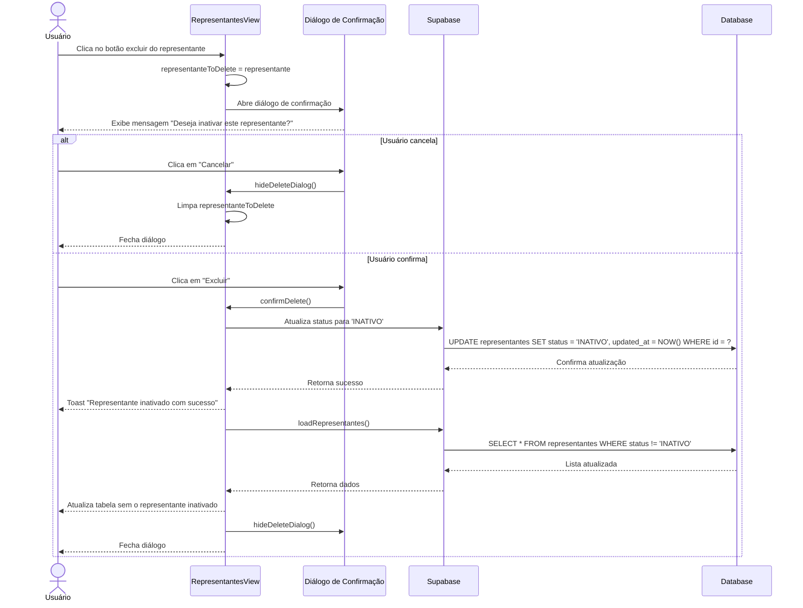

# Funcionalidade: Inativar Representante

## Descrição

Esta funcionalidade permite marcar representantes como inativos no sistema, ao invés de excluí-los permanentemente. Isso possibilita manter o histórico de atuação desses representantes em processos anteriores enquanto impede sua seleção em novos processos.

## Fluxo da Funcionalidade



## Interface de Usuário

- Botão de exclusão na tabela principal (ícone de lixeira)
- Diálogo de confirmação com:
  - Título "Confirmar Inativação"
  - Mensagem perguntando se deseja realmente inativar o representante
  - Botões "Cancelar" e "Excluir"
- Feedback visual através de toast após a operação

## Diálogo de Confirmação

O componente mostra um diálogo de confirmação antes da inativação:

```javascript
const deleteRepresentante = (representante) => {
  deleteConfirmDialog.value = {
    show: true,
    representante
  };
};

const hideDeleteDialog = () => {
  deleteConfirmDialog.value = {
    show: false,
    representante: null
  };
};
```

## Processo de Inativação

```javascript
const confirmDelete = async () => {
  try {
    const { error } = await supabase
      .from('representantes')
      .update({ 
        status: 'INATIVO',
        updated_at: new Date().toISOString() 
      })
      .eq('id', deleteConfirmDialog.value.representante.id);
    
    if (error) throw error;
    
    await loadRepresentantes();
    showToast('Representante inativado com sucesso!');
    hideDeleteDialog();
  } catch (error) {
    console.error('Erro ao inativar:', error);
    showToast(error.message || 'Erro ao inativar representante', 'error');
  }
};
```

## Efeitos na Visualização

Após a inativação, o representante não aparecerá mais na listagem padrão, pois a consulta filtra representantes inativos:

```javascript
const loadRepresentantes = async () => {
  try {
    const { data, error } = await supabase
      .from('representantes')
      .select('*')
      .not('status', 'eq', 'INATIVO') // Filtra representantes inativos
      .order('nome');
    
    if (error) throw error;
    representantes.value = data || [];
  } catch (error) {
    // Tratamento de erro
  }
};
```

## Tabela e Colunas Atualizadas

### Atualização na tabela representantes

| Coluna | Tipo | Descrição | Novo Valor |
|--------|------|-----------|------------|
| status | text | Status do representante | 'INATIVO' |
| updated_at | timestamp | Data da atualização | Data atual |

## Consulta SQL para Inativação

```sql
-- Inativação de um representante
UPDATE representantes
SET status = 'INATIVO',
    updated_at = NOW()
WHERE id = 'uuid-do-representante';
```

## Considerações Sobre a Abordagem

A abordagem de inativar representantes, ao invés de excluí-los permanentemente, oferece várias vantagens:

1. **Preservação de Histórico**: Mantém o histórico de atuação do representante em processos anteriores
2. **Referência Integrais**: Evita problemas de integridade referencial com tabelas associadas
3. **Recuperação de Dados**: Permite reativar representantes posteriormente, se necessário
4. **Auditoria**: Facilita auditoria e rastreamento histórico de responsabilidades

## Efeitos em Outras Funcionalidades

Em funcionalidades relacionadas a processos licitatórios, apenas representantes ativos serão exibidos nas listas de seleção, garantindo que representantes inativados não sejam designados para novos processos:

```javascript
const loadRepresentantesAtivos = async () => {
  const { data } = await supabase
    .from('representantes')
    .select('id, nome')
    .eq('status', 'ACTIVE')
    .order('nome');
    
  return data || [];
};
```
