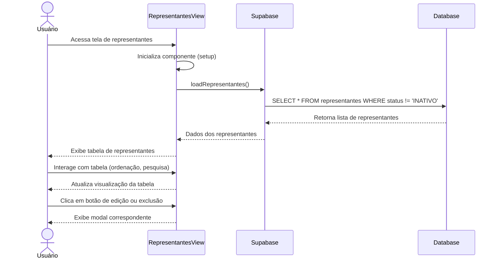

# Funcionalidade: Listar Representantes

## Descrição

Esta funcionalidade exibe uma tabela com todos os representantes cadastrados no sistema, permitindo visualização, pesquisa e acesso às operações de adição, edição e inativação.

## Fluxo da Funcionalidade



## Interface de Usuário

A tabela de representantes apresenta:

- Cabeçalho com título "Gerenciamento de Representantes"
- Botão para adicionar novo representante
- Tabela com colunas:
  - Nome
  - Documento (CPF)
  - Email
  - Telefone
  - Ações (editar, excluir)

## Dados Recuperados

Os dados são carregados da tabela `representantes` usando a função `loadRepresentantes`:

```javascript
const loadRepresentantes = async () => {
  try {
    isLoading.value = true;
    const { data, error } = await supabase
      .from('representantes')
      .select('*')
      .not('status', 'eq', 'INATIVO') // Filtra representantes inativos
      .order('nome');
    
    if (error) throw error;
    representantes.value = data || [];
  } catch (error) {
    console.error('Erro ao carregar representantes:', error);
    showToast('Erro ao carregar representantes', 'error');
  } finally {
    isLoading.value = false;
  }
};
```

## Estados da Interface

A interface gerencia os seguintes estados:

| Estado | Propriedade | Descrição |
|--------|-------------|-----------|
| Carregando | isLoading | Indica se a operação de carregamento está em andamento |
| Dados | representantes | Armazena a lista de representantes carregados do banco |
| Modal Visível | showModal | Controla a visibilidade do modal de cadastro/edição |
| ID em Edição | editingId | Armazena o ID do representante em edição, se houver |

## Formatação de Dados

Os dados são exibidos diretamente como retornados pelo banco de dados, com formatação mínima:

```html
<tr v-for="representante in representantes" :key="representante.id">
  <td>{{ representante.nome }}</td>
  <td>{{ representante.documento }}</td>
  <td>{{ representante.email }}</td>
  <td>{{ representante.telefone }}</td>
  <td class="actions-cell">
    <div class="actions-buttons">
      <button class="btn-action edit" @click="editRepresentante(representante)">
        
      </button>
      <button class="btn-action delete" @click="deleteRepresentante(representante)">
        
      </button>
    </div>
  </td>
</tr>
```

## Ciclo de Vida do Componente

O carregamento dos dados ocorre durante a montagem do componente:

```javascript
onMounted(() => {
  loadRepresentantes();
});
```

## Tabela do Banco de Dados

### Tabela: representantes

| Coluna | Tipo | Descrição |
|--------|------|-----------|
| id | uuid | Identificador único do representante |
| nome | text | Nome completo do representante |
| documento | text | Documento de identificação (CPF) |
| email | text | Email de contato |
| telefone | text | Telefone de contato |
| cidade | text | Cidade de atuação |
| estado | text | Estado/UF de atuação |
| empresa | text | Empresa que representa (quando relevante) |
| observacoes | text | Observações adicionais |
| status | text | Status do cadastro ('ACTIVE', 'INATIVO') |
| created_at | timestamp | Data e hora de criação do registro |
| updated_at | timestamp | Data e hora da última atualização do registro |

## Consulta SQL

```sql
-- Consulta para listar representantes ativos, ordenados por nome
SELECT id, nome, documento, email, telefone, cidade, estado, empresa, observacoes, status, created_at, updated_at
FROM representantes
WHERE status != 'INATIVO'
ORDER BY nome;
```
