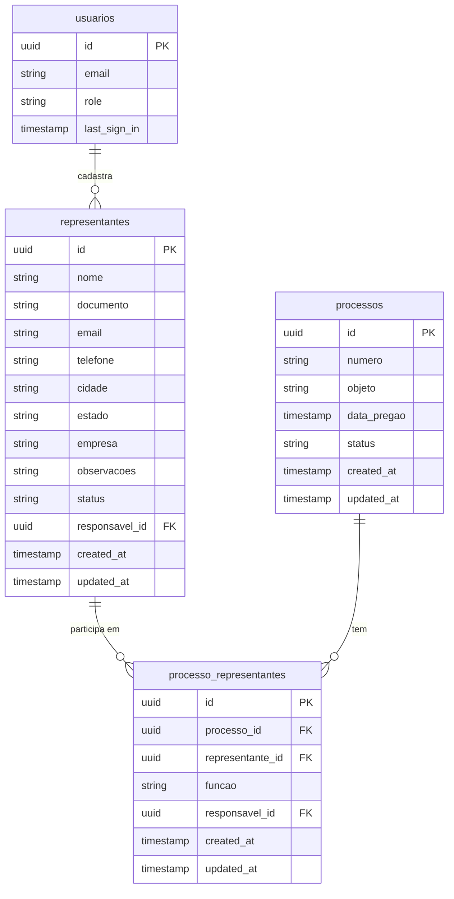

# Modelo de Dados - Representantes

## Visão Geral do Modelo

O módulo de Gerenciamento de Representantes utiliza um modelo de dados que permite cadastrar e gerenciar os representantes que atuam nos processos licitatórios, além de relacioná-los com os processos.

## Diagrama ER



## Detalhamento das Tabelas

### Tabela: representantes

Esta tabela armazena as informações básicas dos representantes.

| Coluna | Tipo | Nulável | Descrição | Restrições |
|--------|------|---------|-----------|------------|
| id | uuid | não | Identificador único | Chave primária, default: gen_random_uuid() |
| nome | text | não | Nome completo do representante | - |
| documento | text | sim | Documento de identificação (CPF) | - |
| email | text | sim | Email de contato | - |
| telefone | text | sim | Telefone de contato | - |
| cidade | text | sim | Cidade de atuação | - |
| estado | text | sim | Estado/UF de atuação | - |
| empresa | text | sim | Empresa que representa | - |
| observacoes | text | sim | Observações adicionais | - |
| status | text | não | Status do cadastro | DEFAULT: 'ACTIVE', CHECK (status IN ('ACTIVE', 'INATIVO')) |
| responsavel_id | uuid | sim | ID do usuário que cadastrou | Chave estrangeira |
| created_at | timestamp with time zone | não | Data de criação | Default: now() |
| updated_at | timestamp with time zone | não | Data de última atualização | Default: now() |

#### Índices da tabela representantes

- Índice primário: id
- Índice para pesquisa: nome
- Índice para pesquisa: documento
- Índice para filtragem: status

### Tabela: processo_representantes

Esta tabela estabelece o relacionamento entre processos licitatórios e representantes.

| Coluna | Tipo | Nulável | Descrição | Restrições |
|--------|------|---------|-----------|------------|
| id | uuid | não | Identificador único | Chave primária, default: gen_random_uuid() |
| processo_id | uuid | não | ID do processo | Chave estrangeira |
| representante_id | uuid | não | ID do representante | Chave estrangeira |
| funcao | text | sim | Função do representante no processo | - |
| responsavel_id | uuid | sim | ID do usuário que cadastrou | Chave estrangeira |
| created_at | timestamp with time zone | não | Data de criação | Default: now() |
| updated_at | timestamp with time zone | não | Data de última atualização | Default: now() |

#### Índices da tabela processo_representantes

- Índice primário: id
- Índice para busca: processo_id
- Índice para busca: representante_id

## Chaves Estrangeiras

- `representantes.responsavel_id` → `auth.users.id`
  - ON DELETE: SET NULL (quando um usuário é excluído, o representante permanece mas perde a referência)
  - ON UPDATE: CASCADE (atualiza a referência quando o ID do usuário muda)

- `processo_representantes.processo_id` → `processos.id`
  - ON DELETE: CASCADE (exclui os relacionamentos quando o processo é excluído)
  - ON UPDATE: CASCADE (atualiza a referência quando o ID do processo muda)

- `processo_representantes.representante_id` → `representantes.id`
  - ON DELETE: CASCADE (exclui os relacionamentos quando o representante é excluído)
  - ON UPDATE: CASCADE (atualiza a referência quando o ID do representante muda)

- `processo_representantes.responsavel_id` → `auth.users.id`
  - ON DELETE: SET NULL (quando um usuário é excluído, o registro permanece mas perde a referência)
  - ON UPDATE: CASCADE (atualiza a referência quando o ID do usuário muda)

## Relacionamentos

1. **Representante para Processos**: Um representante pode estar associado a múltiplos processos licitatórios através da tabela `processo_representantes`.

2. **Processo para Representantes**: Um processo pode ter múltiplos representantes associados, cada um com uma função específica.

3. **Usuário para Representante**: Um usuário pode ser responsável por cadastrar múltiplos representantes.

## SQL para Criação das Tabelas

```sql
-- Tabela de representantes
CREATE TABLE IF NOT EXISTS representantes (
    id UUID PRIMARY KEY DEFAULT gen_random_uuid(),
    nome TEXT NOT NULL,
    documento TEXT,
    email TEXT,
    telefone TEXT,
    cidade TEXT,
    estado TEXT,
    empresa TEXT,
    observacoes TEXT,
    status TEXT NOT NULL DEFAULT 'ACTIVE' CHECK (status IN ('ACTIVE', 'INATIVO')),
    responsavel_id UUID REFERENCES auth.users(id) ON DELETE SET NULL,
    created_at TIMESTAMP WITH TIME ZONE DEFAULT now() NOT NULL,
    updated_at TIMESTAMP WITH TIME ZONE DEFAULT now() NOT NULL
);

-- Tabela de relacionamento entre processos e representantes
CREATE TABLE IF NOT EXISTS processo_representantes (
    id UUID PRIMARY KEY DEFAULT gen_random_uuid(),
    processo_id UUID NOT NULL REFERENCES processos(id) ON DELETE CASCADE,
    representante_id UUID NOT NULL REFERENCES representantes(id) ON DELETE CASCADE,
    funcao TEXT,
    responsavel_id UUID REFERENCES auth.users(id) ON DELETE SET NULL,
    created_at TIMESTAMP WITH TIME ZONE DEFAULT now() NOT NULL,
    updated_at TIMESTAMP WITH TIME ZONE DEFAULT now() NOT NULL
);

-- Índices para melhorar performance
CREATE INDEX idx_representantes_nome ON representantes(nome);
CREATE INDEX idx_representantes_documento ON representantes(documento);
CREATE INDEX idx_representantes_status ON representantes(status);
CREATE INDEX idx_processo_representantes_processo ON processo_representantes(processo_id);
CREATE INDEX idx_processo_representantes_representante ON processo_representantes(representante_id);
```

## Políticas de Segurança (RLS)

```sql
-- Política para representantes - somente usuários autenticados podem ler
ALTER TABLE representantes ENABLE ROW LEVEL SECURITY;

CREATE POLICY "Permitir leitura para usuários autenticados"
    ON representantes FOR SELECT
    TO authenticated
    USING (true);

-- Apenas usuários com role 'admin' ou 'manager' podem modificar
CREATE POLICY "Permitir modificação para admins e gerentes"
    ON representantes FOR ALL
    TO authenticated
    USING ((SELECT role FROM profiles WHERE user_id = auth.uid()) IN ('admin', 'manager'));

-- Política similar para processo_representantes
ALTER TABLE processo_representantes ENABLE ROW LEVEL SECURITY;

CREATE POLICY "Permitir leitura para usuários autenticados"
    ON processo_representantes FOR SELECT
    TO authenticated
    USING (true);

CREATE POLICY "Permitir modificação para admins e gerentes"
    ON processo_representantes FOR ALL
    TO authenticated
    USING ((SELECT role FROM profiles WHERE user_id = auth.uid()) IN ('admin', 'manager'));
```

## Considerações de Design

1. **Inativação vs. Exclusão**: O sistema utiliza um status 'INATIVO' ao invés de excluir permanentemente os representantes, permitindo manter histórico e referências.

2. **Dados Flexíveis**: Diversos campos são opcionais para acomodar diferentes níveis de informação disponíveis sobre os representantes.

3. **Relacionamento com Processos**: A tabela intermediária `processo_representantes` permite associar representantes a processos com diferentes funções.

4. **Rastreabilidade**: Todos os registros incluem informações sobre quem os criou/modificou e quando.

## Consultas Comuns

### Consulta de representantes ativos

```sql
SELECT * FROM representantes 
WHERE status = 'ACTIVE' 
ORDER BY nome;
```

### Consulta de representantes por processo

```sql
SELECT r.* 
FROM representantes r
JOIN processo_representantes pr ON r.id = pr.representante_id
WHERE pr.processo_id = 'uuid-do-processo'
AND r.status = 'ACTIVE'
ORDER BY r.nome;
```

### Consulta de processos por representante

```sql
SELECT p.* 
FROM processos p
JOIN processo_representantes pr ON p.id = pr.processo_id
WHERE pr.representante_id = 'uuid-do-representante'
ORDER BY p.data_pregao DESC;
```
