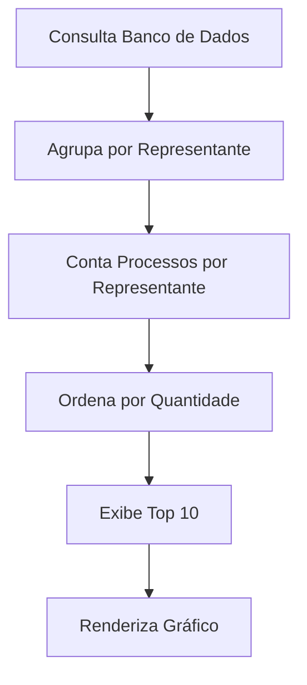
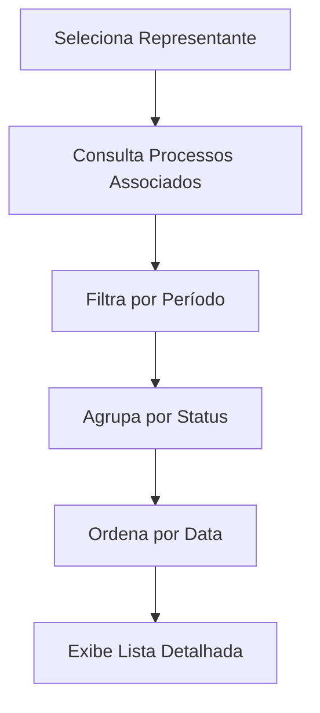
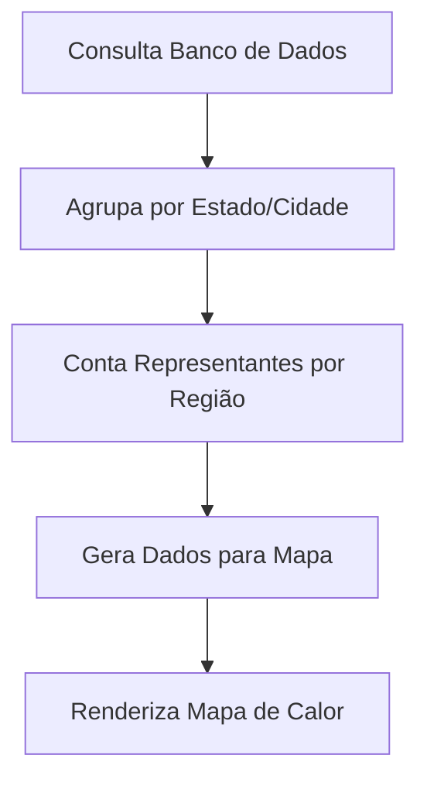
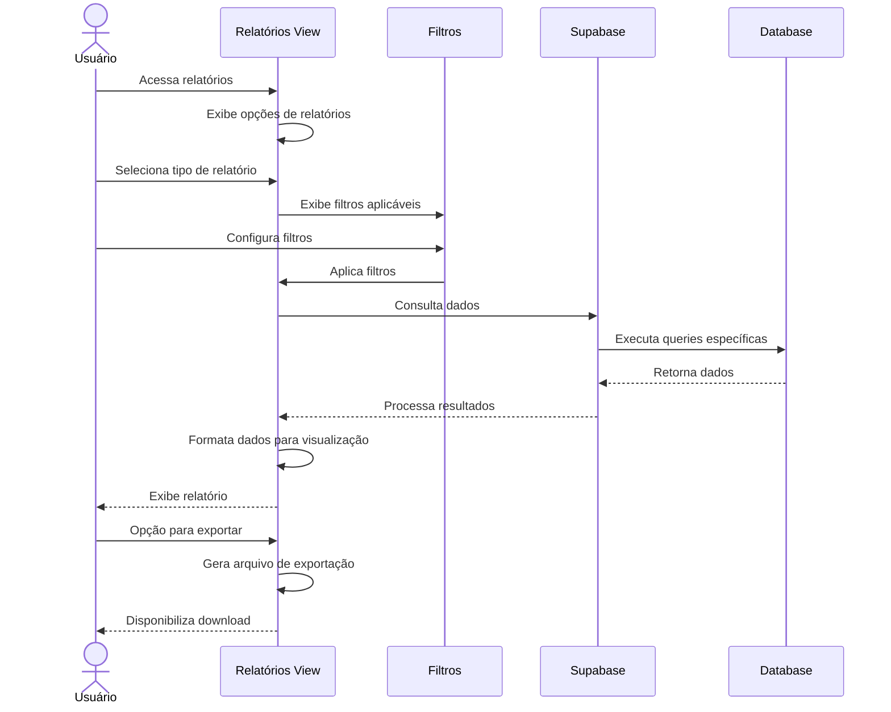
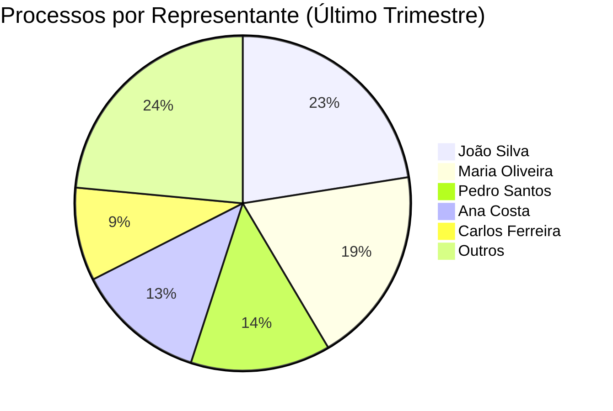

# Funcionalidade: Relatórios de Representantes

## Descrição

Esta funcionalidade permite gerar relatórios sobre a atuação dos representantes em processos licitatórios, oferecendo visões consolidadas e detalhadas para análise e tomada de decisão.

## Tipos de Relatórios

### 1. Representantes por Quantidade de Processos



### 2. Processos por Representante (Detalhado)



### 3. Mapa de Atuação dos Representantes



## Fluxo da Funcionalidade



## Consultas Principais

### Representantes por Volume de Processos

```javascript
const getRepresentantesPorVolume = async (periodo = null) => {
  try {
    let query = supabase
      .from('processo_representantes')
      .select(`
        representante:representante_id (
          id, nome
        ),
        count: processo_id (*)
      `)
      .group('representante');
    
    if (periodo) {
      // Adiciona filtro de período baseado em data de criação do vínculo
      const dataInicio = periodo.inicio;
      const dataFim = periodo.fim;
      
      query = query.gte('created_at', dataInicio)
                   .lte('created_at', dataFim);
    }
    
    const { data, error } = await query;
    
    if (error) throw error;
    
    // Formata dados para exibição
    return data.map(item => ({
      representante: item.representante.nome,
      quantidade: item.count.length
    })).sort((a, b) => b.quantidade - a.quantidade); // Ordenar do maior para o menor
    
  } catch (error) {
    console.error('Erro ao gerar relatório de volume:', error);
    throw error;
  }
};
```

### Processos por Representante

```javascript
const getProcessosPorRepresentante = async (representanteId, filtros = {}) => {
  try {
    let query = supabase
      .from('processo_representantes')
      .select(`
        id,
        funcao,
        created_at,
        processo:processo_id (
          id, numero, objeto, data_pregao, status
        )
      `)
      .eq('representante_id', representanteId);
    
    // Aplicar filtros adicionais
    if (filtros.status) {
      query = query.eq('processo.status', filtros.status);
    }
    
    if (filtros.dataInicio) {
      query = query.gte('processo.data_pregao', filtros.dataInicio);
    }
    
    if (filtros.dataFim) {
      query = query.lte('processo.data_pregao', filtros.dataFim);
    }
    
    const { data, error } = await query.order('processo.data_pregao', { ascending: false });
    
    if (error) throw error;
    
    return data;
    
  } catch (error) {
    console.error('Erro ao buscar processos do representante:', error);
    throw error;
  }
};
```

## Interface de Relatório

A interface de relatórios inclui:

1. **Seletor de Tipo de Relatório**: Permite escolher entre diferentes visualizações
2. **Filtros**: Controles para filtrar dados por período, status, localidade, etc.
3. **Área de Visualização**: Exibe os dados em formato tabular ou gráfico
4. **Opções de Exportação**: Botões para exportar relatórios em formatos como PDF, CSV, Excel

## Visualização Gráfica



## Tabelas e Colunas Utilizadas

### Tabela: representantes

| Coluna | Uso no Relatório |
|--------|------------------|
| id | Identificação e junção com outras tabelas |
| nome | Exibição em relatórios e gráficos |
| cidade, estado | Agrupamento por região geográfica |
| status | Filtro para incluir apenas representantes ativos |

### Tabela: processo_representantes

| Coluna | Uso no Relatório |
|--------|------------------|
| processo_id | Junção com tabela de processos |
| representante_id | Junção com tabela de representantes |
| funcao | Agrupamento por tipo de função/responsabilidade |
| created_at | Filtro por período de designação |

### Tabela: processos

| Coluna | Uso no Relatório |
|--------|------------------|
| id | Identificação e contagem de processos |
| numero | Exibição em listagens detalhadas |
| data_pregao | Filtro e agrupamento por período |
| status | Filtro e agrupamento por situação do processo |

## Exportação de Dados

O módulo de relatórios permite a exportação dos dados em diferentes formatos:

```javascript
const exportarRelatorio = async (dados, formato) => {
  switch (formato) {
    case 'csv':
      return exportarCSV(dados);
    case 'excel':
      return exportarExcel(dados);
    case 'pdf':
      return exportarPDF(dados);
    default:
      throw new Error('Formato não suportado');
  }
};

const exportarCSV = (dados) => {
  // Transforma array de objetos em CSV
  const header = Object.keys(dados[0]).join(',');
  const rows = dados.map(obj => Object.values(obj).join(','));
  const csv = [header, ...rows].join('\n');
  
  // Cria arquivo para download
  const blob = new Blob([csv], { type: 'text/csv' });
  const url = URL.createObjectURL(blob);
  const a = document.createElement('a');
  a.href = url;
  a.download = `relatorio-representantes-${new Date().toISOString().split('T')[0]}.csv`;
  document.body.appendChild(a);
  a.click();
  document.body.removeChild(a);
  URL.revokeObjectURL(url);
};

// Funções similares para outros formatos...
```

## Benefícios para o Negócio

1. **Análise de Produtividade**: Identifica quais representantes estão mais ativos em processos
2. **Distribuição Geográfica**: Mapeia a cobertura territorial dos representantes
3. **Planejamento de Recursos**: Auxilia na alocação eficiente de representantes por região
4. **Avaliação de Desempenho**: Fornece métricas para avaliar o desempenho dos representantes
5. **Identificação de Tendências**: Permite visualizar padrões e tendências na atuação dos representantes
