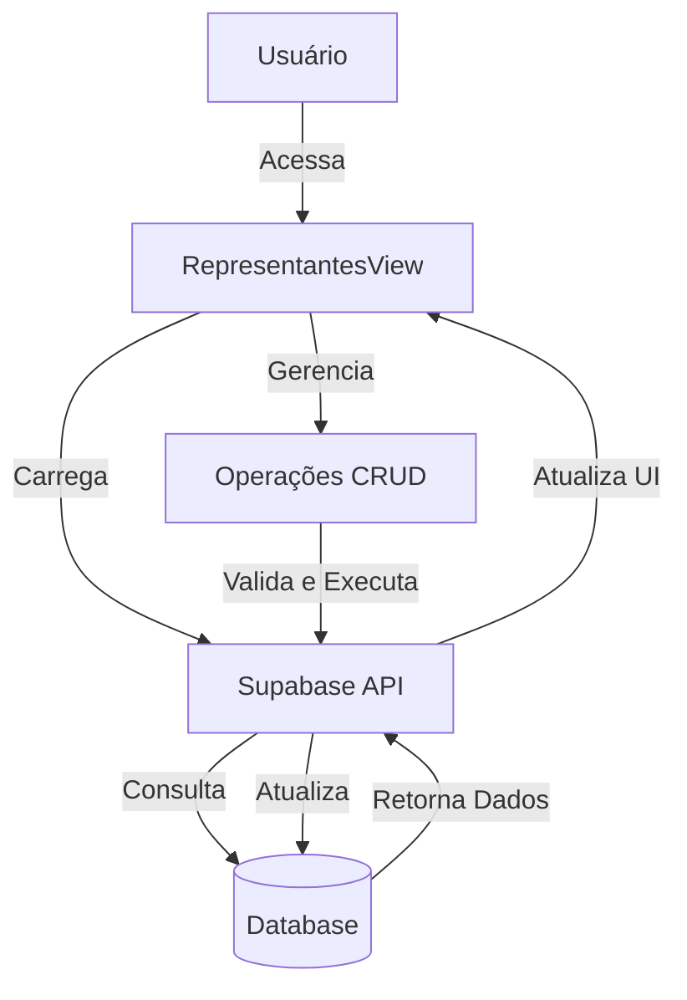
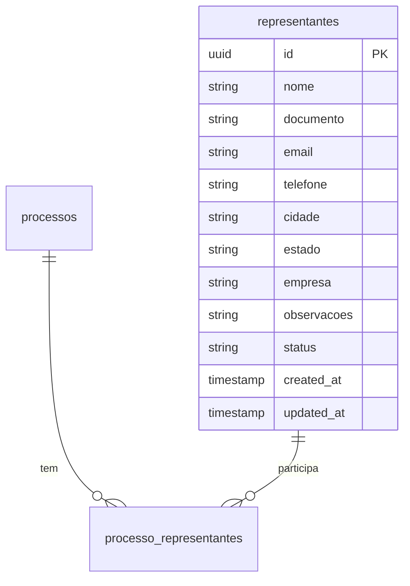
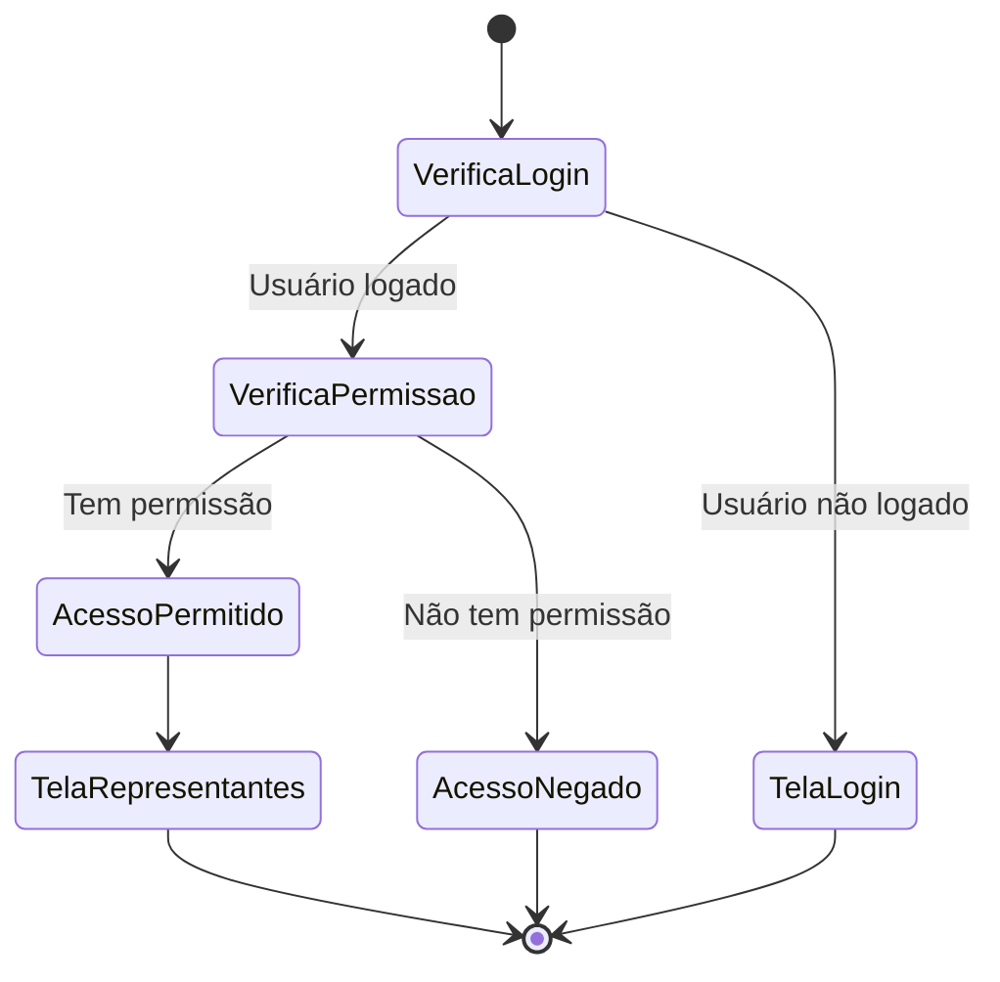

# Visão Geral - Gerenciamento de Representantes

## Descrição da Funcionalidade

O módulo de "Gerenciamento de Representantes" permite cadastrar, visualizar, editar e inativar representantes que atuam nos processos licitatórios. Estes representantes são pessoas físicas que representam a empresa em licitações presenciais ou são responsáveis por determinados processos licitatórios.

## Acesso

- Disponível para usuários autenticados com permissões adequadas
- Caminho: Menu Principal > Cadastros > Representantes

## Funcionalidades Principais

1. **Listar Representantes**: Visualização de todos os representantes cadastrados no sistema
2. **Adicionar Representante**: Inclusão de novos representantes com seus dados pessoais e de contato
3. **Editar Representante**: Modificação dos dados de um representante existente
4. **Inativar Representante**: Marcação de um representante como inativo (ao invés de excluir permanentemente)

## Diagrama de Arquitetura

## Modelo de Dados Simplificado

## Fluxo de Permissões

## Componentes Principais

1. **RepresentantesView.vue**: Componente principal que gerencia a tela de representantes
2. **RepresentantesView.js**: Lógica do componente separada em script
3. **Modal de Cadastro/Edição**: Interface para adicionar ou editar representantes
4. **Sistema de Toast Notifications**: Feedback visual para o usuário após operações

## Tabela do Banco de Dados

| Tabela | Descrição |
|--------|-----------|
| representantes | Armazena as informações dos representantes da empresa |
| processo_representantes | (Opcional) Relaciona representantes com processos licitatórios |

## Tecnologias Utilizadas

- Vue.js para a interface do usuário
- Supabase como backend e banco de dados
- Validações de formulários em tempo real
- Sistema de notificações por toast
