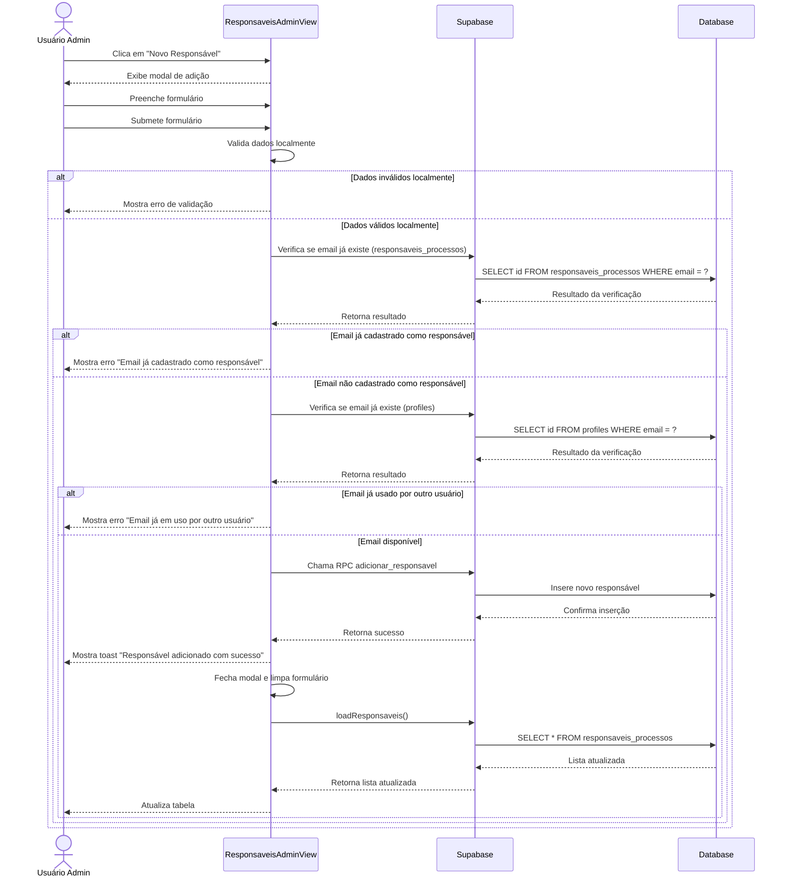

# Funcionalidade: Adicionar Responsável

## Descrição
Esta funcionalidade permite adicionar novos responsáveis ao sistema. Um modal é exibido com um formulário para preenchimento dos dados do novo responsável.

## Fluxo da Funcionalidade


## Interface de Usuário
O modal de adição contém um formulário com os seguintes campos:
- Nome (obrigatório)
- Email (obrigatório)
- Departamento (opcional)
- Botões de "Cancelar" e "Salvar"

## Validações
O processo de adição realiza as seguintes validações:
1. Validação de campos obrigatórios (nome e email)
2. Verificação se o email já existe na tabela de responsáveis
3. Verificação se o email já existe na tabela de profiles (evita conflitos)

## Dados Inseridos
Os dados são inseridos na tabela `responsaveis_processos` através de uma função RPC:

```javascript
const { error } = await supabase.rpc('adicionar_responsavel', {
  p_nome: newResponsavel.value.nome.trim(),
  p_email: newResponsavel.value.email.trim(),
  p_departamento: newResponsavel.value.departamento.trim() || null
})
```

## Tabela e Colunas
| Tabela | Coluna | Tipo | Descrição |
|--------|--------|------|-----------|
| responsaveis_processos | nome | text | Nome do responsável |
| responsaveis_processos | email | text | Email do responsável (único) |
| responsaveis_processos | departamento | text | Departamento do responsável (opcional) |
| responsaveis_processos | status | text | Status (automático: ACTIVE) |
| responsaveis_processos | created_at | timestamp | Data de criação (automático) |
| responsaveis_processos | updated_at | timestamp | Data de atualização (automático) |

## Função PostgreSQL Utilizada
```sql
CREATE OR REPLACE FUNCTION adicionar_responsavel(p_nome TEXT, p_email TEXT, p_departamento TEXT DEFAULT NULL)
RETURNS void
LANGUAGE plpgsql
SECURITY DEFINER
AS $$
BEGIN
  INSERT INTO responsaveis_processos (nome, email, departamento, status, created_at, updated_at)
  VALUES (p_nome, p_email, p_departamento, 'ACTIVE', now(), now());
END;
$$;
```

## Tratamento de Erros
- Validação local para campos obrigatórios
- Verificação de duplicidade de email em duas tabelas
- Exibição de mensagens de erro específicas para cada caso
- Feedback visual com toast messages
