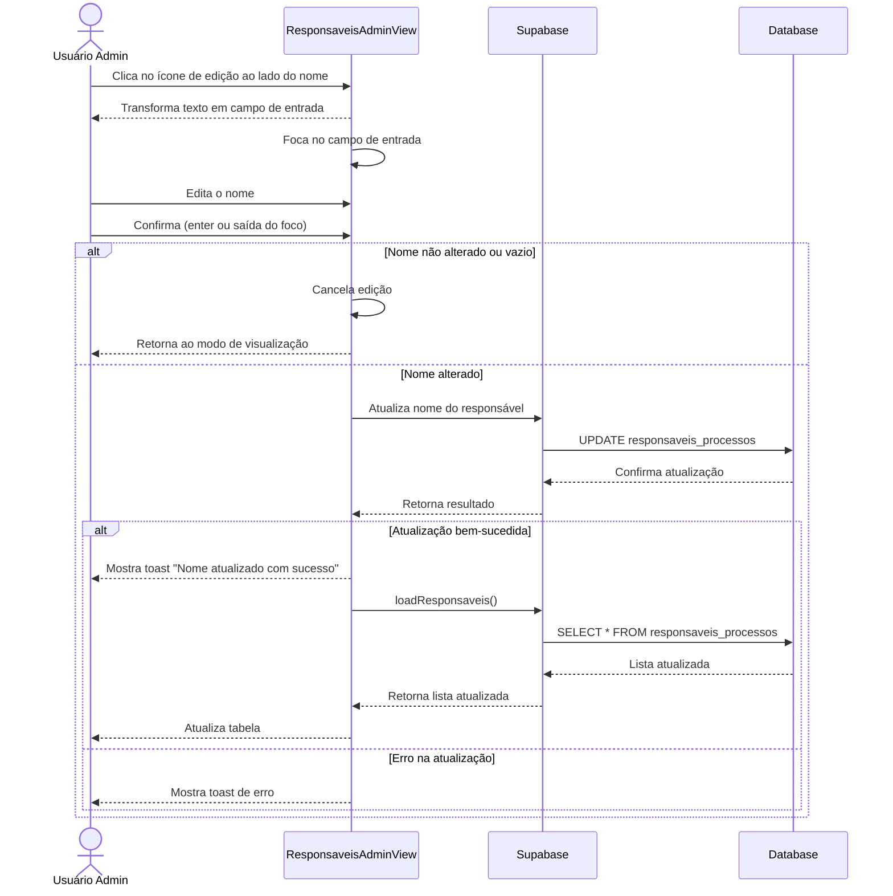
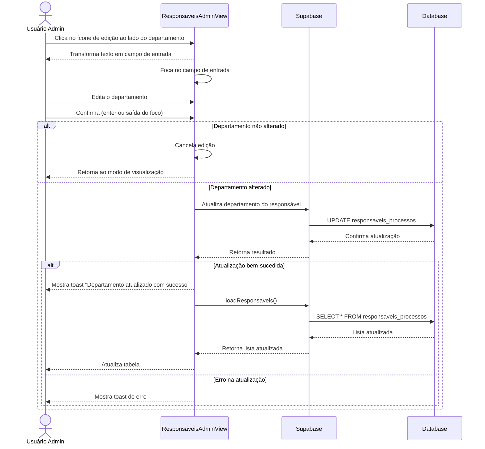

# Funcionalidade: Atualizar Responsável

## Descrição

Esta funcionalidade permite a edição inline dos dados de um responsável diretamente na tabela, sem necessidade de abrir um modal. Os campos editáveis são: Nome e Departamento.

## Fluxo da Funcionalidade - Atualização de Nome



## Fluxo da Funcionalidade - Atualização de Departamento



## Interface de Usuário

A edição acontece diretamente na tabela:

- Campos editáveis têm um ícone de edição ao lado
- Ao clicar no ícone, o texto transforma-se em um campo de entrada
- A atualização ocorre ao pressionar Enter ou quando o campo perde o foco
- Feedback visual é fornecido através de toast messages

## Dados Atualizados

### Atualização de Nome

```javascript
const { error } = await supabase
  .from('responsaveis_processos')
  .update({ 
    nome: newName.trim(),
    updated_at: new Date().toISOString() 
  })
  .eq('id', responsavel.id)
```

### Atualização de Departamento

```javascript
const { error } = await supabase
  .from('responsaveis_processos')
  .update({ 
    departamento: newDept.trim() || null,
    updated_at: new Date().toISOString() 
  })
  .eq('id', responsavel.id)
```

## Tabela e Colunas Atualizadas

| Tabela | Coluna | Tipo | Descrição |
|--------|--------|------|-----------|
| responsaveis_processos | nome | text | Nome do responsável |
| responsaveis_processos | departamento | text | Departamento do responsável (pode ser nulo) |
| responsaveis_processos | updated_at | timestamp | Data de atualização (atualizada automaticamente) |

## Controles de Edição Inline

A funcionalidade usa estados locais para controlar a edição inline:

```javascript
// Estados para controle da edição inline
const editingNames = ref({})      // Controla quais linhas estão editando o nome
const editingDepts = ref({})      // Controla quais linhas estão editando o departamento
const editingData = ref({})       // Armazena os dados em edição
```

## Validações

- O nome não pode ficar em branco após a edição
- O departamento pode ficar em branco (será armazenado como null)

## Tratamento de Erros

- Exibe mensagem de erro em caso de falha na atualização
- Retorna ao modo de visualização em caso de erro
