# Funcionalidade: Excluir Responsável

## Descrição

Esta funcionalidade permite excluir um responsável do sistema, desde que ele não esteja associado a nenhum processo. Um diálogo de confirmação é exibido antes da exclusão, e verificações são realizadas para garantir que não existam processos associados.

## Fluxo da Funcionalidade

```mermaid
sequenceDiagram
    actor U as Usuário Admin
    participant V as ResponsaveisAdminView
    participant S as Supabase
    participant DB as Database
    
    U->>V: Clica no botão de exclusão
    V-->>U: Exibe diálogo de confirmação
    
    alt Usuário cancela
        U->>V: Clica em "Cancelar"
        V-->>U: Fecha diálogo
    else Usuário confirma
        U->>V: Clica em "Excluir"
        
        V->>S: Verifica associação a processos
        S->>DB: SELECT FROM processos WHERE responsavel_id = ?
        DB-->>S: Retorna processos associados
        S-->>V: Resultado da verificação
        
        alt Responsável associado a processos
            V->>V: Fecha diálogo de confirmação
            V-->>U: Mostra toast de erro explicando impossibilidade
        else Responsável não associado a processos
            V->>S: Exclui responsável
            S->>DB: DELETE FROM responsaveis_processos
            DB-->>S: Confirma exclusão
            S-->>V: Retorna resultado
            
            alt Exclusão bem-sucedida
                V->>V: Fecha diálogo de confirmação
                V-->>U: Mostra toast "Responsável excluído com sucesso"
                V->>S: loadResponsaveis()
                S->>DB: SELECT * FROM responsaveis_processos
                DB-->>S: Lista atualizada
                S-->>V: Retorna lista atualizada
                V-->>U: Atualiza tabela
            else Erro na exclusão
                V-->>U: Mostra toast de erro
            end
        end
    end
```



## Interface de Usuário

- Botão de exclusão na coluna de ações com ícone de lixeira
- Diálogo de confirmação com:
  - Título "Confirmar Exclusão"
  - Mensagem explicativa
  - Aviso sobre a irreversibilidade da ação
  - Botões "Cancelar" e "Excluir"
  - O botão "Excluir" tem estilo visual de perigo/vermelho

## Verificações Realizadas

Antes da exclusão, o sistema verifica se o responsável está associado a algum processo:

```javascript
// Verifica se responsável está associado a processos
const { data: processos, error: checkError } = await supabase
  .from('processos')
  .select('id')
  .eq('responsavel_id', responsavel.id)
  .limit(1)
```

## Dados Excluídos

```javascript
const { error } = await supabase
  .from('responsaveis_processos')
  .delete()
  .eq('id', responsavel.id)
```

## Tabela e Relações

| Tabela | Coluna | Tipo | Descrição |
|--------|--------|------|-----------|
| responsaveis_processos | id | uuid | ID do responsável (excluído) |
| processos | responsavel_id | uuid | FK referenciando responsaveis_processos.id |

## Função de Exclusão

```javascript
const deleteResponsavel = (responsavel) => {
  showConfirmDialog.value = true;
  dialogConfig.value = {
    title: 'Confirmar Exclusão',
    message: `Deseja realmente excluir o responsável ${responsavel.nome}?`,
    warning: 'Esta ação não poderá ser desfeita!',
    confirmText: 'Excluir',
    onConfirm: async () => {
      try {
        // Verifica se responsável está associado a processos
        const { data: processos, error: checkError } = await supabase
          .from('processos')
          .select('id')
          .eq('responsavel_id', responsavel.id)
          .limit(1);
        
        if (checkError) throw checkError;
        
        if (processos && processos.length > 0) {
          showConfirmDialog.value = false;
          showToastMessage(
            `Não é possível excluir. O responsável está associado a ${processos.length} processo(s).`,
            'error'
          );
          return;
        }
        
        // Procede com a exclusão
        const { error } = await supabase
          .from('responsaveis_processos')
          .delete()
          .eq('id', responsavel.id);
        
        if (error) throw error;
        
        showConfirmDialog.value = false;
        showToastMessage('Responsável excluído com sucesso!');
        await loadResponsaveis();
      } catch (error) {
        console.error('Erro ao excluir responsável:', error);
        showToastMessage('Erro ao excluir responsável', 'error');
      }
    }
  };
}
```

## Regras de Negócio

- Um responsável só pode ser excluído se não estiver associado a nenhum processo
- A exclusão é permanente e não pode ser desfeita
- Para casos temporários, é recomendado usar a funcionalidade de inativação em vez de exclusão
