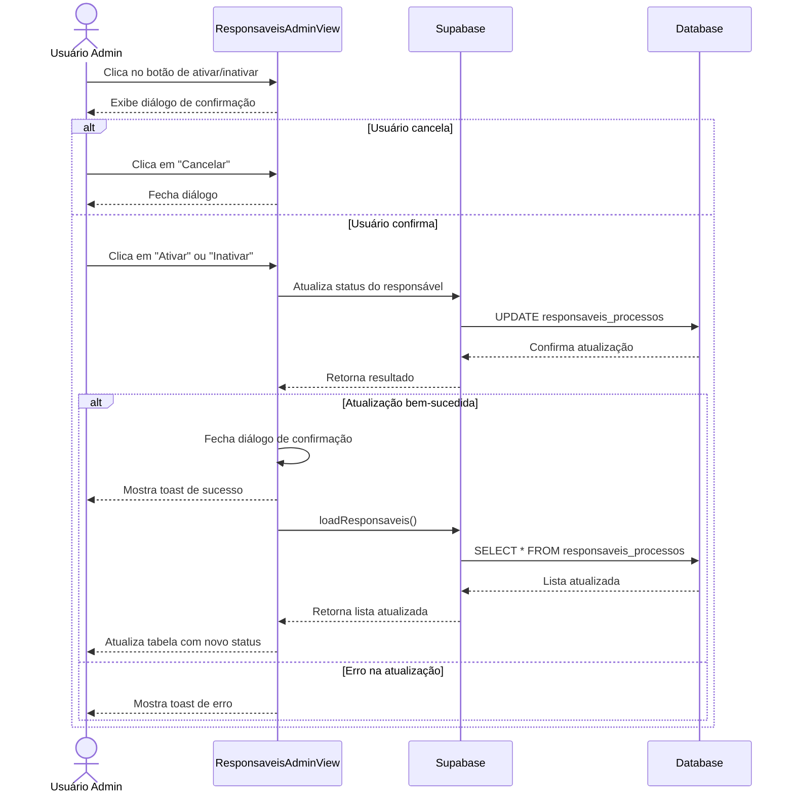

# Funcionalidade: Ativar/Inativar Responsável

## Descrição
Esta funcionalidade permite alterar o status de um responsável entre ativo (ACTIVE) e inativo (INACTIVE). Um diálogo de confirmação é exibido antes de processar a alteração.

## Fluxo da Funcionalidade


## Interface de Usuário
- Botão na coluna de ações com ícone correspondente ao estado atual:
  - Ativo: Mostra ícone para inativar
  - Inativo: Mostra ícone para ativar
- Diálogo de confirmação com:
  - Título dinâmico ("Confirmar Ativação" ou "Confirmar Inativação")
  - Mensagem explicativa
  - Botões "Cancelar" e "Ativar/Inativar"
- Feedback visual do status na tabela através de badges coloridos:
  - Ativo: Badge verde
  - Inativo: Badge vermelho
  
## Dados Atualizados
```javascript
const { error } = await supabase
  .from('responsaveis_processos')
  .update({
    status: newStatus, // 'ACTIVE' ou 'INACTIVE'
    updated_at: new Date().toISOString()
  })
  .eq('id', responsavel.id)
```

## Tabela e Colunas Atualizadas
| Tabela | Coluna | Tipo | Descrição |
|--------|--------|------|-----------|
| responsaveis_processos | status | text | Status do responsável ('ACTIVE' ou 'INACTIVE') |
| responsaveis_processos | updated_at | timestamp | Data de atualização (atualizada automaticamente) |

## Função de Alteração de Status
```javascript
const toggleResponsavelStatus = (responsavel) => {
  const newStatus = responsavel.status === 'ACTIVE' ? 'INACTIVE' : 'ACTIVE';
  const actionText = responsavel.status === 'ACTIVE' ? 'inativar' : 'ativar';
  
  showConfirmDialog.value = true;
  dialogConfig.value = {
    title: `Confirmar ${actionText.charAt(0).toUpperCase() + actionText.slice(1)}`,
    message: `Deseja realmente ${actionText} o responsável ${responsavel.nome}?`,
    confirmText: actionText.charAt(0).toUpperCase() + actionText.slice(1),
    onConfirm: async () => {
      try {
        const { error } = await supabase
          .from('responsaveis_processos')
          .update({
            status: newStatus,
            updated_at: new Date().toISOString()
          })
          .eq('id', responsavel.id);
        
        if (error) throw error;
        
        showConfirmDialog.value = false;
        showToastMessage(`Responsável ${actionText === 'ativar' ? 'ativado' : 'inativado'} com sucesso!`);
        await loadResponsaveis();
      } catch (error) {
        console.error(`Erro ao ${actionText} responsável:`, error);
        showToastMessage(`Erro ao ${actionText} responsável`, 'error');
      }
    }
  };
}
```

## Impacto Funcional
- Responsáveis com status 'INACTIVE' não podem ser designados para novos processos
- A interface visual mostra claramente o status do responsável através de badges coloridos
- Essa funcionalidade é útil quando um responsável deixa temporariamente de atuar nos processos, mas não deve ser excluído do sistema
