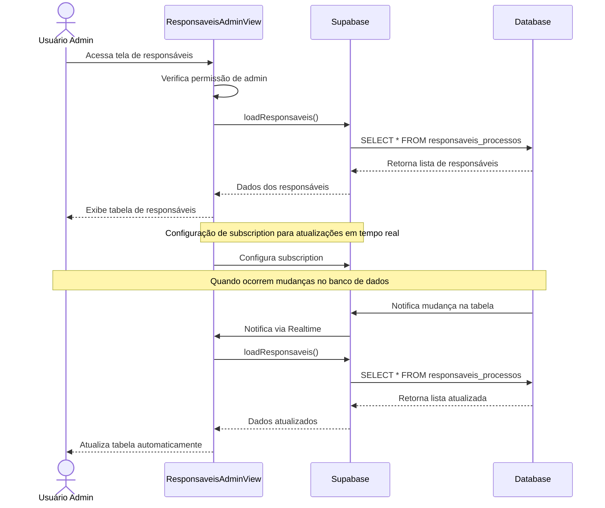

# Funcionalidade: Listar Responsáveis

## Descrição
Esta funcionalidade exibe uma tabela com todos os responsáveis cadastrados no sistema, incluindo seus dados principais e status. A lista é atualizada em tempo real usando o recurso Realtime do Supabase.

## Fluxo da Funcionalidade


## Interface de Usuário
A tabela de responsáveis exibe as seguintes colunas:
- Nome (editável inline)
- Email
- Departamento (editável inline)
- Status (com indicação visual por cor)
- Ações (ativar/inativar e excluir)

## Dados Recuperados
Os dados são carregados da tabela `responsaveis_processos` usando a função `loadResponsaveis`:

```javascript
const loadResponsaveis = async () => {
  try {
    loading.value = true;
    const { data, error } = await supabase
      .from('responsaveis_processos')
      .select('*')
      .order('nome');
    
    if (error) throw error;
    responsaveis.value = data;
  } catch (error) {
    console.error('Erro ao carregar responsáveis:', error);
    showToastMessage('Erro ao carregar dados', 'error');
  } finally {
    loading.value = false;
  }
}
```

## Atualização em Tempo Real
A funcionalidade utiliza o recurso Realtime do Supabase para manter a lista sempre atualizada:

```javascript
const channel = supabase.channel('responsaveis-updates')
  .on('postgres_changes', 
    { event: '*', schema: 'public', table: 'responsaveis_processos' }, 
    () => loadData()
  )
  .subscribe()
```

## Tabela do Banco de Dados
| Tabela | Coluna | Tipo | Descrição |
|--------|--------|------|-----------|
| responsaveis_processos | id | uuid | Identificador único do responsável |
| responsaveis_processos | nome | text | Nome do responsável |
| responsaveis_processos | email | text | Email do responsável |
| responsaveis_processos | departamento | text | Departamento do responsável (opcional) |
| responsaveis_processos | status | text | Status (ACTIVE, INACTIVE) |
| responsaveis_processos | created_at | timestamp with timezone | Data de criação |
| responsaveis_processos | updated_at | timestamp with timezone | Data de última atualização |
