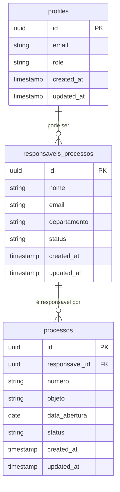

# Modelo de Dados - Administração de Responsáveis

## Visão Geral do Modelo

O módulo de Administração de Responsáveis trabalha principalmente com a tabela `responsaveis_processos`, que mantém o cadastro de pessoas que podem ser designadas como responsáveis pelos processos licitatórios. Esta tabela tem uma relação com a tabela `processos`.

## Diagrama ER



## Detalhamento das Tabelas

### Tabela: responsaveis_processos

Esta é a tabela principal usada pela funcionalidade de Administração de Responsáveis.

| Coluna | Tipo | Nulável | Descrição | Restrições |
|--------|------|---------|-----------|------------|
| id | uuid | não | Identificador único do responsável | Chave primária |
| nome | text | não | Nome completo do responsável | - |
| email | text | não | Email do responsável | Único |
| departamento | text | sim | Departamento do responsável | - |
| status | text | não | Status do responsável | Valores: 'ACTIVE', 'INACTIVE' |
| created_at | timestamp with time zone | não | Data de criação | Default: now() |
| updated_at | timestamp with time zone | não | Data de última atualização | Default: now() |

#### Índices

- Índice primário: id
- Índice único: email
- Índice para melhorar performance de consulta: status

### Tabela: processos (Relacionada)

Esta tabela se relaciona com `responsaveis_processos` através da coluna `responsavel_id`.

| Coluna | Tipo | Nulável | Descrição | Restrições |
|--------|------|---------|-----------|------------|
| id | uuid | não | Identificador único do processo | Chave primária |
| responsavel_id | uuid | sim | ID do responsável pelo processo | Chave estrangeira |
| ... | ... | ... | (outros campos do processo) | ... |

#### Relacionamentos

- `responsavel_id` é uma chave estrangeira que referencia `responsaveis_processos.id`

### Tabela: profiles (Relacionada)

Esta tabela não é diretamente modificada pela funcionalidade, mas é consultada para verificar duplicidade de emails.

| Coluna | Tipo | Nulável | Descrição | Restrições |
|--------|------|---------|-----------|------------|
| id | uuid | não | Identificador único do perfil | Chave primária |
| email | text | não | Email do usuário | Único |
| role | text | não | Função do usuário (admin, user) | - |
| ... | ... | ... | (outros campos do perfil) | ... |

## Chaves Estrangeiras

- `processos.responsavel_id` → `responsaveis_processos.id`
  - ON DELETE: SET NULL (ao excluir um responsável, o campo em processos é definido como NULL)
  - ON UPDATE: CASCADE (ao atualizar o ID de um responsável, a referência em processos é atualizada)

## SQL para Criação da Tabela Principal

```sql
CREATE TABLE public.responsaveis_processos (
    id uuid DEFAULT gen_random_uuid() PRIMARY KEY,
    nome text NOT NULL,
    email text NOT NULL UNIQUE,
    departamento text,
    status text NOT NULL DEFAULT 'ACTIVE',
    created_at timestamp with time zone DEFAULT now() NOT NULL,
    updated_at timestamp with time zone DEFAULT now() NOT NULL
);

COMMENT ON TABLE public.responsaveis_processos IS 'Tabela de responsáveis por processos licitatórios';

ALTER TABLE public.responsaveis_processos ENABLE ROW LEVEL SECURITY;

CREATE POLICY "Permissão de leitura para todos usuários autenticados"
    ON public.responsaveis_processos
    FOR SELECT
    TO authenticated
    USING (true);

CREATE POLICY "Permissão de inserção para admins"
    ON public.responsaveis_processos
    FOR INSERT
    TO authenticated
    WITH CHECK (
        (SELECT role FROM public.profiles WHERE id = auth.uid()) = 'admin'
    );

CREATE POLICY "Permissão de atualização para admins"
    ON public.responsaveis_processos
    FOR UPDATE
    TO authenticated
    USING (
        (SELECT role FROM public.profiles WHERE id = auth.uid()) = 'admin'
    );

CREATE POLICY "Permissão de exclusão para admins"
    ON public.responsaveis_processos
    FOR DELETE
    TO authenticated
    USING (
        (SELECT role FROM public.profiles WHERE id = auth.uid()) = 'admin'
    );
```

## Função RPC para Adicionar Responsáveis

```sql
CREATE OR REPLACE FUNCTION public.adicionar_responsavel(
    p_nome TEXT,
    p_email TEXT,
    p_departamento TEXT DEFAULT NULL
)
RETURNS void
LANGUAGE plpgsql
SECURITY DEFINER
AS $$
BEGIN
    -- Verifica se o usuário tem permissão de admin
    IF (SELECT role FROM public.profiles WHERE id = auth.uid()) <> 'admin' THEN
        RAISE EXCEPTION 'Acesso negado: permissão de administrador necessária';
    END IF;

    -- Insere o novo responsável
    INSERT INTO public.responsaveis_processos (
        nome,
        email,
        departamento,
        status,
        created_at,
        updated_at
    )
    VALUES (
        p_nome,
        p_email,
        p_departamento,
        'ACTIVE',
        now(),
        now()
    );
END;
$$;
```
