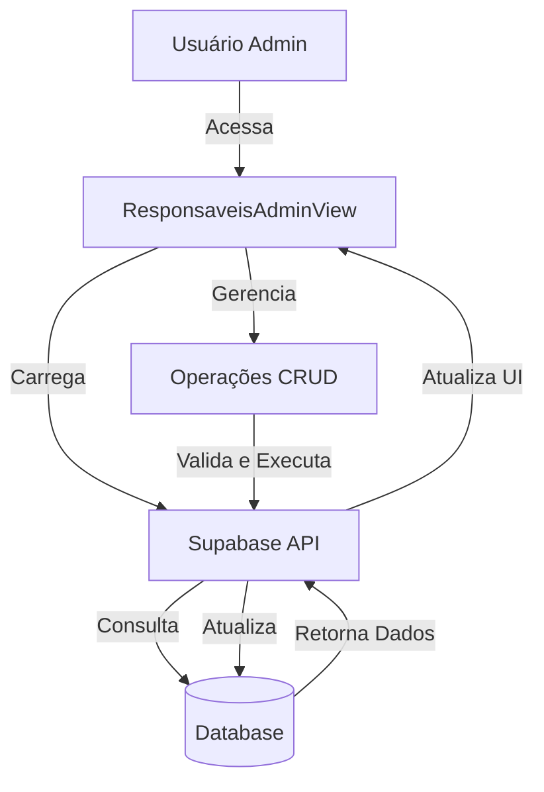
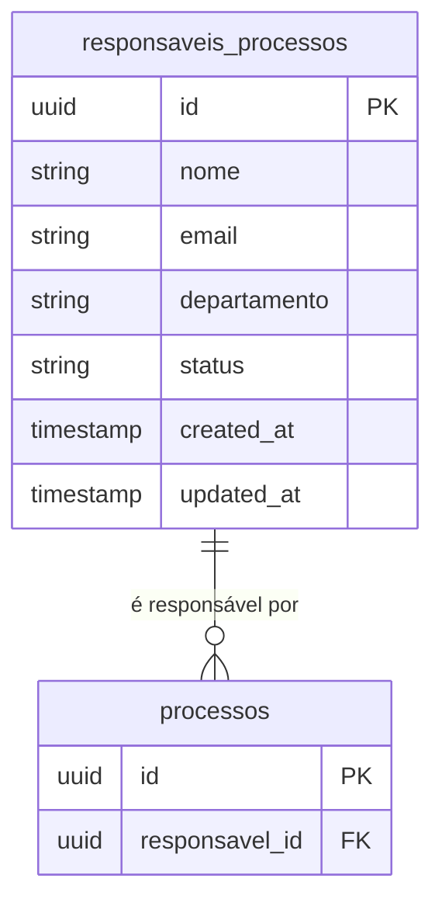
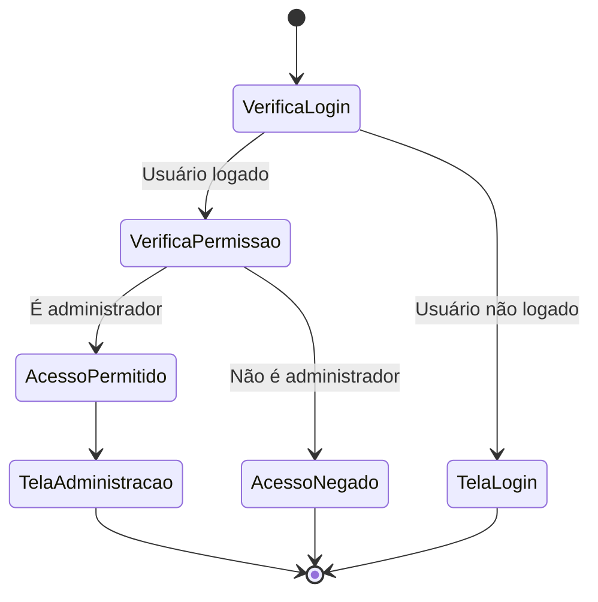

# Visão Geral - Administração de Responsáveis

## Descrição da Funcionalidade
A tela de "Administração de Responsáveis" permite o gerenciamento completo dos usuários que serão designados como responsáveis pelos processos licitatórios. Através desta interface, administradores do sistema podem visualizar, adicionar, editar, ativar/inativar e excluir responsáveis.

## Acesso
- Acesso restrito a usuários com permissão de administrador
- Caminho: Menu Principal > Administração > Responsáveis

## Funcionalidades Principais
1. **Listar Responsáveis**: Visualização de todos os responsáveis cadastrados no sistema
2. **Adicionar Responsável**: Inclusão de novos responsáveis no sistema
3. **Editar Responsável**: Modificação dos dados de um responsável existente
4. **Ativar/Inativar Responsável**: Alteração do status de um responsável
5. **Excluir Responsável**: Remoção de um responsável do sistema (quando não vinculado a processos)

## Diagrama de Arquitetura

## Modelo de Dados Simplificado

## Fluxo de Permissões

## Restrições e Regras de Negócio
1. Somente usuários com função 'admin' podem acessar esta tela
2. Um responsável só pode ser excluído se não estiver associado a nenhum processo
3. Um responsável inativo não pode ser designado para novos processos
4. Emails devem ser únicos no sistema (tabela de responsáveis e perfis)
