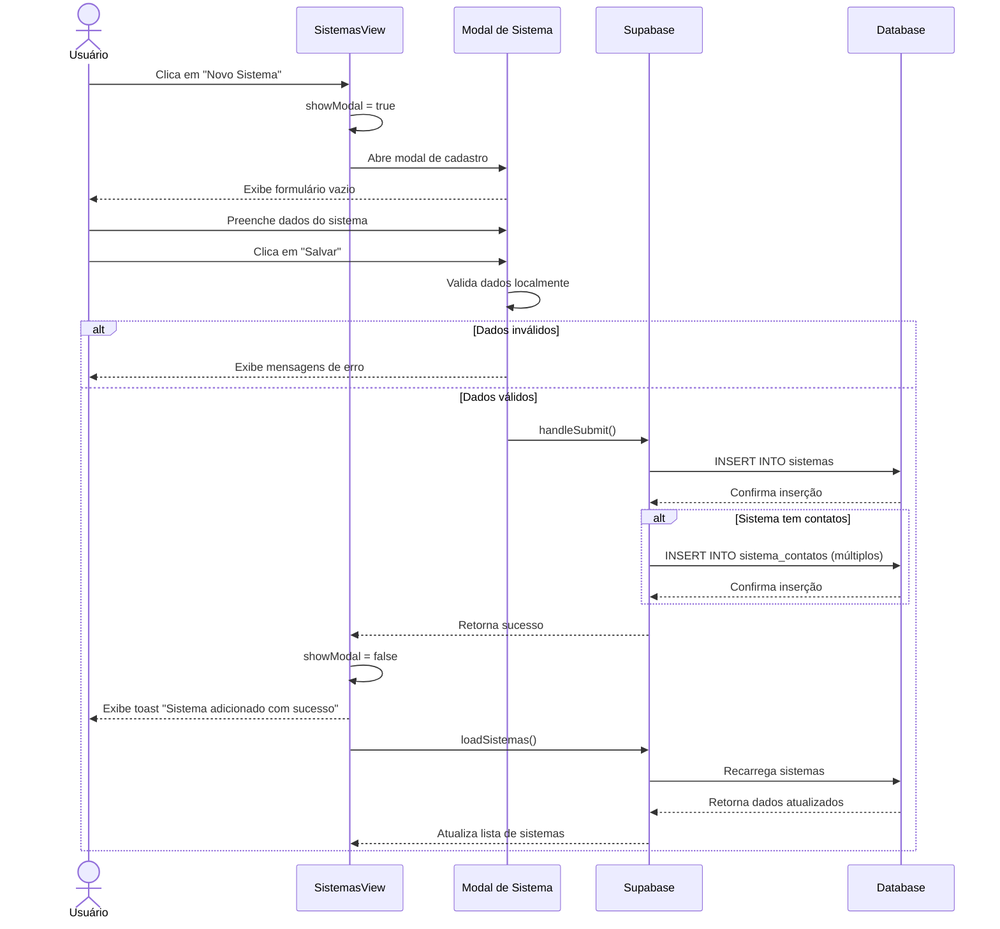

# Funcionalidade: Adicionar Sistema

## Descrição

Esta funcionalidade permite adicionar um novo sistema ao banco de dados através de um formulário modal. O usuário fornece informações como nome, descrição, URL do sistema e associa-o a um setor existente.

## Fluxo da Funcionalidade



## Interface de Usuário

O modal de cadastro de sistema contém:

- Título "Novo Sistema"
- Campo para o nome do sistema (obrigatório)
- Campo para a descrição do sistema
- Campo para a URL do sistema
- Dropdown para seleção do setor (obrigatório)
- Seção para adicionar contatos (opcional), com:
  - Campo para nome do contato
  - Campo para telefone do contato
  - Botão para adicionar mais contatos
  - Botão para remover contato
- Botões de "Cancelar" e "Salvar"

## Validações Realizadas

```javascript
const validateForm = () => {
  formErrors.value = {};
  let isValid = true;
  
  // Validar nome (obrigatório)
  if (!formData.value.nome || formData.value.nome.trim() === '') {
    formErrors.value.nome = 'O nome do sistema é obrigatório';
    isValid = false;
  }
  
  // Validar setor (obrigatório)
  if (!formData.value.setor_id) {
    formErrors.value.setor_id = 'O setor é obrigatório';
    isValid = false;
  }
  
  // Validar URL (não obrigatório, mas deve ser válida se preenchida)
  if (formData.value.url && !isValidUrl(formData.value.url)) {
    formErrors.value.url = 'URL inválida';
    isValid = false;
  }
  
  // Validar contatos (nomes não vazios)
  if (formData.value.contatos.length > 0) {
    formData.value.contatos.forEach((contato, index) => {
      if (!contato.nome || contato.nome.trim() === '') {
        if (!formErrors.value.contatos) formErrors.value.contatos = {};
        formErrors.value.contatos[index] = { nome: 'O nome do contato é obrigatório' };
        isValid = false;
      }
    });
  }
  
  return isValid;
};

const isValidUrl = (url) => {
  try {
    new URL(url);
    return true;
  } catch (e) {
    return false;
  }
};
```

## Submissão do Formulário

```javascript
const handleSubmit = async () => {
  try {
    // Validar formulário
    if (!validateForm()) {
      return;
    }
    
    const sistemaData = {
      nome: formData.value.nome.trim(),
      descricao: formData.value.descricao.trim() || null,
      url: formData.value.url.trim() || null,
      setor_id: formData.value.setor_id,
      status: true // Novo sistema é sempre ativo
    };
    
    // 1. Inserir o sistema
    const { data: newSistema, error } = await supabase
      .from('sistemas')
      .insert(sistemaData)
      .select();
    
    if (error) throw error;
    
    // 2. Inserir os contatos, se houver
    const contatos = formData.value.contatos.filter(c => c.nome.trim() !== '');
    
    if (contatos.length > 0) {
      const contatosData = contatos.map(c => ({
        sistema_id: newSistema[0].id,
        nome: c.nome.trim(),
        telefone: c.telefone ? c.telefone.trim() : null
      }));
      
      const { error: contatosError } = await supabase
        .from('sistema_contatos')
        .insert(contatosData);
      
      if (contatosError) throw contatosError;
    }
    
    // 3. Atualizar UI
    showToast('Sistema adicionado com sucesso!', 'success');
    closeModal();
    loadSistemas(); // Recarregar a lista de sistemas
    
  } catch (error) {
    console.error('Erro ao adicionar sistema:', error);
    showToast('Erro ao adicionar sistema: ' + error.message, 'error');
  }
};
```

## Manipulação de Contatos

```javascript
// Adicionar novo contato vazio
const addContato = () => {
  formData.value.contatos.push({ nome: '', telefone: '' });
};

// Remover contato pelo índice
const removeContato = (index) => {
  formData.value.contatos.splice(index, 1);
};
```

## Estado do Formulário

```javascript
const formData = ref({
  nome: '',
  descricao: '',
  url: '',
  setor_id: '',
  contatos: [{ nome: '', telefone: '' }] // Inicia com um contato vazio
});

// Estado para armazenar erros de validação
const formErrors = ref({});

// Reset do formulário
const resetForm = () => {
  formData.value = {
    nome: '',
    descricao: '',
    url: '',
    setor_id: '',
    contatos: [{ nome: '', telefone: '' }]
  };
  formErrors.value = {};
};

// Fechar modal
const closeModal = () => {
  resetForm();
  showModal.value = false;
};
```

## Tabelas e Colunas Afetadas

### Inserção na tabela sistemas

| Coluna | Tipo | Descrição | Valor |
|--------|------|-----------|-------|
| id | uuid | Identificador único | Gerado automaticamente |
| nome | text | Nome do sistema | Fornecido pelo usuário |
| descricao | text | Descrição do sistema | Fornecido pelo usuário |
| url | text | URL do sistema | Fornecido pelo usuário |
| setor_id | uuid | ID do setor | Selecionado pelo usuário |
| status | boolean | Status do sistema | true (ativo) |
| created_at | timestamp | Data de criação | Gerado automaticamente |
| updated_at | timestamp | Data de atualização | Gerado automaticamente |

### Inserção na tabela sistema_contatos (para cada contato)

| Coluna | Tipo | Descrição | Valor |
|--------|------|-----------|-------|
| id | uuid | Identificador único | Gerado automaticamente |
| sistema_id | uuid | ID do sistema | ID do sistema recém-criado |
| nome | text | Nome do contato | Fornecido pelo usuário |
| telefone | text | Telefone do contato | Fornecido pelo usuário |
| created_at | timestamp | Data de criação | Gerado automaticamente |

## Consultas SQL

```sql
-- Inserção do sistema
INSERT INTO sistemas (nome, descricao, url, setor_id, status)
VALUES ('Nome do Sistema', 'Descrição do Sistema', 'https://url.do.sistema', 'uuid-do-setor', true);

-- Inserção de contatos (para cada contato)
INSERT INTO sistema_contatos (sistema_id, nome, telefone)
VALUES ('uuid-do-sistema', 'Nome do Contato', 'Telefone do Contato');
```
