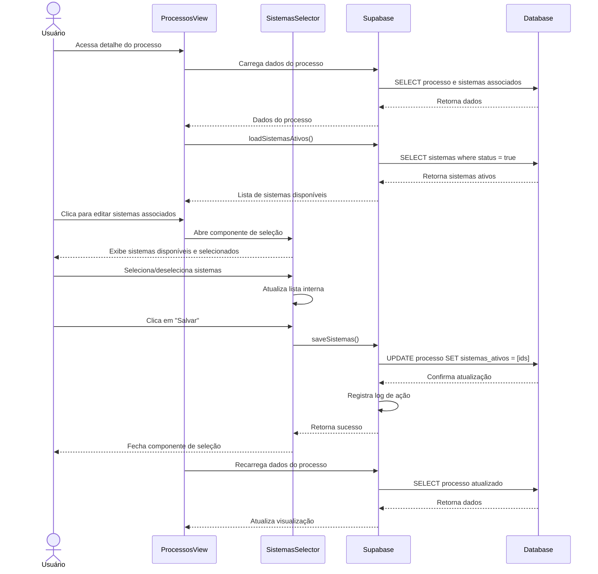

# Funcionalidade: Associar Sistemas a Processos

## Descrição

Esta funcionalidade permite vincular um ou mais sistemas a processos licitatórios específicos. Essa associação indica quais sistemas estão sendo oferecidos ou foram vendidos em determinado processo, facilitando o gerenciamento de propostas e contratos.

## Fluxo da Funcionalidade



## Interface de Usuário

O componente SistemasSelector inclui:

- Lista de sistemas disponíveis com checkboxes
- Sistemas já selecionados aparecem marcados
- Opções para "Selecionar Todos" e "Limpar Seleção"
- Campo de busca para filtrar sistemas por nome
- Botões "Cancelar" e "Salvar" para confirmar alterações

## Componente de Seleção de Sistemas

```javascript
// Componente SistemasImplantacaoSelector

export default {
  name: 'SistemasImplantacaoSelector',
  props: {
    processoId: {
      type: String,
      required: true
    },
    sistemasAtivos: {
      type: Array,
      default: () => []
    },
    value: {
      type: Object,
      default: () => ({ sistemas_ids: [], informacoes_adicionais: '' })
    }
  },
  
  emits: ['update:value', 'save'],
  
  setup(props, { emit }) {
    const sistemasSelecionados = ref(props.value?.sistemas_ids || []);
    const informacoesAdicionais = ref(props.value?.informacoes_adicionais || '');
    const sistemasDisponiveis = ref([]);
    const loading = ref(false);
    const searchQuery = ref('');
    
    // Observa mudanças no valor externo
    watch(() => props.value, (newVal) => {
      if (newVal) {
        sistemasSelecionados.value = newVal.sistemas_ids || [];
        informacoesAdicionais.value = newVal.informacoes_adicionais || '';
      }
    });
    
    // Observa mudanças nos sistemas ativos para atualizar disponíveis
    watch(() => props.sistemasAtivos, async (newSistemas) => {
      if (newSistemas && newSistemas.length) {
        await carregarSistemasDisponiveis();
      }
    }, { immediate: true });
    
    // Carrega detalhes dos sistemas disponíveis
    const carregarSistemasDisponiveis = async () => {
      if (!props.sistemasAtivos || !props.sistemasAtivos.length) return;
      
      loading.value = true;
      try {
        const { data, error } = await supabase
          .from('sistemas')
          .select('id, nome')
          .in('id', props.sistemasAtivos)
          .eq('status', true); // Apenas sistemas ativos
          
        if (error) throw error;
        sistemasDisponiveis.value = data || [];
      } catch (error) {
        console.error('Erro ao carregar sistemas disponíveis:', error);
      } finally {
        loading.value = false;
      }
    };
    
    // Lista filtrada por busca
    const sistemasFiltrados = computed(() => {
      if (!searchQuery.value) return sistemasDisponiveis.value;
      
      const query = searchQuery.value.toLowerCase();
      return sistemasDisponiveis.value.filter(
        s => s.nome.toLowerCase().includes(query)
      );
    });
    
    // Alterna a seleção de um sistema
    const toggleSistema = (sistemaId) => {
      const index = sistemasSelecionados.value.indexOf(sistemaId);
      if (index === -1) {
        sistemasSelecionados.value.push(sistemaId);
      } else {
        sistemasSelecionados.value.splice(index, 1);
      }
      atualizarValor();
    };
    
    // Atualiza o valor para os componentes pais
    const atualizarValor = () => {
      const valorAtualizado = {
        sistemas_ids: sistemasSelecionados.value,
        informacoes_adicionais: informacoesAdicionais.value
      };
      emit('update:value', valorAtualizado);
    };
    
    // Observa mudanças nas informações adicionais
    watch(informacoesAdicionais, () => {
      atualizarValor();
    });
    
    // Selecionar todos os sistemas
    const selecionarTodos = () => {
      sistemasSelecionados.value = sistemasDisponiveis.value.map(s => s.id);
      atualizarValor();
    };
    
    // Limpar seleção
    const limparSelecao = () => {
      sistemasSelecionados.value = [];
      atualizarValor();
    };
    
    // Salvar no banco de dados
    const salvar = async () => {
      try {
        const { error } = await supabase
          .from('processos')
          .update({
            sistemas_ativos: sistemasSelecionados.value,
            updated_at: new Date().toISOString()
          })
          .eq('id', props.processoId);
          
        if (error) throw error;
        emit('save');
      } catch (error) {
        console.error('Erro ao salvar sistemas:', error);
      }
    };
    
    // Verifica se um sistema está selecionado
    const isSistemaSelecionado = (sistemaId) => {
      return sistemasSelecionados.value.includes(sistemaId);
    };
    
    return {
      sistemasDisponiveis,
      sistemasFiltrados,
      sistemasSelecionados,
      informacoesAdicionais,
      searchQuery,
      loading,
      toggleSistema,
      isSistemaSelecionado,
      selecionarTodos,
      limparSelecao,
      salvar
    };
  }
}
```

## Uso do Componente na Tela de Processos

```html
<!-- Dentro de ProcessosView -->
<template>
  <!-- Outras partes da interface -->
  
  <div class="sistemas-section">
    <div class="section-header">
      <h3>Sistemas Incluídos</h3>
      <button v-if="isEditable" @click="openSistemasSelector" class="btn-edit-sistemas">
        <i class="icon-edit"></i> Editar Sistemas
      </button>
    </div>
    
    <div class="sistemas-list">
      <div v-if="!processo.sistemas_ativos || processo.sistemas_ativos.length === 0" class="no-sistemas">
        Nenhum sistema associado a este processo.
      </div>
      
      <div v-else class="sistemas-chips">
        <div v-for="sistema in sistemasMapeados" :key="sistema.id" class="sistema-chip">
          {{ sistema.nome }}
        </div>
      </div>
    </div>
  </div>
  
  <!-- Modal de seleção de sistemas -->
  <SistemasImplantacaoSelector
    v-if="showSistemasSelector"
    :processo-id="processo.id"
    :sistemas-ativos="sistemasAtivosDisponiveis"
    v-model:value="sistemasValue"
    @save="saveSistemas"
    @cancel="hideSistemasSelector"
  />
</template>

<script>
export default {
  setup() {
    const processo = ref({});
    const showSistemasSelector = ref(false);
    const sistemasAtivosDisponiveis = ref([]);
    const sistemasValue = ref({ sistemas_ids: [], informacoes_adicionais: '' });
    
    // Mapeia IDs para objetos de sistema
    const sistemasMapeados = computed(() => {
      if (!processo.value.sistemas_ativos || !sistemasCache.value) return [];
      
      return processo.value.sistemas_ativos.map(id => {
        return sistemasCache.value.find(s => s.id === id) || { id, nome: 'Sistema Desconhecido' };
      });
    });
    
    // Abre o seletor de sistemas
    const openSistemasSelector = () => {
      sistemasValue.value = {
        sistemas_ids: processo.value.sistemas_ativos || [],
        informacoes_adicionais: processo.value.sistemas_informacoes_adicionais || ''
      };
      showSistemasSelector.value = true;
    };
    
    // Fecha o seletor de sistemas
    const hideSistemasSelector = () => {
      showSistemasSelector.value = false;
    };
    
    // Salva sistemas associados
    const saveSistemas = async () => {
      try {
        // Registrar log de alteração
        await logSystemAction({
          tipo: 'atualizacao',
          tabela: 'processos',
          registro_id: processo.value.id,
          campo_alterado: 'sistemas_ativos',
          dados_anteriores: processo.value.sistemas_ativos,
          dados_novos: sistemasValue.value.sistemas_ids
        });
        
        // Atualizar processo com novos sistemas
        processo.value.sistemas_ativos = sistemasValue.value.sistemas_ids;
        processo.value.sistemas_informacoes_adicionais = sistemasValue.value.informacoes_adicionais;
        
        await loadProcesso(); // Recarregar dados do processo
        
        hideSistemasSelector();
      } catch (error) {
        console.error('Erro ao salvar sistemas:', error);
      }
    };
    
    return {
      processo,
      showSistemasSelector,
      sistemasAtivosDisponiveis,
      sistemasValue,
      sistemasMapeados,
      openSistemasSelector,
      hideSistemasSelector,
      saveSistemas
    };
  }
}
</script>
```

## Tabelas e Colunas Afetadas

### Tabela: processos

| Coluna | Tipo | Descrição | Valor |
|--------|------|-----------|-------|
| sistemas_ativos | array / jsonb | Array de IDs dos sistemas ativos no processo | ['uuid1', 'uuid2', ...] |
| updated_at | timestamp | Data da última atualização | Data atual |

### Tabela: system_logs (registro de alteração)

| Coluna | Tipo | Descrição | Valor |
|--------|------|-----------|-------|
| usuario_id | uuid | ID do usuário | ID do usuário logado |
| usuario_email | text | Email do usuário | Email do usuário logado |
| tipo | text | Tipo de operação | 'atualizacao' |
| tabela | text | Nome da tabela | 'processos' |
| registro_id | uuid | ID do registro | ID do processo |
| campo_alterado | text | Nome do campo | 'sistemas_ativos' |
| dados_anteriores | jsonb | Valor anterior | Array antigo de sistemas |
| dados_novos | jsonb | Novo valor | Array novo de sistemas |
| data_hora | timestamp | Data e hora da operação | Data atual |

## Consultas SQL

```sql
-- Atualizar sistemas associados a um processo
UPDATE processos
SET sistemas_ativos = '["uuid-sistema-1", "uuid-sistema-2", "uuid-sistema-3"]',
    updated_at = NOW()
WHERE id = 'uuid-do-processo';

-- Registrar alteração no log
INSERT INTO system_logs (
  usuario_id, usuario_email, tipo, tabela, registro_id, 
  campo_alterado, dados_anteriores, dados_novos, data_hora
) VALUES (
  'uuid-do-usuario',
  'usuario@email.com',
  'atualizacao',
  'processos',
  'uuid-do-processo',
  'sistemas_ativos',
  '["uuid-sistema-1"]',
  '["uuid-sistema-1", "uuid-sistema-2", "uuid-sistema-3"]',
  NOW()
);
```

## Considerações Importantes

1. **Armazenamento dos Sistemas**: Os sistemas ativos são armazenados como um array de IDs para facilitar a manipulação e consulta
2. **Sistemas Inativos**: Apenas sistemas marcados como ativos podem ser selecionados
3. **Log de Alterações**: Cada mudança na lista de sistemas é registrada para fins de auditoria
4. **Informações Adicionais**: O componente permite armazenar observações sobre os sistemas no processo
5. **Cache de Dados**: Para melhorar o desempenho, os detalhes dos sistemas são carregados e armazenados em cache
6. **Filtragem**: Implementa-se busca local para facilitar a seleção em listas grandes de sistemas
