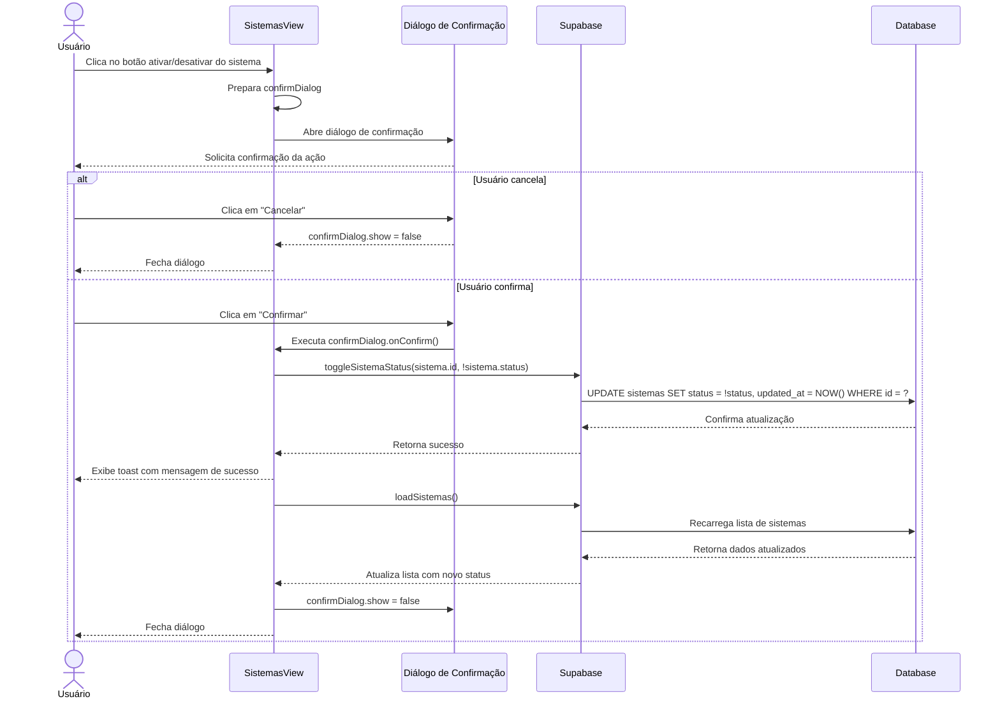

# Funcionalidade: Ativar/Desativar Sistema

## Descrição

Esta funcionalidade permite alterar o status de um sistema entre ativo e inativo, sem excluí-lo permanentemente do banco de dados. Sistemas inativos permanecem visíveis na lista (possivelmente com indicação visual diferente) mas não são considerados em operações como associação com novos processos.

## Fluxo da Funcionalidade



## Interface de Usuário

- **Botão de Ação**: Um botão ou toggle na lista de sistemas que muda conforme o status atual
  - Para sistemas ativos: Botão "Desativar"
  - Para sistemas inativos: Botão "Ativar"
- **Diálogo de Confirmação**: Modal que solicita confirmação antes de executar a ação
- **Feedback Visual**:
  - Toast notification após a ação
  - Mudança na aparência do sistema na lista (cor, ícone ou badge)

## Diálogo de Confirmação

```javascript
// Estado do diálogo de confirmação
const confirmDialog = ref({
  show: false,
  title: '',
  message: '',
  warning: '',
  confirmText: '',
  onConfirm: null
});

// Função para alternar o status do sistema
const toggleSistemaStatus = async (sistemaId, novoStatus) => {
  try {
    // Prepara o texto do diálogo conforme a ação
    const acao = novoStatus ? "ativar" : "desativar";
    
    confirmDialog.value = {
      show: true,
      title: `Confirmar ${acao}`,
      message: `Tem certeza que deseja ${acao} este sistema?`,
      warning: novoStatus ? '' : 'Sistemas inativos não aparecerão nas listas de seleção.',
      confirmText: novoStatus ? 'Ativar' : 'Desativar',
      onConfirm: async () => {
        await executarMudancaStatus(sistemaId, novoStatus);
        confirmDialog.value.show = false;
      }
    };
  } catch (error) {
    console.error(`Erro ao ${novoStatus ? 'ativar' : 'desativar'} sistema:`, error);
    showToast(`Erro ao alterar status do sistema: ${error.message}`, 'error');
  }
};

// Função que executa a mudança de status
const executarMudancaStatus = async (sistemaId, novoStatus) => {
  try {
    const { error } = await supabase
      .from('sistemas')
      .update({ 
        status: novoStatus,
        updated_at: new Date().toISOString() 
      })
      .eq('id', sistemaId);
    
    if (error) throw error;
    
    showToast(
      `Sistema ${novoStatus ? 'ativado' : 'desativado'} com sucesso!`,
      'success'
    );
    
    await loadSistemas(); // Recarrega a lista de sistemas
  } catch (error) {
    console.error('Erro ao alterar status:', error);
    showToast(`Erro ao alterar status: ${error.message}`, 'error');
    throw error;
  }
};
```

## Template do Diálogo de Confirmação

```html
<div v-if="confirmDialog.show" class="confirm-dialog-overlay">
  <div class="confirm-dialog">
    <h3 class="dialog-title">{{ confirmDialog.title }}</h3>
    
    <div class="dialog-content">
      <p class="dialog-message">{{ confirmDialog.message }}</p>
      
      <p v-if="confirmDialog.warning" class="dialog-warning">
        <i class="icon-warning"></i>
        {{ confirmDialog.warning }}
      </p>
    </div>
    
    <div class="dialog-actions">
      <button 
        class="btn-cancel" 
        @click="confirmDialog.show = false"
      >
        Cancelar
      </button>
      
      <button 
        class="btn-confirm" 
        :class="{ 'btn-danger': !confirmDialog.confirmText.includes('Ativar') }"
        @click="confirmDialog.onConfirm"
      >
        {{ confirmDialog.confirmText }}
      </button>
    </div>
  </div>
</div>
```

## Indicação Visual de Status

```html
<!-- Trecho de código da lista de sistemas -->
<span 
  class="sistema-status" 
  :class="{ 'status-ativo': sistema.status, 'status-inativo': !sistema.status }"
>
  {{ sistema.status ? 'Ativo' : 'Inativo' }}
</span>

<!-- Botão para alternar o status -->
<button 
  class="btn-status" 
  :class="{ 'btn-desativar': sistema.status, 'btn-ativar': !sistema.status }"
  @click="toggleSistemaStatus(sistema.id, !sistema.status)"
>
  <i :class="sistema.status ? 'icon-disable' : 'icon-enable'"></i>
  {{ sistema.status ? 'Desativar' : 'Ativar' }}
</button>
```

## CSS para Indicação Visual

```css
.sistema-status {
  padding: 4px 8px;
  border-radius: 4px;
  font-size: 0.8rem;
  font-weight: 500;
}

.status-ativo {
  background-color: #e6f7e6;
  color: #1e7e1e;
}

.status-inativo {
  background-color: #f7e6e6;
  color: #7e1e1e;
}

.btn-ativar {
  color: #1e7e1e;
}

.btn-desativar {
  color: #7e1e1e;
}
```

## Tabela e Colunas Afetadas

### Atualização na tabela sistemas

| Coluna | Tipo | Descrição | Valor |
|--------|------|-----------|-------|
| status | boolean | Status do sistema | true (ativo) ou false (inativo) |
| updated_at | timestamp | Data da última atualização | Data atual |

## Consulta SQL

```sql
-- Desativar sistema
UPDATE sistemas
SET status = false,
    updated_at = NOW()
WHERE id = 'uuid-do-sistema';

-- Ativar sistema
UPDATE sistemas
SET status = true,
    updated_at = NOW()
WHERE id = 'uuid-do-sistema';
```

## Considerações Importantes

1. **Impacto em Relacionamentos**: Sistemas inativos não são excluídos, preservando relacionamentos históricos com processos e outros registros
2. **Filtragem em Consultas**: Ao selecionar sistemas para associação com processos, apenas sistemas ativos são exibidos:

```javascript
// Exemplo de carregamento de sistemas ativos para seleção
const loadSistemasAtivos = async () => {
  const { data } = await supabase
    .from('sistemas')
    .select('id, nome')
    .eq('status', true)
    .order('nome');
  
  return data || [];
};
```

3. **Reversibilidade**: A operação é facilmente reversível, permitindo reativar sistemas quando necessário
4. **Logging**: A alteração de status é registrada com data/hora de atualização no próprio registro
