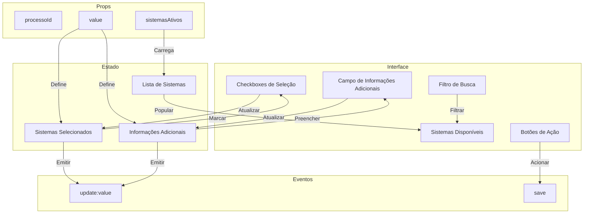

# Componente: SistemasImplantacaoSelector

## Descrição

O componente `SistemasImplantacaoSelector` é um componente Vue especializado para gerenciar a seleção de sistemas para implantação em processos licitatórios. Este componente permite selecionar múltiplos sistemas a partir de uma lista e adicionar informações adicionais sobre a implantação.

## Diagrama de Funcionamento



## Props do Componente

| Nome | Tipo | Obrigatório | Padrão | Descrição |
|------|------|-------------|--------|-----------|
| processoId | String | Sim | - | ID do processo ao qual os sistemas serão vinculados |
| sistemasAtivos | Array | Não | [] | Lista de IDs dos sistemas ativos disponíveis para seleção |
| value | Object | Não | `{ sistemas_ids: [], informacoes_adicionais: '' }` | Valor atual da seleção de sistemas e informações adicionais |

## Eventos Emitidos

| Nome | Payload | Descrição |
|------|---------|-----------|
| update:value | `{ sistemas_ids: Array, informacoes_adicionais: String }` | Emitido quando a seleção de sistemas ou informações adicionais mudam |
| save | - | Emitido quando os dados são salvos com sucesso no banco de dados |

## API do Componente

### Dados Reativos

| Nome | Tipo | Descrição |
|------|------|-----------|
| sistemasSelecionados | Ref\<Array> | IDs dos sistemas atualmente selecionados |
| informacoesAdicionais | Ref\<String> | Texto de informações adicionais sobre a implantação |
| sistemasDisponiveis | Ref\<Array> | Lista dos sistemas disponíveis para seleção, com seus detalhes |
| loading | Ref\<Boolean> | Estado de carregamento do componente |
| searchQuery | Ref\<String> | Texto atual de busca para filtrar sistemas |

### Propriedades Computadas

| Nome | Dependências | Descrição |
|------|-------------|-----------|
| sistemasFiltrados | sistemasDisponiveis, searchQuery | Lista de sistemas filtrada conforme texto de busca |

### Métodos

| Nome | Parâmetros | Retorno | Descrição |
|------|------------|---------|-----------|
| carregarSistemasDisponiveis | - | Promise\<void> | Carrega detalhes dos sistemas disponíveis do backend |
| toggleSistema | sistemaId: String | void | Alterna a seleção do sistema com o ID especificado |
| atualizarValor | - | void | Emite evento update:value com os valores atuais |
| selecionarTodos | - | void | Seleciona todos os sistemas disponíveis |
| limparSelecao | - | void | Remove todos os sistemas da seleção |
| salvar | - | Promise\<void> | Salva a seleção atual no banco de dados |
| isSistemaSelecionado | sistemaId: String | Boolean | Verifica se um sistema está atualmente selecionado |

## Código do Componente

```javascript
// SistemasImplantacaoSelector.js
import { ref, watch, computed } from 'vue';
import { supabase } from '@/services/supabase';

export default {
  name: 'SistemasImplantacaoSelector',
  props: {
    processoId: {
      type: String,
      required: true
    },
    sistemasAtivos: {
      type: Array,
      default: () => []
    },
    value: {
      type: Object,
      default: () => ({ sistemas_ids: [], informacoes_adicionais: '' })
    }
  },
  
  emits: ['update:value', 'save'],
  
  setup(props, { emit }) {
    const sistemasSelecionados = ref(props.value?.sistemas_ids || []);
    const informacoesAdicionais = ref(props.value?.informacoes_adicionais || '');
    const sistemasDisponiveis = ref([]);
    const loading = ref(false);
    const searchQuery = ref('');
    
    // Observa mudanças no valor externo
    watch(() => props.value, (newVal) => {
      if (newVal) {
        sistemasSelecionados.value = newVal.sistemas_ids || [];
        informacoesAdicionais.value = newVal.informacoes_adicionais || '';
      }
    });
    
    // Observa mudanças nos sistemas ativos para atualizar disponíveis
    watch(() => props.sistemasAtivos, async (newSistemas) => {
      if (newSistemas && newSistemas.length) {
        await carregarSistemasDisponiveis();
      }
    }, { immediate: true });
    
    // Carrega detalhes dos sistemas disponíveis
    const carregarSistemasDisponiveis = async () => {
      if (!props.sistemasAtivos || !props.sistemasAtivos.length) return;
      
      loading.value = true;
      try {
        const { data, error } = await supabase
          .from('sistemas')
          .select('id, nome')
          .in('id', props.sistemasAtivos);
          
        if (error) throw error;
        sistemasDisponiveis.value = data || [];
      } catch (error) {
        console.error('Erro ao carregar sistemas disponíveis:', error);
      } finally {
        loading.value = false;
      }
    };
    
    // Lista filtrada por busca
    const sistemasFiltrados = computed(() => {
      if (!searchQuery.value) return sistemasDisponiveis.value;
      
      const query = searchQuery.value.toLowerCase();
      return sistemasDisponiveis.value.filter(
        s => s.nome.toLowerCase().includes(query)
      );
    });
    
    // Alterna a seleção de um sistema
    const toggleSistema = (sistemaId) => {
      const index = sistemasSelecionados.value.indexOf(sistemaId);
      if (index === -1) {
        sistemasSelecionados.value.push(sistemaId);
      } else {
        sistemasSelecionados.value.splice(index, 1);
      }
      atualizarValor();
    };
    
    // Atualiza o valor para os componentes pais
    const atualizarValor = () => {
      const valorAtualizado = {
        sistemas_ids: sistemasSelecionados.value,
        informacoes_adicionais: informacoesAdicionais.value
      };
      emit('update:value', valorAtualizado);
    };
    
    // Observa mudanças nas informações adicionais
    watch(informacoesAdicionais, () => {
      atualizarValor();
    });
    
    // Selecionar todos os sistemas
    const selecionarTodos = () => {
      sistemasSelecionados.value = sistemasDisponiveis.value.map(s => s.id);
      atualizarValor();
    };
    
    // Limpar seleção
    const limparSelecao = () => {
      sistemasSelecionados.value = [];
      atualizarValor();
    };
    
    // Salvar no banco de dados
    const salvar = async () => {
      try {
        const { error } = await supabase
          .from('processos')
          .update({
            sistemas_implantacao: {
              sistemas_ids: sistemasSelecionados.value,
              informacoes_adicionais: informacoesAdicionais.value
            },
            updated_at: new Date().toISOString()
          })
          .eq('id', props.processoId);
          
        if (error) throw error;
        emit('save');
      } catch (error) {
        console.error('Erro ao salvar sistemas a implantar:', error);
      }
    };
    
    // Verifica se um sistema está selecionado
    const isSistemaSelecionado = (sistemaId) => {
      return sistemasSelecionados.value.includes(sistemaId);
    };
    
    return {
      sistemasDisponiveis,
      sistemasFiltrados,
      sistemasSelecionados,
      informacoesAdicionais,
      searchQuery,
      loading,
      toggleSistema,
      isSistemaSelecionado,
      selecionarTodos,
      limparSelecao,
      salvar
    };
  }
}
```

## Interface de Usuário (Template)

```vue
<template>
  <div class="sistemas-implantacao-selector">
    <div class="selector-header">
      <h3>Selecionar Sistemas para Implantação</h3>
      
      <div class="search-box">
        <input 
          v-model="searchQuery"
          type="text" 
          placeholder="Buscar sistemas..." 
          class="search-input"
        />
        <i class="icon-search"></i>
      </div>
    </div>
    
    <div class="selector-body">
      <div class="bulk-actions">
        <button 
          type="button" 
          class="btn-select-all" 
          @click="selecionarTodos" 
          :disabled="loading || sistemasDisponiveis.length === 0"
        >
          Selecionar Todos
        </button>
        <button 
          type="button" 
          class="btn-clear" 
          @click="limparSelecao" 
          :disabled="loading || sistemasSelecionados.length === 0"
        >
          Limpar Seleção
        </button>
      </div>
      
      <div class="sistemas-list" :class="{ 'loading': loading }">
        <div v-if="loading" class="loading-indicator">
          <span class="spinner"></span>
          <p>Carregando sistemas...</p>
        </div>
        
        <div v-else-if="sistemasDisponiveis.length === 0" class="empty-state">
          <i class="icon-info"></i>
          <p>Nenhum sistema disponível para seleção</p>
        </div>
        
        <div v-else-if="sistemasFiltrados.length === 0" class="empty-state">
          <i class="icon-search-off"></i>
          <p>Nenhum sistema encontrado com este termo</p>
          <button class="btn-clear-search" @click="searchQuery = ''">
            Limpar busca
          </button>
        </div>
        
        <div v-else class="sistemas-checkboxes">
          <div 
            v-for="sistema in sistemasFiltrados" 
            :key="sistema.id"
            class="sistema-item"
            :class="{ 'selected': isSistemaSelecionado(sistema.id) }"
          >
            <label>
              <input 
                type="checkbox" 
                :checked="isSistemaSelecionado(sistema.id)" 
                @change="toggleSistema(sistema.id)" 
              />
              <span class="sistema-nome">{{ sistema.nome }}</span>
            </label>
          </div>
        </div>
      </div>
      
      <div class="informacoes-adicionais">
        <label for="informacoes">Informações Adicionais</label>
        <textarea 
          id="informacoes" 
          v-model="informacoesAdicionais" 
          placeholder="Informe detalhes sobre a implantação, prazos, necessidades especiais..."
          rows="4"
        ></textarea>
      </div>
    </div>
    
    <div class="selector-footer">
      <button 
        type="button" 
        class="btn-cancel" 
        @click="$emit('cancel')"
      >
        Cancelar
      </button>
      <button 
        type="button" 
        class="btn-save" 
        @click="salvar"
        :disabled="loading"
      >
        {{ loading ? 'Salvando...' : 'Salvar' }}
      </button>
    </div>
  </div>
</template>
```

## CSS (Estilos Sugeridos)

```css
.sistemas-implantacao-selector {
  display: flex;
  flex-direction: column;
  background-color: #fff;
  border-radius: 8px;
  box-shadow: 0 2px 10px rgba(0, 0, 0, 0.1);
  max-width: 600px;
  width: 100%;
}

.selector-header {
  padding: 16px 20px;
  border-bottom: 1px solid #e0e0e0;
}

.selector-header h3 {
  margin: 0 0 12px 0;
  font-size: 18px;
  color: #333;
}

.search-box {
  position: relative;
}

.search-input {
  width: 100%;
  padding: 8px 12px 8px 32px;
  border: 1px solid #ddd;
  border-radius: 4px;
  font-size: 14px;
}

.icon-search {
  position: absolute;
  left: 10px;
  top: 50%;
  transform: translateY(-50%);
  color: #999;
}

.selector-body {
  padding: 16px 20px;
  flex-grow: 1;
  max-height: 400px;
  overflow-y: auto;
}

.bulk-actions {
  display: flex;
  justify-content: space-between;
  margin-bottom: 12px;
}

.btn-select-all, .btn-clear {
  padding: 6px 10px;
  font-size: 13px;
  background-color: #f5f5f5;
  border: 1px solid #ddd;
  border-radius: 4px;
  cursor: pointer;
}

.btn-select-all:hover, .btn-clear:hover {
  background-color: #e9e9e9;
}

.btn-select-all:disabled, .btn-clear:disabled {
  opacity: 0.5;
  cursor: not-allowed;
}

.sistemas-list {
  margin-bottom: 20px;
  border: 1px solid #ddd;
  border-radius: 4px;
  max-height: 200px;
  overflow-y: auto;
  padding: 8px;
}

.sistemas-list.loading {
  display: flex;
  justify-content: center;
  align-items: center;
  min-height: 150px;
}

.loading-indicator {
  display: flex;
  flex-direction: column;
  align-items: center;
}

.spinner {
  display: inline-block;
  width: 24px;
  height: 24px;
  border: 3px solid #f3f3f3;
  border-top: 3px solid #3498db;
  border-radius: 50%;
  animation: spin 1s linear infinite;
}

@keyframes spin {
  0% { transform: rotate(0deg); }
  100% { transform: rotate(360deg); }
}

.empty-state {
  display: flex;
  flex-direction: column;
  align-items: center;
  justify-content: center;
  padding: 20px;
  color: #666;
  text-align: center;
}

.sistema-item {
  padding: 8px;
  border-radius: 4px;
  margin-bottom: 4px;
}

.sistema-item:hover {
  background-color: #f5f5f5;
}

.sistema-item.selected {
  background-color: #e6f7ff;
}

.informacoes-adicionais {
  margin-top: 16px;
}

.informacoes-adicionais label {
  display: block;
  margin-bottom: 6px;
  font-weight: 500;
}

.informacoes-adicionais textarea {
  width: 100%;
  padding: 8px;
  border: 1px solid #ddd;
  border-radius: 4px;
  resize: vertical;
}

.selector-footer {
  padding: 16px 20px;
  border-top: 1px solid #e0e0e0;
  display: flex;
  justify-content: flex-end;
  gap: 10px;
}

.btn-cancel, .btn-save {
  padding: 8px 16px;
  border-radius: 4px;
  cursor: pointer;
  font-weight: 500;
}

.btn-cancel {
  background-color: #f5f5f5;
  border: 1px solid #ddd;
  color: #333;
}

.btn-save {
  background-color: #1890ff;
  border: 1px solid #1890ff;
  color: white;
}

.btn-cancel:hover {
  background-color: #e9e9e9;
}

.btn-save:hover {
  background-color: #40a9ff;
}

.btn-save:disabled {
  opacity: 0.7;
  cursor: not-allowed;
}
```

## Uso do Componente

```vue
<template>
  <div>
    <button @click="openSelector">Definir Sistemas para Implantação</button>
    
    <!-- Lista de sistemas selecionados -->
    <div v-if="sistemasImplantacao.sistemas_ids.length > 0">
      <h4>Sistemas para Implantação:</h4>
      <ul>
        <li v-for="sistema in sistemasSelecionadosInfo" :key="sistema.id">
          {{ sistema.nome }}
        </li>
      </ul>
      
      <div v-if="sistemasImplantacao.informacoes_adicionais">
        <h5>Informações Adicionais:</h5>
        <p>{{ sistemasImplantacao.informacoes_adicionais }}</p>
      </div>
    </div>
    
    <div v-else class="empty-info">
      Nenhum sistema definido para implantação
    </div>
    
    <!-- Modal com o seletor -->
    <modal-overlay v-if="showSelector">
      <sistemas-implantacao-selector
        :processo-id="processoId"
        :sistemas-ativos="sistemasDisponiveis"
        v-model:value="sistemasImplantacao"
        @save="handleSave"
        @cancel="showSelector = false"
      />
    </modal-overlay>
  </div>
</template>

<script>
import SistemasImplantacaoSelector from '@/components/SistemasImplantacaoSelector';
import ModalOverlay from '@/components/common/ModalOverlay';
import { ref, computed } from 'vue';

export default {
  components: {
    SistemasImplantacaoSelector,
    ModalOverlay
  },
  props: {
    processoId: {
      type: String,
      required: true
    }
  },
  setup(props) {
    const showSelector = ref(false);
    const sistemasDisponiveis = ref([]);
    const sistemasCache = ref([]);
    const sistemasImplantacao = ref({
      sistemas_ids: [],
      informacoes_adicionais: ''
    });
    
    // Carregar sistemas disponíveis
    const loadSistemasDisponiveis = async () => {
      try {
        const { data } = await supabase
          .from('sistemas')
          .select('id, nome')
          .eq('status', true)
          .order('nome');
          
        sistemasDisponiveis.value = data.map(s => s.id);
        sistemasCache.value = data;
      } catch (error) {
        console.error('Erro ao carregar sistemas:', error);
      }
    };
    
    // Informação completa dos sistemas selecionados
    const sistemasSelecionadosInfo = computed(() => {
      return sistemasImplantacao.value.sistemas_ids
        .map(id => sistemasCache.value.find(s => s.id === id))
        .filter(s => s); // Remover undefined
    });
    
    const openSelector = async () => {
      await loadSistemasDisponiveis();
      showSelector.value = true;
    };
    
    const handleSave = () => {
      showSelector.value = false;
      // Lógica adicional após salvar...
    };
    
    return {
      showSelector,
      sistemasDisponiveis,
      sistemasImplantacao,
      sistemasSelecionadosInfo,
      openSelector,
      handleSave
    };
  }
}
</script>
```

## Estrutura de Dados

O componente trabalha principalmente com a seguinte estrutura de dados no campo `sistemas_implantacao` da tabela `processos`:

```json
{
  "sistemas_ids": ["uuid-sistema-1", "uuid-sistema-2", "uuid-sistema-3"],
  "informacoes_adicionais": "Texto com informações sobre a implantação."
}
```

## Considerações de Desempenho

- **Carregamento sob Demanda**: Os detalhes dos sistemas são carregados apenas quando necessário
- **Filtragem Local**: A filtragem dos sistemas é realizada localmente para evitar múltiplas consultas ao banco
- **Observadores Eficientes**: Os observadores (watchers) são configurados para reagir apenas a mudanças reais
- **Memoização**: Uso de `computed` para evitar recálculos desnecessários

## Melhores Práticas

1. **Composição**: O componente segue o padrão de composição do Vue 3 com Composition API
2. **Props Validadas**: Todas as props têm validação de tipo
3. **Valores Padrão**: Todas as props opcionais têm valores padrão apropriados
4. **Comunicação Bidirecional**: Implementa v-model personalizado através de props e eventos
5. **Estados de Carregamento**: Mostra indicadores claros durante operações assíncronas
6. **Estados Vazios**: Provê feedback visual apropriado para listas vazias

## Possíveis Melhorias

- **Agrupamento por Categorias**: Agrupar sistemas por setor/categoria para facilitar a seleção
- **Histórico de Seleções**: Manter histórico das seleções recentes para sugestões
- **Drag-and-Drop**: Adicionar capacidade de arrastar e soltar para ordenar os sistemas selecionados
- **Paginação**: Para casos com grande número de sistemas, implementar paginação local
- **Testes Unitários**: Implementar testes automatizados para garantir comportamento consistente
