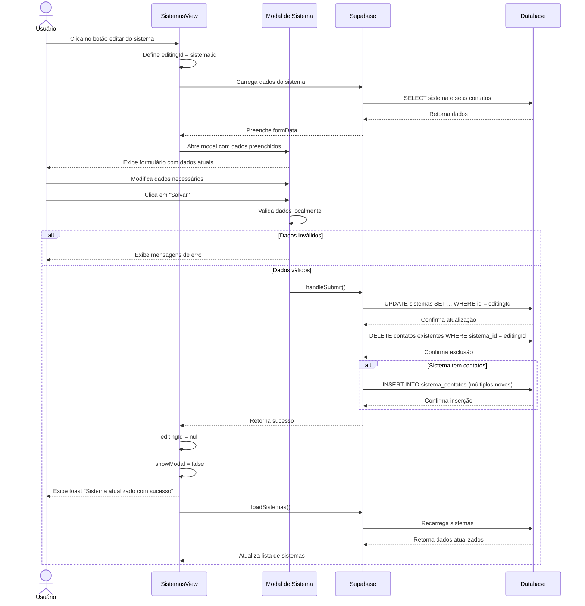

# Funcionalidade: Editar Sistema

## Descrição

Esta funcionalidade permite modificar os dados de um sistema já cadastrado, incluindo seu nome, descrição, URL, setor associado e os contatos vinculados.

## Fluxo da Funcionalidade



## Interface de Usuário

A interface para edição é a mesma utilizada para adição, com as seguintes diferenças:

- O título muda para "Editar Sistema"
- Os campos vêm pré-preenchidos com os dados existentes
- A lista de contatos já inclui os contatos cadastrados
- Opção para adicionar novos contatos ou remover existentes

## Carregamento de Dados para Edição

```javascript
const editSistema = async (sistema) => {
  try {
    editingId.value = sistema.id;
    
    // Busca dados completos do sistema e seus contatos
    const { data, error } = await supabase
      .from('sistemas')
      .select(`
        *,
        sistema_contatos (*)
      `)
      .eq('id', sistema.id)
      .single();
    
    if (error) throw error;
    
    // Preenche o formulário com dados existentes
    formData.value = {
      nome: data.nome || '',
      descricao: data.descricao || '',
      url: data.url || '',
      setor_id: data.setor_id || '',
      contatos: data.sistema_contatos.length > 0 
        ? data.sistema_contatos.map(c => ({ nome: c.nome, telefone: c.telefone }))
        : [{ nome: '', telefone: '' }] // Se não tem contatos, inicia com um vazio
    };
    
    // Abre o modal
    showModal.value = true;
  } catch (error) {
    console.error('Erro ao carregar dados do sistema:', error);
    showToast('Erro ao carregar dados do sistema', 'error');
  }
};
```

## Submissão da Edição

```javascript
const handleSubmit = async () => {
  try {
    // Validar formulário (mesmo método usado na adição)
    if (!validateForm()) {
      return;
    }
    
    // Verifica se está em modo de edição
    if (editingId.value) {
      // 1. Atualiza o sistema
      const sistemaData = {
        nome: formData.value.nome.trim(),
        descricao: formData.value.descricao.trim() || null,
        url: formData.value.url.trim() || null,
        setor_id: formData.value.setor_id,
        updated_at: new Date().toISOString()
      };
      
      const { error: updateError } = await supabase
        .from('sistemas')
        .update(sistemaData)
        .eq('id', editingId.value);
      
      if (updateError) throw updateError;
      
      // 2. Remove todos os contatos existentes
      const { error: deleteError } = await supabase
        .from('sistema_contatos')
        .delete()
        .eq('sistema_id', editingId.value);
      
      if (deleteError) throw deleteError;
      
      // 3. Insere os novos contatos
      const contatos = formData.value.contatos.filter(c => c.nome.trim() !== '');
      
      if (contatos.length > 0) {
        const contatosData = contatos.map(c => ({
          sistema_id: editingId.value,
          nome: c.nome.trim(),
          telefone: c.telefone ? c.telefone.trim() : null
        }));
        
        const { error: contatosError } = await supabase
          .from('sistema_contatos')
          .insert(contatosData);
        
        if (contatosError) throw contatosError;
      }
      
      // 4. Atualiza UI
      showToast('Sistema atualizado com sucesso!', 'success');
      closeModal();
      loadSistemas(); // Recarregar a lista de sistemas
    }
    
  } catch (error) {
    console.error('Erro ao atualizar sistema:', error);
    showToast('Erro ao atualizar sistema: ' + error.message, 'error');
  }
};
```

## Gerenciamento de Contatos na Edição

O mesmo mecanismo utilizado para manipular contatos na adição é utilizado na edição:

```javascript
// Adicionar novo contato vazio
const addContato = () => {
  formData.value.contatos.push({ nome: '', telefone: '' });
};

// Remover contato pelo índice
const removeContato = (index) => {
  formData.value.contatos.splice(index, 1);
};
```

## Validação de Dados

As mesmas validações usadas na adição são aplicadas na edição, garantindo que todos os campos obrigatórios sejam preenchidos corretamente.

## Tabelas e Colunas Afetadas

### Atualização na tabela sistemas

| Coluna | Tipo | Descrição | Valor |
|--------|------|-----------|-------|
| nome | text | Nome do sistema | Fornecido pelo usuário |
| descricao | text | Descrição do sistema | Fornecido pelo usuário |
| url | text | URL do sistema | Fornecido pelo usuário |
| setor_id | uuid | ID do setor | Selecionado pelo usuário |
| updated_at | timestamp | Data da última atualização | Data atual |

### Operações na tabela sistema_contatos

1. Exclusão de todos os contatos existentes:

```sql
DELETE FROM sistema_contatos WHERE sistema_id = 'uuid-do-sistema';
```

2. Inserção dos novos contatos (para cada contato):

```sql
INSERT INTO sistema_contatos (sistema_id, nome, telefone)
VALUES ('uuid-do-sistema', 'Nome do Contato', 'Telefone do Contato');
```

## Consulta SQL de Atualização

```sql
-- Atualização do sistema
UPDATE sistemas
SET nome = 'Novo Nome do Sistema',
    descricao = 'Nova Descrição',
    url = 'https://nova.url.sistema',
    setor_id = 'uuid-do-setor',
    updated_at = NOW()
WHERE id = 'uuid-do-sistema';
```

## Tratamento de Erros

O sistema inclui tratamento de erros em várias etapas do processo de edição:

1. **Erro ao carregar dados**: Captura e exibe erros que possam ocorrer ao buscar os dados do sistema para edição
2. **Erro na validação**: Exibe mensagens específicas para cada campo com erro
3. **Erro na atualização**: Captura e exibe erros durante a atualização do sistema no banco de dados
4. **Erro na gestão de contatos**: Trata erros que possam ocorrer na exclusão ou inserção de contatos
