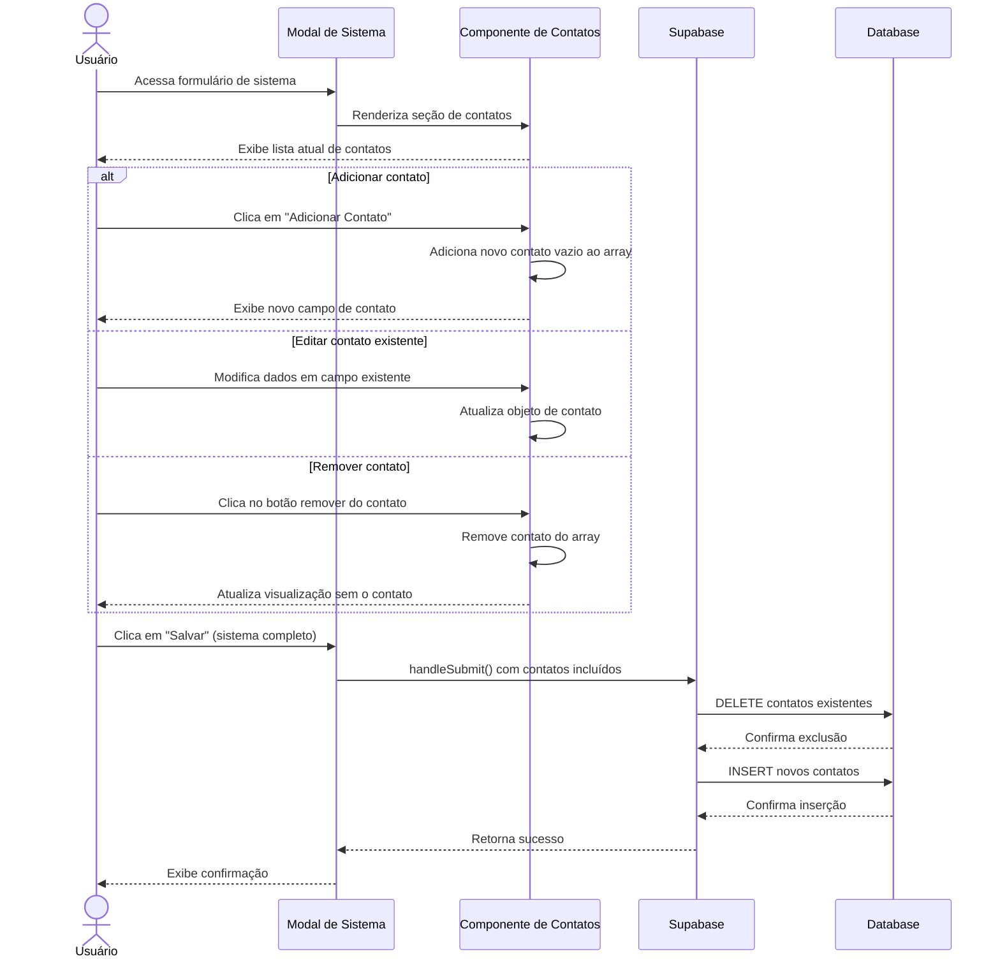

# Funcionalidade: Gerenciar Contatos de Sistemas

## Descrição

Esta funcionalidade permite gerenciar os contatos associados a cada sistema, incluindo adicionar novos contatos, editar informações de contatos existentes e remover contatos. É implementada como parte do processo de edição de sistemas, mas possui uma lógica específica para manipulação dos contatos.

## Fluxo da Funcionalidade



## Interface de Usuário

A seção de contatos dentro do formulário de sistema inclui:

- Uma lista de contatos atuais com:
  - Campo para nome de cada contato
  - Campo para telefone de cada contato
  - Botão para remover cada contato individual
- Botão para adicionar novo contato
- Validação visual para contatos sem nome

## Componente de Contatos

```html
<div class="contatos-section">
  <h3>Contatos</h3>
  
  <div v-for="(contato, index) in formData.contatos" :key="index" class="contato-item">
    <div class="contato-fields">
      <div class="form-group">
        <label :for="`contato-nome-${index}`">Nome*</label>
        <input
          :id="`contato-nome-${index}`"
          v-model="contato.nome"
          type="text"
          :class="{ 'is-invalid': hasContatoError(index, 'nome') }"
        />
        <div v-if="hasContatoError(index, 'nome')" class="invalid-feedback">
          {{ getContatoError(index, 'nome') }}
        </div>
      </div>
      
      <div class="form-group">
        <label :for="`contato-telefone-${index}`">Telefone</label>
        <input
          :id="`contato-telefone-${index}`"
          v-model="contato.telefone"
          type="text"
        />
      </div>
    </div>
    
    <button 
      type="button" 
      class="btn-remove-contato" 
      @click="removeContato(index)"
      :disabled="formData.contatos.length === 1"
    >
      <span class="icon-delete"></span>
    </button>
  </div>
  
  <button type="button" class="btn-add-contato" @click="addContato">
    <span class="icon-add"></span> Adicionar Contato
  </button>
</div>
```

## Lógica de Manipulação

```javascript
// Adicionar novo contato vazio
const addContato = () => {
  formData.value.contatos.push({ nome: '', telefone: '' });
};

// Remover contato pelo índice
const removeContato = (index) => {
  // Se é o único contato, apenas limpa os campos
  if (formData.value.contatos.length === 1) {
    formData.value.contatos[0] = { nome: '', telefone: '' };
    return;
  }
  
  // Remove o contato do array
  formData.value.contatos.splice(index, 1);
};

// Verificar se há erro em um campo de contato específico
const hasContatoError = (index, field) => {
  return formErrors.value.contatos && 
         formErrors.value.contatos[index] && 
         formErrors.value.contatos[index][field];
};

// Obter mensagem de erro para um campo de contato
const getContatoError = (index, field) => {
  if (hasContatoError(index, field)) {
    return formErrors.value.contatos[index][field];
  }
  return '';
};
```

## Validação de Contatos

```javascript
// Parte da função de validação do formulário
const validateForm = () => {
  // ... outras validações

  // Validar contatos (nomes não vazios para contatos preenchidos)
  const contatosPreenchidos = formData.value.contatos.filter(
    c => c.nome.trim() !== '' || c.telefone.trim() !== ''
  );
  
  contatosPreenchidos.forEach((contato, index) => {
    if (!contato.nome || contato.nome.trim() === '') {
      if (!formErrors.value.contatos) formErrors.value.contatos = {};
      formErrors.value.contatos[index] = { 
        nome: 'O nome do contato é obrigatório' 
      };
      isValid = false;
    }
  });
  
  return isValid;
};
```

## Salvamento de Contatos

```javascript
// Parte da função handleSubmit para salvar o sistema e contatos
const saveContacts = async (sistemaId) => {
  // 1. Filtrar apenas contatos preenchidos
  const contatosValidos = formData.value.contatos.filter(c => c.nome.trim() !== '');
  
  if (contatosValidos.length === 0) {
    return { success: true }; // Não há contatos para salvar
  }
  
  // 2. Preparar dados para inserção
  const contatosData = contatosValidos.map(c => ({
    sistema_id: sistemaId,
    nome: c.nome.trim(),
    telefone: c.telefone ? c.telefone.trim() : null
  }));
  
  // 3. Inserir contatos
  const { error } = await supabase
    .from('sistema_contatos')
    .insert(contatosData);
  
  if (error) {
    return { success: false, error };
  }
  
  return { success: true, count: contatosValidos.length };
};
```

## Tabela e Colunas

### Tabela: sistema_contatos

| Coluna | Tipo | Descrição | Manipulação |
|--------|------|-----------|-------------|
| id | uuid | Identificador único | Gerado automaticamente |
| sistema_id | uuid | ID do sistema associado | Obtido do sistema em edição |
| nome | text | Nome do contato | Fornecido pelo usuário |
| telefone | text | Telefone do contato | Fornecido pelo usuário |
| created_at | timestamp | Data de criação | Gerado automaticamente |

## Padrão de Dados Otimizado

Para reduzir operações desnecessárias no banco de dados, o sistema:

1. Filtra contatos vazios antes do salvamento
2. Realiza um único DELETE seguido de INSERTs em lote
3. Apenas contatos com pelo menos o nome preenchido são salvos

## Consultas SQL

```sql
-- 1. Excluir todos os contatos existentes
DELETE FROM sistema_contatos WHERE sistema_id = 'uuid-do-sistema';

-- 2. Inserir novos contatos (em batch)
INSERT INTO sistema_contatos (sistema_id, nome, telefone)
VALUES
  ('uuid-do-sistema', 'Contato 1', '(99) 99999-9999'),
  ('uuid-do-sistema', 'Contato 2', '(88) 88888-8888'),
  ('uuid-do-sistema', 'Contato 3', NULL);
```

## Considerações Especiais

1. **Contato Mínimo**: O formulário sempre exibe pelo menos um contato vazio
2. **Validação Seletiva**: Apenas contatos com alguma informação são validados
3. **Exclusão Segura**: Não é possível remover o último contato, apenas limpá-lo
4. **Operação Atômica**: Todos os contatos são salvos ou excluídos em uma única operação
