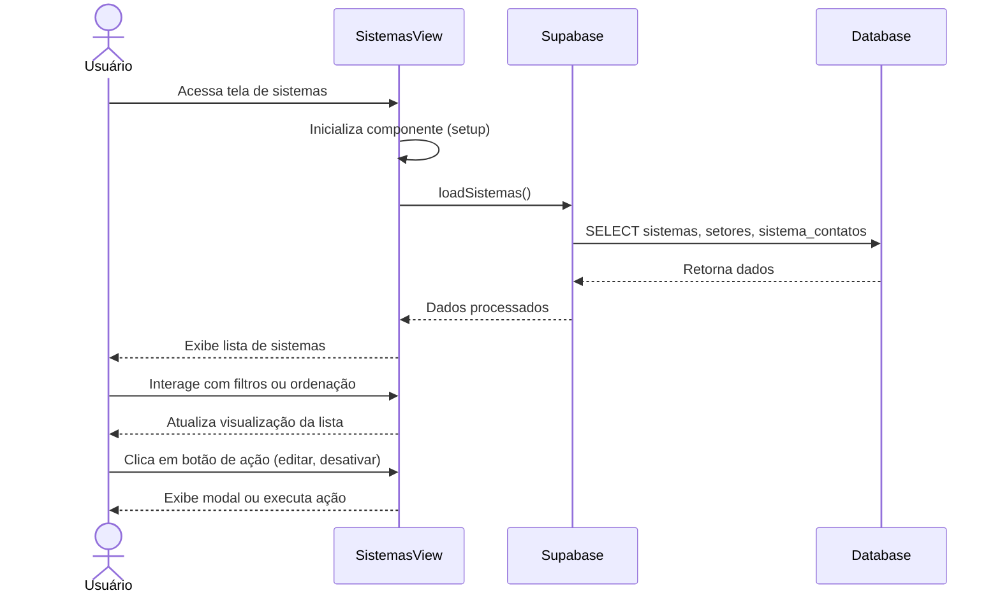

# Funcionalidade: Listar Sistemas

## Descrição

Esta funcionalidade exibe uma lista de todos os sistemas cadastrados no banco de dados, com informações básicas como nome, descrição, URL, setor associado e status. A lista pode ser filtrada e ordenada.

## Fluxo da Funcionalidade



## Interface de Usuário

A lista de sistemas é apresentada em formato de cards ou tabela, dependendo da preferência do usuário, exibindo:

- Nome do sistema
- Descrição (parcial)
- URL (com link clicável)
- Nome do setor associado
- Status visual (ativo/inativo)
- Número de contatos associados
- Botões de ação:
  - Editar
  - Desativar/Ativar
  - Ver detalhes

## Dados Carregados

```javascript
const loadSistemas = async () => {
  try {
    loading.value = true
    const { data, error } = await supabase
      .from('sistemas')
      .select(`
        *,
        setores (
          nome
        ),
        sistema_contatos (
          id,
          nome,
          telefone
        )
      `)
      .order('status', { ascending: false })
      .order('created_at', { ascending: false });
    
    if (error) throw error;
    sistemas.value = data || [];
  } catch (error) {
    console.error('Erro ao carregar sistemas:', error);
    // Exibir notificação de erro
  } finally {
    loading.value = false;
  }
}
```

## Filtragem e Ordenação

A funcionalidade permite filtragem pelo status do sistema (ativo/inativo) e pelo setor, bem como ordenação por nome, data de criação ou setor.

```javascript
const sistemasFiltrados = computed(() => {
  let resultado = [...sistemas.value];
  
  // Aplicar filtros
  if (filtroStatus.value) {
    resultado = resultado.filter(s => s.status === filtroStatus.value);
  }
  
  if (filtroSetor.value) {
    resultado = resultado.filter(s => s.setor_id === filtroSetor.value);
  }
  
  // Aplicar ordenação
  if (ordenacao.value === 'nome') {
    resultado.sort((a, b) => a.nome.localeCompare(b.nome));
  } else if (ordenacao.value === 'setor') {
    resultado.sort((a, b) => a.setores?.nome.localeCompare(b.setores?.nome));
  }
  // Outras ordenações...
  
  return resultado;
});
```

## Exibição de Status

O sistema utiliza indicadores visuais para o status:

```javascript
const getStatusClass = (sistema) => {
  return sistema.status ? 'status-ativo' : 'status-inativo';
};

const getStatusText = (sistema) => {
  return sistema.status ? 'Ativo' : 'Inativo';
};
```

## Tabelas e Colunas

### Tabela: sistemas

| Coluna | Tipo | Descrição | Uso na Exibição |
|--------|------|-----------|-----------------|
| id | uuid | Identificador único | Internamente para operações |
| nome | text | Nome do sistema | Exibido como título principal |
| descricao | text | Descrição do sistema | Exibido como texto secundário |
| url | text | URL da documentação | Exibido como link clicável |
| setor_id | uuid | ID do setor | Usado para buscar nome do setor |
| status | boolean | Status do sistema | Exibido como indicador visual |
| created_at | timestamp | Data de criação | Usado para ordenação |
| updated_at | timestamp | Data de atualização | Exibido em detalhes |

### Tabela: setores

| Coluna | Tipo | Descrição | Uso na Exibição |
|--------|------|-----------|-----------------|
| id | uuid | Identificador único | Internamente para operações |
| nome | text | Nome do setor | Exibido junto com o sistema |
| created_at | timestamp | Data de criação | Não exibido na lista |

### Tabela: sistema_contatos

| Coluna | Tipo | Descrição | Uso na Exibição |
|--------|------|-----------|-----------------|
| id | uuid | Identificador único | Internamente para operações |
| sistema_id | uuid | ID do sistema | Relacionamento com o sistema |
| nome | text | Nome do contato | Exibido na lista de contatos |
| telefone | text | Telefone do contato | Exibido na lista de contatos |
| created_at | timestamp | Data de criação | Não exibido na lista |

## Consulta SQL

```sql
-- Consulta equivalente ao carregamento de sistemas
SELECT 
  s.*,
  st.nome AS nome_setor,
  COUNT(sc.id) AS num_contatos
FROM sistemas s
LEFT JOIN setores st ON s.setor_id = st.id
LEFT JOIN sistema_contatos sc ON s.id = sc.sistema_id
GROUP BY s.id, st.nome
ORDER BY s.status DESC, s.created_at DESC;
```

## Ciclo de Vida do Componente

O carregamento dos dados ocorre durante a montagem do componente e pode ser recarregado após operações de CRUD:

```javascript
onMounted(() => {
  loadSistemas();
  loadSetores();
});
```
