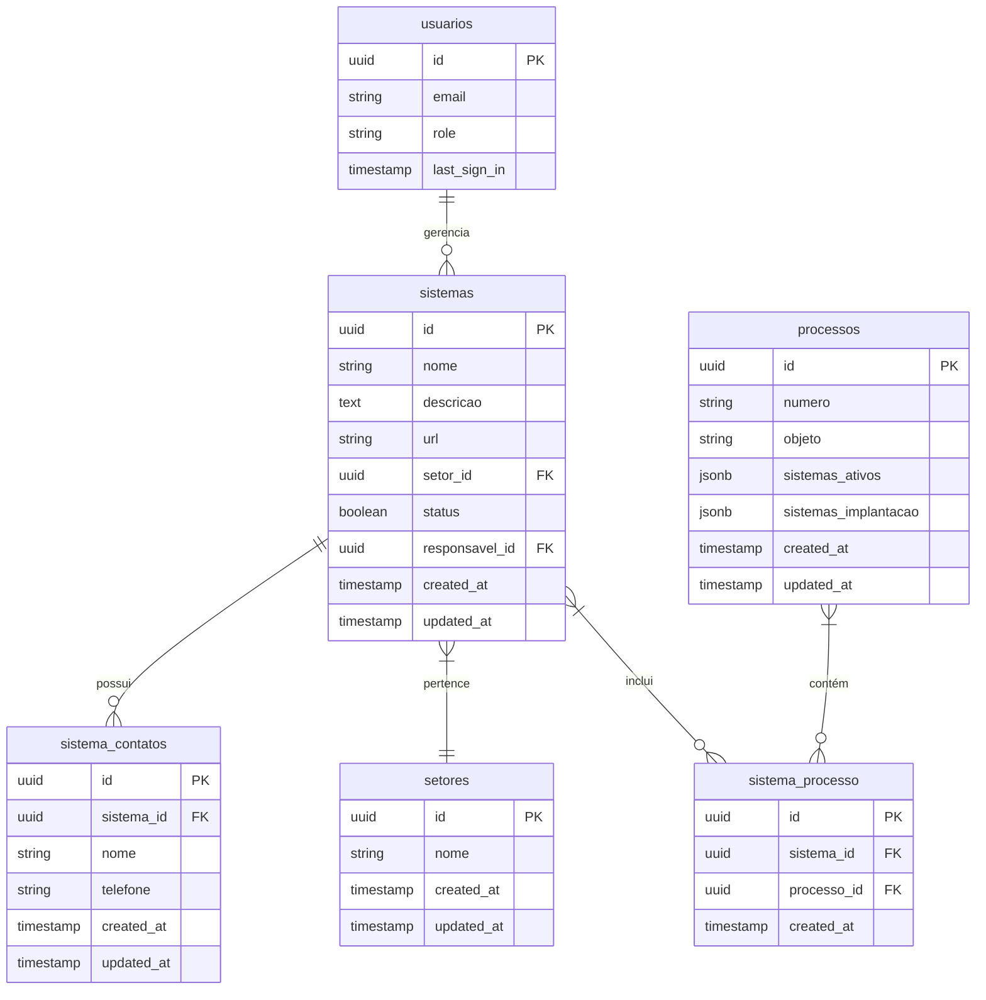

# Modelo de Dados - Gerenciamento de Sistemas

## Visão Geral do Modelo

O módulo de Gerenciamento de Sistemas utiliza um modelo de dados que permite cadastrar sistemas, associá-los a setores e processos, além de gerenciar contatos relacionados a cada sistema.

## Diagrama ER



## Detalhamento das Tabelas

### Tabela: sistemas

Esta tabela armazena as informações básicas dos sistemas de software comercializados pela empresa.

| Coluna | Tipo | Nulável | Descrição | Restrições |
|--------|------|---------|-----------|------------|
| id | uuid | não | Identificador único | Chave primária, default: gen_random_uuid() |
| nome | text | não | Nome do sistema | Índice para pesquisa |
| descricao | text | sim | Descrição detalhada do sistema | - |
| url | text | sim | URL da documentação ou acesso | - |
| setor_id | uuid | não | Setor ao qual pertence | Chave estrangeira para setores |
| status | boolean | não | Status do sistema (ativo/inativo) | Default: true |
| responsavel_id | uuid | sim | ID do usuário que cadastrou | Chave estrangeira para auth.users |
| created_at | timestamp with time zone | não | Data de criação | Default: now() |
| updated_at | timestamp with time zone | não | Data de última atualização | Default: now() |

#### Índices da tabela sistemas

- Índice primário: id
- Índice para pesquisa: nome
- Índice para filtro: status
- Índice para junção: setor_id

### Tabela: setores

Esta tabela armazena os setores ou áreas aos quais os sistemas pertencem.

| Coluna | Tipo | Nulável | Descrição | Restrições |
|--------|------|---------|-----------|------------|
| id | uuid | não | Identificador único | Chave primária, default: gen_random_uuid() |
| nome | text | não | Nome do setor | UNIQUE |
| created_at | timestamp with time zone | não | Data de criação | Default: now() |
| updated_at | timestamp with time zone | não | Data de última atualização | Default: now() |

#### Índices da tabela setores

- Índice primário: id
- Índice único: nome

### Tabela: sistema_contatos

Esta tabela armazena os contatos técnicos ou comerciais relacionados a cada sistema.

| Coluna | Tipo | Nulável | Descrição | Restrições |
|--------|------|---------|-----------|------------|
| id | uuid | não | Identificador único | Chave primária, default: gen_random_uuid() |
| sistema_id | uuid | não | ID do sistema | Chave estrangeira para sistemas |
| nome | text | não | Nome do contato | - |
| telefone | text | sim | Telefone do contato | - |
| created_at | timestamp with time zone | não | Data de criação | Default: now() |
| updated_at | timestamp with time zone | não | Data de última atualização | Default: now() |

#### Índices da tabela sistema_contatos

- Índice primário: id
- Índice para junção: sistema_id

### Tabela: processos

Esta tabela contém os processos licitatórios, incluindo referências aos sistemas oferecidos ou implantados.

| Coluna | Tipo | Nulável | Descrição | Restrições |
|--------|------|---------|-----------|------------|
| id | uuid | não | Identificador único | Chave primária, default: gen_random_uuid() |
| numero | text | não | Número do processo | - |
| objeto | text | sim | Objeto da licitação | - |
| sistemas_ativos | jsonb | sim | Array de IDs dos sistemas ativos | - |
| sistemas_implantacao | jsonb | sim | Objeto com sistemas a implantar e informações adicionais | - |
| created_at | timestamp with time zone | não | Data de criação | Default: now() |
| updated_at | timestamp with time zone | não | Data de última atualização | Default: now() |

#### Índices da tabela processos

- Índice primário: id
- Índice para pesquisa: numero
- Índice GIN para busca em JSONB: sistemas_ativos

### Tabela: sistema_processo (alternativa ao campo JSONB)

Esta tabela estabelece um relacionamento muitos-para-muitos entre sistemas e processos, quando necessário um relacionamento mais estruturado.

| Coluna | Tipo | Nulável | Descrição | Restrições |
|--------|------|---------|-----------|------------|
| id | uuid | não | Identificador único | Chave primária, default: gen_random_uuid() |
| sistema_id | uuid | não | ID do sistema | Chave estrangeira para sistemas |
| processo_id | uuid | não | ID do processo | Chave estrangeira para processos |
| created_at | timestamp with time zone | não | Data de criação | Default: now() |

#### Índices da tabela sistema_processo

- Índice primário: id
- Índice composto único: (sistema_id, processo_id)

## Chaves Estrangeiras

- `sistemas.setor_id` → `setores.id`
  - ON DELETE: RESTRICT (impede a exclusão de setores que tenham sistemas associados)
  - ON UPDATE: CASCADE (atualiza a referência quando o ID do setor muda)

- `sistemas.responsavel_id` → `auth.users.id`
  - ON DELETE: SET NULL (quando um usuário é excluído, o sistema permanece mas perde a referência)
  - ON UPDATE: CASCADE (atualiza a referência quando o ID do usuário muda)

- `sistema_contatos.sistema_id` → `sistemas.id`
  - ON DELETE: CASCADE (exclui os contatos quando o sistema é excluído)
  - ON UPDATE: CASCADE (atualiza a referência quando o ID do sistema muda)

- `sistema_processo.sistema_id` → `sistemas.id`
  - ON DELETE: CASCADE (exclui a associação quando o sistema é excluído)
  - ON UPDATE: CASCADE (atualiza a referência quando o ID do sistema muda)

- `sistema_processo.processo_id` → `processos.id`
  - ON DELETE: CASCADE (exclui a associação quando o processo é excluído)
  - ON UPDATE: CASCADE (atualiza a referência quando o ID do processo muda)

## SQL para Criação das Tabelas

```sql
-- Tabela de setores
CREATE TABLE IF NOT EXISTS setores (
    id UUID PRIMARY KEY DEFAULT gen_random_uuid(),
    nome TEXT NOT NULL UNIQUE,
    created_at TIMESTAMP WITH TIME ZONE DEFAULT now() NOT NULL,
    updated_at TIMESTAMP WITH TIME ZONE DEFAULT now() NOT NULL
);

-- Tabela de sistemas
CREATE TABLE IF NOT EXISTS sistemas (
    id UUID PRIMARY KEY DEFAULT gen_random_uuid(),
    nome TEXT NOT NULL,
    descricao TEXT,
    url TEXT,
    setor_id UUID NOT NULL REFERENCES setores(id) ON DELETE RESTRICT ON UPDATE CASCADE,
    status BOOLEAN NOT NULL DEFAULT true,
    responsavel_id UUID REFERENCES auth.users(id) ON DELETE SET NULL,
    created_at TIMESTAMP WITH TIME ZONE DEFAULT now() NOT NULL,
    updated_at TIMESTAMP WITH TIME ZONE DEFAULT now() NOT NULL
);

-- Tabela de contatos dos sistemas
CREATE TABLE IF NOT EXISTS sistema_contatos (
    id UUID PRIMARY KEY DEFAULT gen_random_uuid(),
    sistema_id UUID NOT NULL REFERENCES sistemas(id) ON DELETE CASCADE,
    nome TEXT NOT NULL,
    telefone TEXT,
    created_at TIMESTAMP WITH TIME ZONE DEFAULT now() NOT NULL,
    updated_at TIMESTAMP WITH TIME ZONE DEFAULT now() NOT NULL
);

-- Índices para melhorar performance
CREATE INDEX idx_sistemas_nome ON sistemas(nome);
CREATE INDEX idx_sistemas_status ON sistemas(status);
CREATE INDEX idx_sistemas_setor ON sistemas(setor_id);
CREATE INDEX idx_sistema_contatos_sistema ON sistema_contatos(sistema_id);
```

## Políticas de Segurança (RLS)

```sql
-- Habilitar RLS para a tabela de sistemas
ALTER TABLE sistemas ENABLE ROW LEVEL SECURITY;

-- Política para leitura de sistemas - todos usuários autenticados
CREATE POLICY "Permitir leitura para usuários autenticados"
    ON sistemas FOR SELECT
    TO authenticated
    USING (true);

-- Política para modificação de sistemas - apenas admin e gerentes
CREATE POLICY "Permitir modificação para admins e gerentes"
    ON sistemas FOR ALL
    TO authenticated
    USING ((
        SELECT role FROM profiles WHERE user_id = auth.uid()
    ) IN ('admin', 'manager'));

-- Habilitar RLS para a tabela de contatos
ALTER TABLE sistema_contatos ENABLE ROW LEVEL SECURITY;

-- Política similar para contatos
CREATE POLICY "Permitir leitura de contatos"
    ON sistema_contatos FOR SELECT
    TO authenticated
    USING (true);

CREATE POLICY "Permitir modificação de contatos"
    ON sistema_contatos FOR ALL
    TO authenticated
    USING ((
        SELECT role FROM profiles WHERE user_id = auth.uid()
    ) IN ('admin', 'manager'));
```

## Exemplo de Consultas

### Consulta de Sistemas com Contatos e Setor

```sql
-- Obter sistema com seus contatos e setor
SELECT 
  s.*,
  st.nome AS nome_setor,
  json_agg(sc.*) AS contatos
FROM sistemas s
LEFT JOIN setores st ON s.setor_id = st.id
LEFT JOIN sistema_contatos sc ON s.id = sc.sistema_id
WHERE s.status = true
GROUP BY s.id, st.id
ORDER BY s.nome;
```

### Consulta de Processos com Sistemas

```sql
-- Obter processos com detalhes dos sistemas ativos
SELECT 
  p.*,
  jsonb_agg(DISTINCT s.*) AS sistemas_detalhados
FROM processos p
CROSS JOIN LATERAL jsonb_array_elements_text(p.sistemas_ativos) as sistema_id
JOIN sistemas s ON s.id::text = sistema_id
GROUP BY p.id
ORDER BY p.created_at DESC;
```

## Estrutura do Campo JSONB sistemas_implantacao

```json
{
  "sistemas_ids": ["uuid-sistema-1", "uuid-sistema-2"],
  "informacoes_adicionais": "Texto com observações sobre a implantação dos sistemas."
}
```

## Considerações de Design

1. **Status ativo/inativo**: Os sistemas possuem um campo de status para evitar exclusões permanentes, preservando o histórico.
2. **Dois Métodos para Associação**: O sistema permite associar sistemas a processos tanto via campo JSONB (mais flexível) quanto por tabela de relacionamento (mais estruturado).
3. **Campos JSONB vs. Tabela de Relacionamento**:
   - JSONB é mais simples para operações de leitura e escrita
   - Tabela de relacionamento oferece maior integridade referencial e facilita consultas complexas
4. **Relação com Setores**: Cada sistema pertence a exatamente um setor, facilitando a categorização e busca.
5. **Múltiplos Contatos**: Um sistema pode ter múltiplos contatos associados, sem limite pré-definido.
