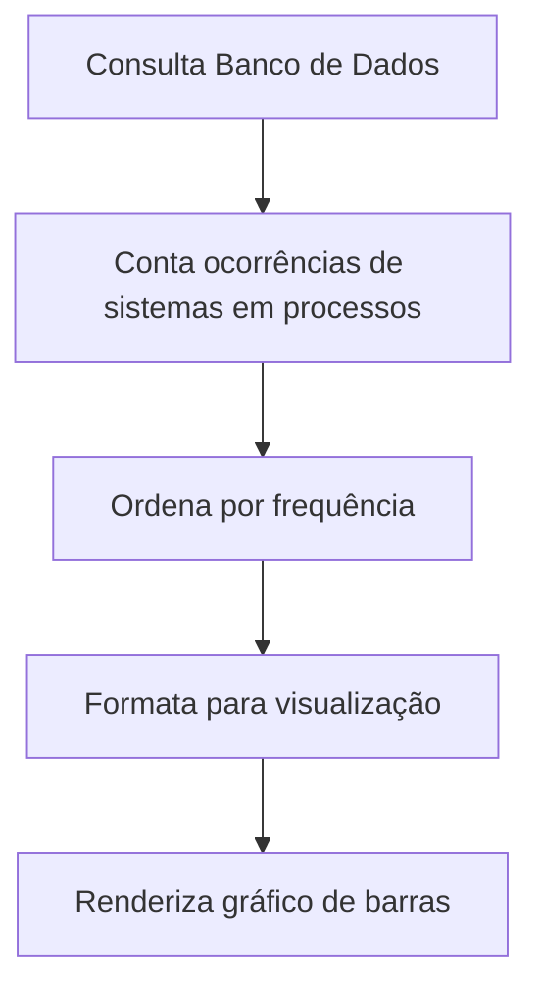
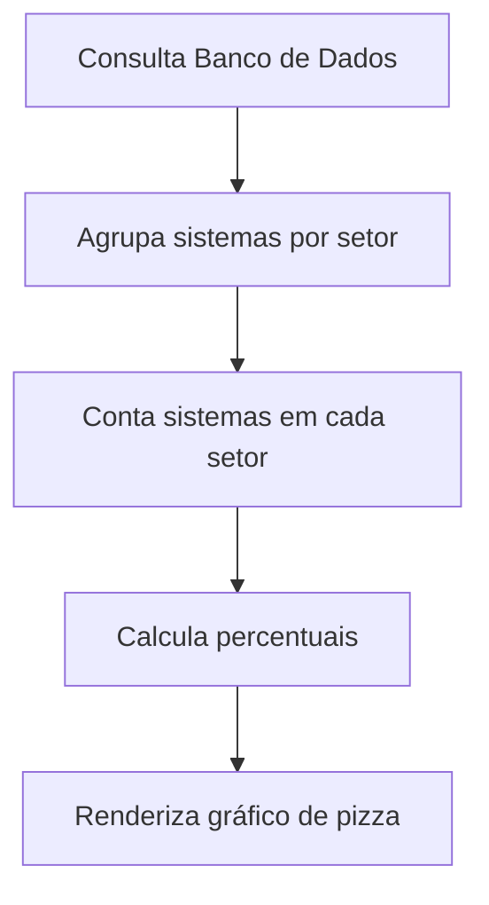
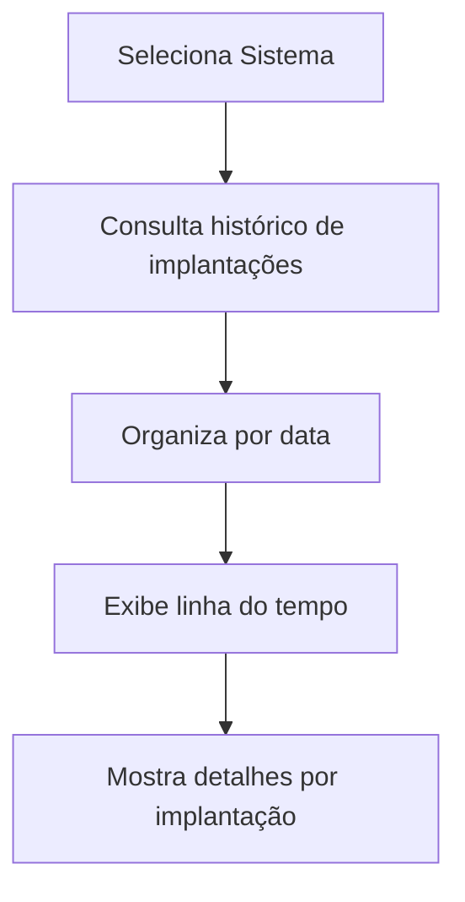
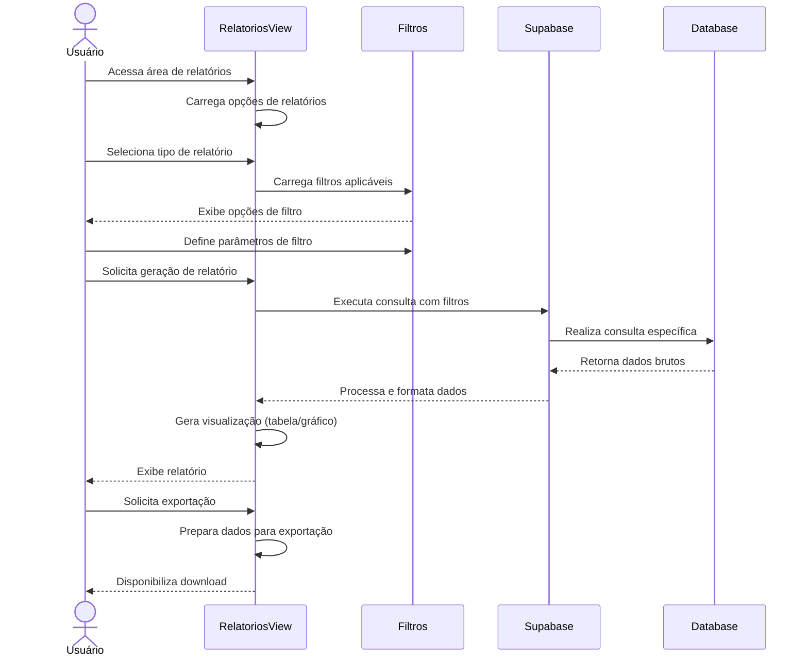

# Funcionalidade: Relatórios de Sistemas

## Descrição

Esta funcionalidade permite gerar relatórios sobre os sistemas da empresa, incluindo estatísticas de uso em processos licitatórios, distribuição por setores, e histórico de implantações. Estes relatórios ajudam na tomada de decisões estratégicas e no acompanhamento do desempenho dos produtos.

## Tipos de Relatórios

### 1. Sistemas por Frequência em Processos



### 2. Distribuição de Sistemas por Setor



### 3. Histórico de Implantações por Sistema



## Fluxo da Funcionalidade



## Implementação de Relatórios

### Relatório de Frequência em Processos

```javascript
const gerarRelatorioFrequencia = async (filtros = {}) => {
  try {
    // Base de consulta
    let query = supabase.rpc('contar_sistemas_por_processos');
    
    // Aplicar filtros adicionais
    if (filtros.dataInicio && filtros.dataFim) {
      query = query.filter('periodo', 'in', [filtros.dataInicio, filtros.dataFim]);
    }
    
    if (filtros.setorId) {
      query = query.eq('setor_id', filtros.setorId);
    }
    
    // Executar consulta
    const { data, error } = await query;
    
    if (error) throw error;
    
    // Formatar dados para visualização
    const dadosFormatados = data.map(item => ({
      sistema: item.nome_sistema,
      setor: item.nome_setor,
      quantidade: item.contagem,
      percentual: ((item.contagem / data.reduce((acc, cur) => acc + cur.contagem, 0)) * 100).toFixed(1) + '%'
    }));
    
    return dadosFormatados;
  } catch (error) {
    console.error('Erro ao gerar relatório de frequência:', error);
    throw error;
  }
};
```

### Relatório de Distribuição por Setor

```javascript
const gerarRelatorioDistribuicaoSetores = async () => {
  try {
    const { data, error } = await supabase.rpc('contar_sistemas_por_setor');
    
    if (error) throw error;
    
    // Formatar para gráfico de pizza
    const dadosGrafico = data.map(item => ({
      setor: item.nome_setor,
      quantidade: item.contagem,
      percentual: item.percentual.toFixed(1) + '%'
    }));
    
    return dadosGrafico;
  } catch (error) {
    console.error('Erro ao gerar relatório de setores:', error);
    throw error;
  }
};
```

### Relatório de Implantações

```javascript
const gerarRelatorioImplantacoes = async (sistemaId, filtros = {}) => {
  try {
    // Busca processos que incluem o sistema na implantação
    let query = supabase
      .from('processos')
      .select(`
        id,
        numero,
        objeto,
        cliente:empresa_vencedora_id (nome),
        data_homologacao,
        data_implantacao_inicio,
        data_implantacao_fim,
        status_implantacao,
        sistemas_implantacao
      `)
      .contains('sistemas_implantacao->>sistemas_ids', `["${sistemaId}"]`);
    
    // Aplicar filtros adicionais
    if (filtros.status) {
      query = query.eq('status_implantacao', filtros.status);
    }
    
    if (filtros.dataInicio) {
      query = query.gte('data_homologacao', filtros.dataInicio);
    }
    
    if (filtros.dataFim) {
      query = query.lte('data_homologacao', filtros.dataFim);
    }
    
    // Ordenar por data
    query = query.order('data_homologacao', { ascending: false });
    
    const { data, error } = await query;
    
    if (error) throw error;
    
    return data.map(proc => ({
      processo: proc.numero,
      cliente: proc.cliente?.nome || 'Não definido',
      objeto: proc.objeto,
      homologacao: proc.data_homologacao,
      inicio_implantacao: proc.data_implantacao_inicio || 'Não iniciada',
      fim_implantacao: proc.data_implantacao_fim || 'Em andamento',
      status: proc.status_implantacao || 'Não iniciada',
      observacoes: proc.sistemas_implantacao?.informacoes_adicionais || ''
    }));
  } catch (error) {
    console.error('Erro ao gerar relatório de implantações:', error);
    throw error;
  }
};
```

## Visualização dos Relatórios

### Gráficos Interativos

Os relatórios utilizam gráficos interativos construídos com bibliotecas como Chart.js:

```javascript
// Configuração para gráfico de barras - Sistemas mais frequentes
const configGraficoFrequencia = (dados) => {
  return {
    type: 'bar',
    data: {
      labels: dados.map(d => d.sistema),
      datasets: [{
        label: 'Processos',
        data: dados.map(d => d.quantidade),
        backgroundColor: 'rgba(54, 162, 235, 0.8)'
      }]
    },
    options: {
      responsive: true,
      scales: {
        y: {
          beginAtZero: true,
          ticks: {
            precision: 0
          }
        }
      },
      plugins: {
        tooltip: {
          callbacks: {
            afterLabel: function(context) {
              return `Percentual: ${dados[context.dataIndex].percentual}`;
            }
          }
        }
      }
    }
  };
};

// Configuração para gráfico de pizza - Distribuição por setor
const configGraficoSetores = (dados) => {
  // Implementação da configuração do gráfico de pizza
};
```

### Tabelas Detalhadas

Além dos gráficos, os dados são exibidos em tabelas detalhadas:

```html
<template>
  <div class="table-container">
    <table class="report-table">
      <thead>
        <tr>
          <th>Sistema</th>
          <th>Setor</th>
          <th>Quantidade de Processos</th>
          <th>Percentual</th>
        </tr>
      </thead>
      <tbody>
        <tr v-for="item in dadosRelatorio" :key="item.sistema">
          <td>{{ item.sistema }}</td>
          <td>{{ item.setor }}</td>
          <td class="number">{{ item.quantidade }}</td>
          <td class="number">{{ item.percentual }}</td>
        </tr>
      </tbody>
      <tfoot>
        <tr>
          <th colspan="2">Total</th>
          <th class="number">{{ totalProcessos }}</th>
          <th class="number">100%</th>
        </tr>
      </tfoot>
    </table>
  </div>
</template>
```

## Funções SQL para Relatórios

Para otimizar consultas complexas, utiliza-se funções SQL no lado do servidor:

```sql
-- Função para contar sistemas por processos
CREATE OR REPLACE FUNCTION contar_sistemas_por_processos(periodo tstzrange DEFAULT NULL)
RETURNS TABLE (
  sistema_id uuid,
  nome_sistema text,
  setor_id uuid,
  nome_setor text,
  contagem bigint
) AS $$
BEGIN
  RETURN QUERY
  WITH contagens AS (
    -- Sistemas em processos via JSONB
    SELECT 
      s.id AS sistema_id,
      s.nome AS nome_sistema,
      s.setor_id,
      st.nome AS nome_setor,
      COUNT(p.id) AS contagem
    FROM processos p
    CROSS JOIN LATERAL jsonb_array_elements_text(p.sistemas_ativos) AS sistema_id_text
    JOIN sistemas s ON s.id::text = sistema_id_text
    JOIN setores st ON s.setor_id = st.id
    WHERE 
      periodo IS NULL OR 
      p.created_at <@ periodo
    GROUP BY s.id, s.nome, s.setor_id, st.nome
    
    UNION ALL
    
    -- Sistemas em processos via tabela de relacionamento
    SELECT 
      s.id AS sistema_id,
      s.nome AS nome_sistema,
      s.setor_id,
      st.nome AS nome_setor,
      COUNT(sp.processo_id) AS contagem
    FROM sistema_processo sp
    JOIN sistemas s ON sp.sistema_id = s.id
    JOIN setores st ON s.setor_id = st.id
    JOIN processos p ON sp.processo_id = p.id
    WHERE 
      periodo IS NULL OR 
      p.created_at <@ periodo
    GROUP BY s.id, s.nome, s.setor_id, st.nome
  )
  
  -- Consolidar e remover duplicatas
  SELECT 
    sistema_id,
    nome_sistema,
    setor_id,
    nome_setor,
    SUM(contagem) AS contagem
  FROM contagens
  GROUP BY sistema_id, nome_sistema, setor_id, nome_setor
  ORDER BY contagem DESC;
END;
$$ LANGUAGE plpgsql;

-- Função para contar sistemas por setor
CREATE OR REPLACE FUNCTION contar_sistemas_por_setor()
RETURNS TABLE (
  setor_id uuid,
  nome_setor text,
  contagem bigint,
  percentual numeric
) AS $$
DECLARE
  total bigint;
BEGIN
  -- Obter total de sistemas
  SELECT COUNT(*) INTO total FROM sistemas WHERE status = true;
  
  RETURN QUERY
  SELECT 
    s.id AS setor_id,
    s.nome AS nome_setor,
    COUNT(sis.id) AS contagem,
    CASE 
      WHEN total > 0 THEN (COUNT(sis.id)::numeric / total * 100)
      ELSE 0
    END AS percentual
  FROM setores s
  LEFT JOIN sistemas sis ON s.id = sis.setor_id AND sis.status = true
  GROUP BY s.id, s.nome
  ORDER BY contagem DESC;
END;
$$ LANGUAGE plpgsql;
```

## Exportação de Relatórios

Os relatórios podem ser exportados em vários formatos:

```javascript
// Exportação para CSV
const exportarCsv = (dados, nomeArquivo) => {
  const header = Object.keys(dados[0]).join(',');
  const rows = dados.map(row => Object.values(row).join(','));
  const csvContent = [header, ...rows].join('\n');
  
  const blob = new Blob([csvContent], { type: 'text/csv;charset=utf-8;' });
  const link = document.createElement('a');
  
  link.href = URL.createObjectURL(blob);
  link.setAttribute('download', `${nomeArquivo}.csv`);
  document.body.appendChild(link);
  link.click();
  document.body.removeChild(link);
};

// Exportação para Excel
const exportarExcel = async (dados, nomeArquivo) => {
  // Usa biblioteca como SheetJS/xlsx para gerar Excel
  const wb = XLSX.utils.book_new();
  const ws = XLSX.utils.json_to_sheet(dados);
  XLSX.utils.book_append_sheet(wb, ws, 'Relatório');
  XLSX.writeFile(wb, `${nomeArquivo}.xlsx`);
};

// Exportação para PDF
const exportarPdf = async (dados, nomeArquivo, titulo) => {
  // Usa biblioteca como pdfmake ou jspdf
  const docDefinition = {
    content: [
      { text: titulo, style: 'header' },
      { text: `Gerado em: ${new Date().toLocaleString()}`, style: 'subheader' },
      {
        table: {
          headerRows: 1,
          body: [
            Object.keys(dados[0]),
            ...dados.map(item => Object.values(item))
          ]
        }
      }
    ],
    styles: {
      header: { fontSize: 18, bold: true, margin: [0, 0, 0, 10] },
      subheader: { fontSize: 12, bold: false, margin: [0, 0, 0, 20] }
    }
  };
  
  pdfMake.createPdf(docDefinition).download(nomeArquivo);
};
```

## Benefícios para o Negócio

1. **Tomada de Decisão**: Identificação dos sistemas mais vendidos e bem-sucedidos
2. **Planejamento Estratégico**: Análise da distribuição de produtos por setor para focar investimentos
3. **Monitoramento de Implantações**: Acompanhamento do status de implantações e prazos
4. **Identificação de Tendências**: Visualização da evolução das vendas ao longo do tempo
5. **Otimização de Portfólio**: Decisões informadas sobre quais sistemas priorizar ou descontinuar
