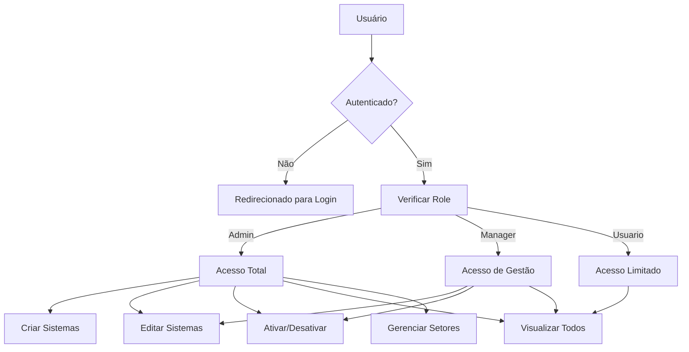

# Segurança e Permissões - Gerenciamento de Sistemas

## Visão Geral

Este documento detalha a implementação de segurança e controle de acesso no módulo de Gerenciamento de Sistemas, abordando autenticação, autorização, políticas de acesso e proteção contra vulnerabilidades comuns.

## Modelo de Permissões

O sistema utiliza um modelo de permissões baseado em funções (RBAC - Role-Based Access Control):



## Implementação no Supabase com RLS

### Políticas na Tabela de Sistemas

```sql
-- Habilitar RLS
ALTER TABLE sistemas ENABLE ROW LEVEL SECURITY;

-- Política para leitura (todos usuários autenticados podem ler)
CREATE POLICY "sistemas_select_policy"
    ON sistemas FOR SELECT
    TO authenticated
    USING (true);

-- Política para inserção (apenas admin e manager)
CREATE POLICY "sistemas_insert_policy"
    ON sistemas FOR INSERT
    TO authenticated
    WITH CHECK (
        (SELECT role FROM profiles WHERE user_id = auth.uid())
        IN ('admin', 'manager')
    );

-- Política para atualização (apenas admin e manager)
CREATE POLICY "sistemas_update_policy"
    ON sistemas FOR UPDATE
    TO authenticated
    USING (
        (SELECT role FROM profiles WHERE user_id = auth.uid())
        IN ('admin', 'manager')
    );

-- Política para exclusão (apenas admin)
CREATE POLICY "sistemas_delete_policy"
    ON sistemas FOR DELETE
    TO authenticated
    USING (
        (SELECT role FROM profiles WHERE user_id = auth.uid()) = 'admin'
    );
```

### Políticas na Tabela de Setores

```sql
-- Habilitar RLS
ALTER TABLE setores ENABLE ROW LEVEL SECURITY;

-- Política para leitura (todos usuários autenticados podem ler)
CREATE POLICY "setores_select_policy"
    ON setores FOR SELECT
    TO authenticated
    USING (true);

-- Política para modificação (apenas admin)
CREATE POLICY "setores_modify_policy"
    ON setores FOR ALL
    TO authenticated
    USING (
        (SELECT role FROM profiles WHERE user_id = auth.uid()) = 'admin'
    );
```

### Políticas na Tabela de Contatos

```sql
-- Habilitar RLS
ALTER TABLE sistema_contatos ENABLE ROW LEVEL SECURITY;

-- Política para leitura (todos usuários autenticados podem ler)
CREATE POLICY "sistema_contatos_select_policy"
    ON sistema_contatos FOR SELECT
    TO authenticated
    USING (true);

-- Política para modificação (apenas admin e manager)
CREATE POLICY "sistema_contatos_modify_policy"
    ON sistema_contatos FOR ALL
    TO authenticated
    USING (
        (SELECT role FROM profiles WHERE user_id = auth.uid())
        IN ('admin', 'manager')
    );
```

## Verificação de Permissões no Front-End

### Hook de Permissões

```javascript
// usePermissions.js
import { ref, computed } from 'vue';
import { supabase } from '@/services/supabase';

export function usePermissions() {
  const userRole = ref(null);
  const isLoading = ref(true);
  const hasError = ref(false);
  
  // Verifica permissões do usuário
  const checkPermissions = async () => {
    try {
      isLoading.value = true;
      hasError.value = false;
      
      // 1. Verifica se o usuário está autenticado
      const { data: { user }, error: authError } = await supabase.auth.getUser();
      
      if (authError || !user) {
        userRole.value = null;
        return false;
      }
      
      // 2. Busca o perfil associado ao usuário
      const { data: profile, error: profileError } = await supabase
        .from('profiles')
        .select('role')
        .eq('user_id', user.id)
        .single();
        
      if (profileError || !profile) {
        userRole.value = null;
        return false;
      }
      
      userRole.value = profile.role;
      return true;
    } catch (error) {
      console.error('Erro ao verificar permissões:', error);
      hasError.value = true;
      return false;
    } finally {
      isLoading.value = false;
    }
  };
  
  // Permissões computadas
  const canCreateSystem = computed(() => 
    userRole.value === 'admin' || userRole.value === 'manager'
  );
  
  const canEditSystem = computed(() => 
    userRole.value === 'admin' || userRole.value === 'manager'
  );
  
  const canDeleteSystem = computed(() => 
    userRole.value === 'admin'
  );
  
  const canManageSectors = computed(() => 
    userRole.value === 'admin'
  );
  
  return {
    userRole,
    isLoading,
    hasError,
    checkPermissions,
    canCreateSystem,
    canEditSystem,
    canDeleteSystem,
    canManageSectors
  };
}
```

### Utilização no Componente

```html
<template>
  <div class="sistemas-view">
    <!-- Controles de ação condicionais -->
    <div class="action-buttons">
      <button 
        v-if="canCreateSystem" 
        class="btn-add" 
        @click="openNewSystemModal"
      >
        <i class="icon-add"></i> Novo Sistema
      </button>
      
      <button 
        v-if="canManageSectors" 
        class="btn-sectors" 
        @click="openManageSectorsModal"
      >
        <i class="icon-sectors"></i> Gerenciar Setores
      </button>
    </div>
    
    <!-- Lista de sistemas com ações condicionais -->
    <div v-for="sistema in sistemas" :key="sistema.id" class="sistema-card">
      <!-- Dados do sistema -->
      
      <!-- Ações condicionais -->
      <div class="sistema-actions">
        <button
          v-if="canEditSystem"
          class="btn-edit"
          @click="editSystem(sistema)"
        >
          <i class="icon-edit"></i> Editar
        </button>
        
        <button
          v-if="canEditSystem"
          class="btn-toggle"
          @click="toggleSystemStatus(sistema)"
        >
          {{ sistema.status ? 'Desativar' : 'Ativar' }}
        </button>
      </div>
    </div>
  </div>
</template>

<script>
import { usePermissions } from '@/composables/usePermissions';

export default {
  setup() {
    const { 
      userRole,
      checkPermissions,
      canCreateSystem,
      canEditSystem,
      canDeleteSystem,
      canManageSectors
    } = usePermissions();
    
    // Verificar permissões ao montar o componente
    onMounted(async () => {
      const hasPermissions = await checkPermissions();
      
      if (!hasPermissions) {
        // Redirecionar para acesso negado ou login
        router.push('/access-denied');
        return;
      }
      
      // Carregar dados para usuário autorizado
      await loadSistemas();
    });
    
    // Resto do setup...
    
    return {
      // Resto das variáveis e funções...
      canCreateSystem,
      canEditSystem,
      canDeleteSystem,
      canManageSectors,
      userRole
    };
  }
};
</script>
```

## Middleware de Autenticação

O sistema utiliza um middleware de rotas para garantir que apenas usuários autenticados acessem áreas protegidas:

```javascript
// router/index.js
import { createRouter } from 'vue-router';
import { supabase } from '@/services/supabase';

// Middleware de autenticação
const requireAuth = async (to, from, next) => {
  try {
    const { data: { user }, error } = await supabase.auth.getUser();
    
    if (error || !user) {
      // Redirecionar para login com retorno
      return next({ 
        path: '/login', 
        query: { redirect: to.fullPath } 
      });
    }
    
    // Se a rota requer role específica
    if (to.meta.requiredRoles && to.meta.requiredRoles.length > 0) {
      const { data: profile } = await supabase
        .from('profiles')
        .select('role')
        .eq('user_id', user.id)
        .single();
        
      if (!profile || !to.meta.requiredRoles.includes(profile.role)) {
        return next({ path: '/access-denied' });
      }
    }
    
    return next();
  } catch (error) {
    console.error('Erro no middleware de autenticação:', error);
    return next({ path: '/login' });
  }
};

// Configuração das rotas
const routes = [
  {
    path: '/sistemas',
    component: () => import('@/views/SistemasView.vue'),
    meta: { 
      requiresAuth: true
    },
    beforeEnter: requireAuth
  },
  {
    path: '/sistemas/setores',
    component: () => import('@/views/SetoresView.vue'),
    meta: { 
      requiresAuth: true,
      requiredRoles: ['admin'] 
    },
    beforeEnter: requireAuth
  }
  // Outras rotas...
];

const router = createRouter({
  history: createWebHistory(),
  routes
});

export default router;
```

## Proteção Contra Vulnerabilidades Comuns

### 1. Cross-Site Scripting (XSS)

```javascript
// Sanitização de entrada de dados
const sanitizeInput = (input) => {
  if (typeof input !== 'string') return '';
  
  // Remover tags HTML e scripts potencialmente perigosos
  return input
    .replace(/<script\b[^<]*(?:(?!<\/script>)<[^<]*)*<\/script>/gi, '')
    .replace(/<[^>]*>/g, '')
    .trim();
};

// Uso ao salvar dados
const handleSubmit = async () => {
  // Sanitizar dados antes de salvar
  const sanitizedData = {
    nome: sanitizeInput(formData.value.nome),
    descricao: sanitizeInput(formData.value.descricao),
    url: formData.value.url, // URLs não são sanitizadas, mas validadas
    setor_id: formData.value.setor_id,
    contatos: formData.value.contatos.map(c => ({
      nome: sanitizeInput(c.nome),
      telefone: sanitizeInput(c.telefone)
    }))
  };
  
  // Prosseguir com o salvamento dos dados sanitizados
};

// Para exibição segura de dados possivelmente não confiáveis
const safeDisplay = (text) => {
  return text.replace(/</g, '&lt;').replace(/>/g, '&gt;');
};
```

### 2. Cross-Site Request Forgery (CSRF)

O Supabase usa tokens JWT para autenticação, o que já oferece proteção contra CSRF. Adicionalmente:

```javascript
// Serviço para API com cabeçalhos padrão
const apiService = {
  headers() {
    return {
      'Content-Type': 'application/json',
      'X-Client-Info': 'supabase-js/2.0.0',
      'X-Session-Id': localStorage.getItem('supabase.auth.token')
    };
  },
  
  async get(url) {
    return fetch(url, {
      method: 'GET',
      headers: this.headers(),
      credentials: 'include'
    }).then(response => response.json());
  },
  
  async post(url, data) {
    return fetch(url, {
      method: 'POST',
      headers: this.headers(),
      credentials: 'include',
      body: JSON.stringify(data)
    }).then(response => response.json());
  }
  
  // Outros métodos...
};
```

### 3. SQL Injection

O Supabase utiliza consultas parametrizadas por padrão, protegendo contra injeções de SQL:

```javascript
// Seguro contra SQL injection
const loadSistemaById = async (id) => {
  const { data, error } = await supabase
    .from('sistemas')
    .select('*')
    .eq('id', id) // Parâmetro tratado adequadamente
    .single();
    
  if (error) throw error;
  return data;
};
```

### 4. Logging Seguro

```javascript
// Sistema de logging seguro
const secureLogger = {
  logAction: async (action, details) => {
    try {
      // Sanitizar dados sensíveis
      const safeDetails = { ...details };
      
      // Remover ou mascarar dados sensíveis
      if (safeDetails.senha) {
        safeDetails.senha = '********';
      }
      
      // Registrar no servidor
      const { data: { user } } = await supabase.auth.getUser();
      
      const { error } = await supabase
        .from('audit_logs')
        .insert({
          user_id: user?.id,
          action,
          details: safeDetails,
          ip_address: await getClientIP(),
          created_at: new Date().toISOString()
        });
        
      if (error) {
        console.warn('Erro ao registrar log (não crítico):', error);
      }
    } catch (error) {
      console.warn('Erro no sistema de logging (não crítico):', error);
    }
  }
};

// Uso
secureLogger.logAction(
  'sistema.update', 
  { id: sistema.id, nome: sistema.nome }
);
```

## Melhores Práticas Implementadas

1. **Princípio do Privilégio Mínimo**: Cada função de usuário tem apenas as permissões necessárias
2. **Defesa em Profundidade**: Verificações em vários níveis (banco, backend, frontend)
3. **Validação Completa**: Validação de entrada tanto no cliente quanto no servidor
4. **Logs de Auditoria**: Registro das ações principais para fins de auditoria
5. **Mensagens de Erro Genéricas**: Evita expor detalhes técnicos em mensagens de erro para o usuário
6. **Timeout de Sessão**: Sessões expiram após período de inatividade

## Verificações de Segurança Periódicas

```javascript
// Implementação de checkup de segurança
const securityCheckup = async () => {
  const checks = [];
  
  // 1. Verificar se o token está prestes a expirar
  const expiresAt = localStorage.getItem('supabase.auth.expires_at');
  if (expiresAt) {
    const expTime = new Date(parseInt(expiresAt) * 1000);
    const timeLeft = (expTime - new Date()) / (1000 * 60); // em minutos
    
    if (timeLeft < 10) {
      // Renovar sessão
      const { error } = await supabase.auth.refreshSession();
      checks.push({
        check: 'token-refresh',
        status: !error ? 'success' : 'failed',
        message: !error ? 'Token renovado' : 'Falha ao renovar token'
      });
    }
  }
  
  // 2. Verificar permissões
  const { data: { user } } = await supabase.auth.getUser();
  if (user) {
    const { data: profile } = await supabase
      .from('profiles')
      .select('role')
      .eq('user_id', user.id)
      .single();
      
    checks.push({
      check: 'user-role',
      status: 'info',
      message: `Função atual: ${profile?.role || 'não definida'}`
    });
  }
  
  return {
    timestamp: new Date().toISOString(),
    checks
  };
};
```
