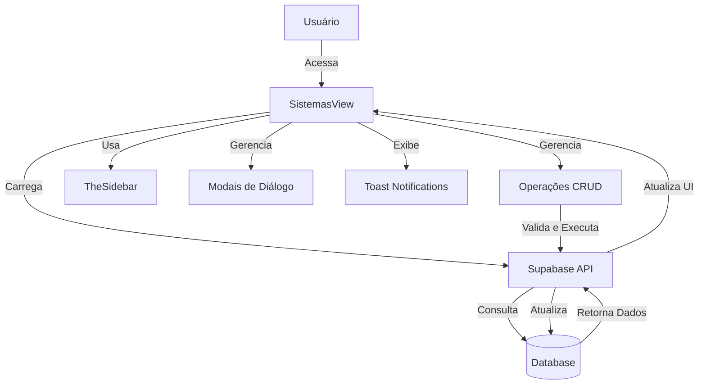
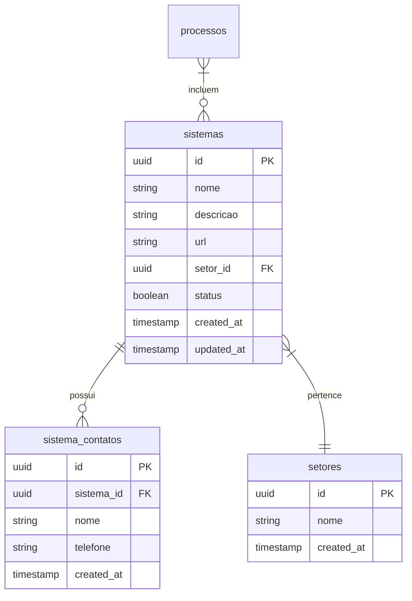
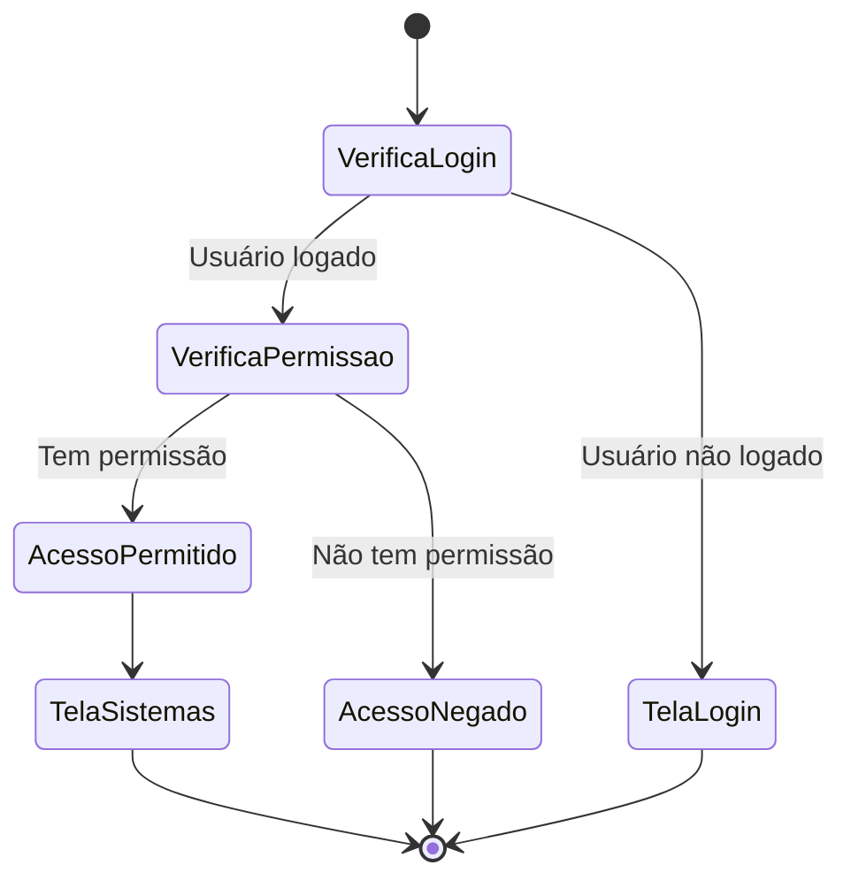

# Visão Geral - Gerenciamento de Sistemas

## Descrição da Funcionalidade

O módulo de "Gerenciamento de Sistemas" permite cadastrar, visualizar, editar e gerenciar os sistemas de software que a empresa comercializa e oferece em processos licitatórios. Este módulo é fundamental para a operação da empresa, pois estes sistemas são os produtos principais ofertados nas licitações.

## Acesso

- Disponível para usuários autenticados com permissões adequadas
- Caminho: Menu Principal > Cadastros > Sistemas

## Funcionalidades Principais

1. **Listar Sistemas**: Visualização de todos os sistemas cadastrados com seus setores e status
2. **Adicionar Sistema**: Inclusão de novos sistemas com nome, descrição, URL e setor
3. **Editar Sistema**: Modificação dos dados de um sistema existente
4. **Gerenciar Contatos**: Adição e remoção de contatos associados a cada sistema
5. **Ativar/Desativar**: Alteração do status do sistema (ativo/inativo)
6. **Associação com Processos**: Vinculação de sistemas a processos licitatórios

## Diagrama de Arquitetura

## Modelo de Dados Simplificado

## Fluxo de Permissões

## Componentes Principais

1. **SistemasView.vue**: Componente principal que gerencia a tela de sistemas
2. **SistemasView.js**: Lógica do componente separada em script
3. **TheSidebar**: Componente da barra lateral
4. **Modais de Diálogo**: Para adição, edição e confirmação
5. **Sistema de Toast Notifications**: Feedback visual para o usuário

## Tabelas do Banco de Dados

| Tabela | Descrição |
|--------|-----------|
| sistemas | Armazena as informações dos sistemas de software |
| setores | Armazena os setores aos quais os sistemas podem pertencer |
| sistema_contatos | Armazena os contatos associados a cada sistema |
| processos | Contém os processos licitatórios que podem incluir os sistemas |

## Tecnologias Utilizadas

- Vue.js para a interface do usuário
- Supabase como backend e banco de dados
- Composables para lógica reutilizável
- Sistema de notificações por toast
- Sistema de tempo real para atualização automática de dados
