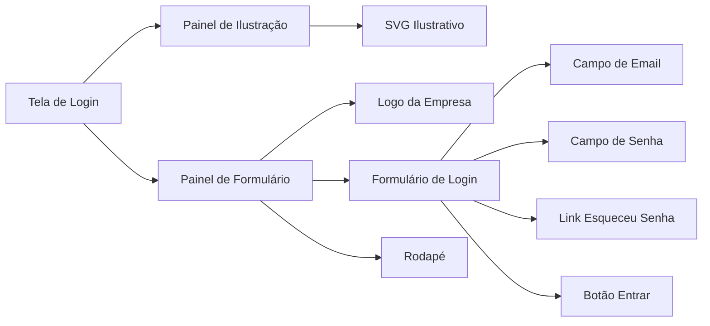
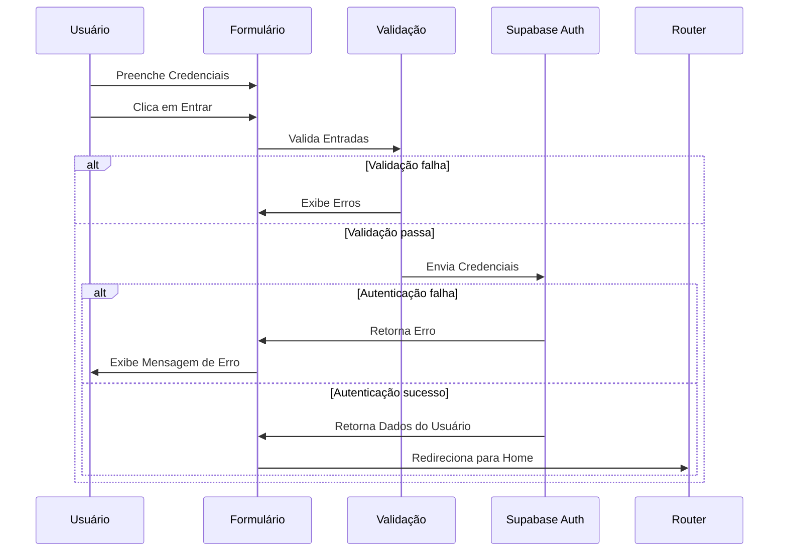
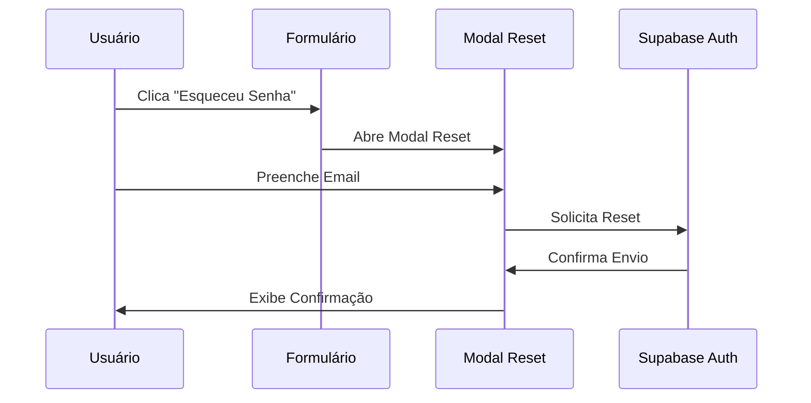
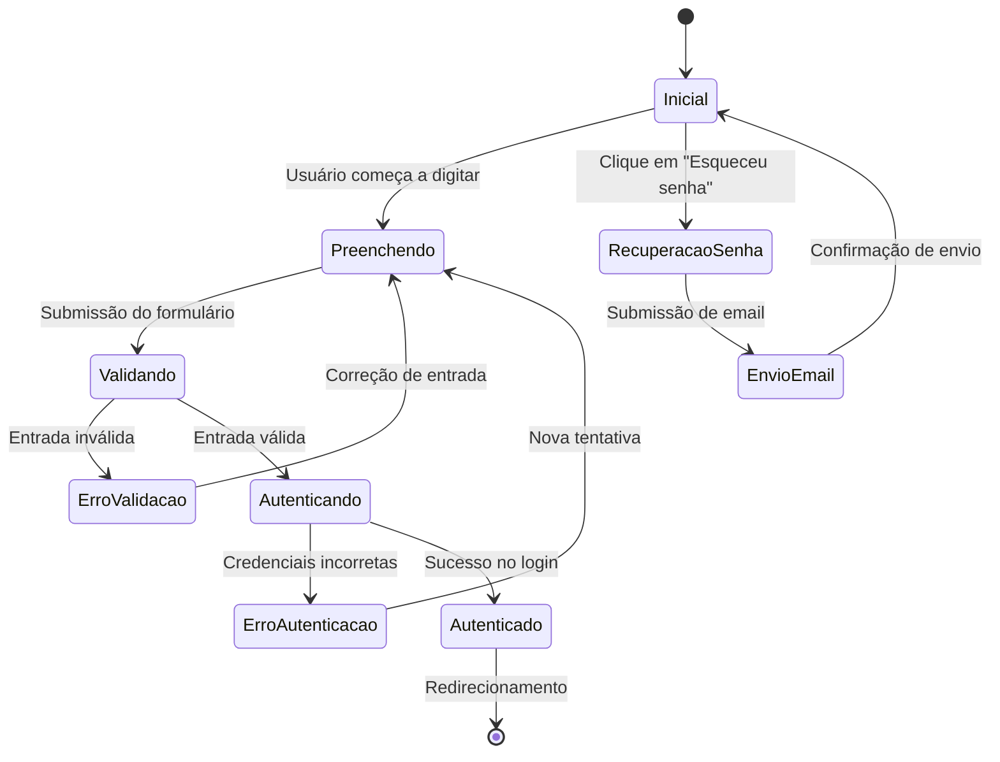
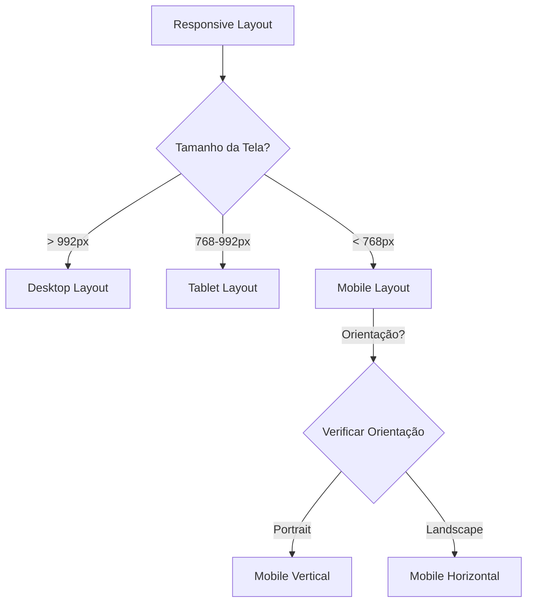

# Documentação da Tela de Login

## Visão Geral
A tela de login do Sistema de Editais Comerciais foi projetada para proporcionar uma experiência moderna, intuitiva e emocionalmente conectada com o usuário. O design combina elementos visuais atrativos com funcionalidades práticas para garantir segurança e usabilidade.

## Componentes Principais

### Estrutura Visual
A tela é dividida em duas seções principais:

1. **Painel de Ilustração** - Lado esquerdo com uma ilustração relacionada a login
2. **Painel de Formulário** - Lado direito contendo os campos de entrada e botões

### Fluxo de Autenticação

### Fluxo de Recuperação de Senha

## Estados da Interface

## Responsividade
A interface foi projetada seguindo princípios de design responsivo para garantir uma experiência consistente em diferentes tamanhos de tela:

- **Desktop**: Layout com dois painéis lado a lado
- **Tablet**: Mantém o layout de dois painéis com ajustes de proporção
- **Mobile**: Converte para layout vertical, com ilustração acima do formulário
- **Mobile Landscape**: Ajusta para melhor visualização em orientação horizontal

## Elementos de Design

### Visuais
- **Cores principais**: Gradientes de azul (#193155 a #254677)
- **Efeitos visuais**: Animações sutis, efeito de pulso, grid dinâmico
- **Tipografia**: Família Roboto para melhor legibilidade
- **Ilustração**: Arte SVG relacionada a login para conexão emocional com o usuário

### Interações
- Input com labels flutuantes para melhor UX
- Animações de transição suaves
- Feedback visual em tempo real durante validações
- Notificações toast para comunicação de status

## Segurança
- Validação de entrada no cliente
- Armazenamento seguro de tokens via Supabase
- Opção de recuperação de senha
- Redirecionamento após autenticação

## Tecnologias Utilizadas
- Vue.js 3 com Composition API
- Supabase para autenticação
- CSS com animações e transições personalizadas
- SVG para ilustrações

## Considerações de Acessibilidade
- Contraste adequado entre texto e fundo
- Tamanhos de fonte ajustáveis
- Feedback visual e mensagens de erro claras
- Navegação por teclado suportada
- Estrutura semântica adequada
